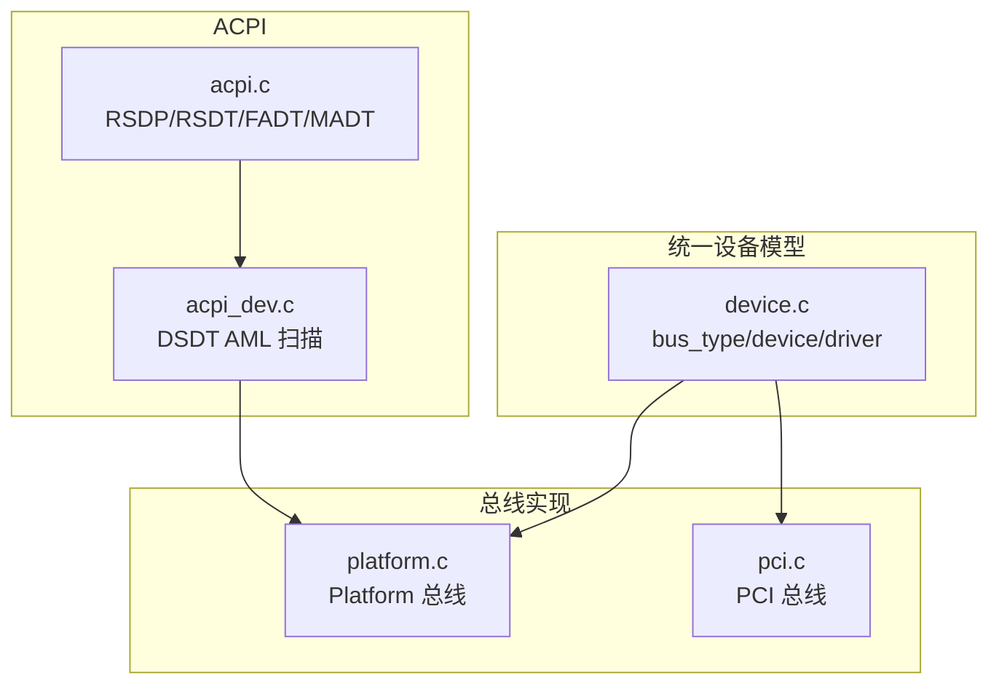
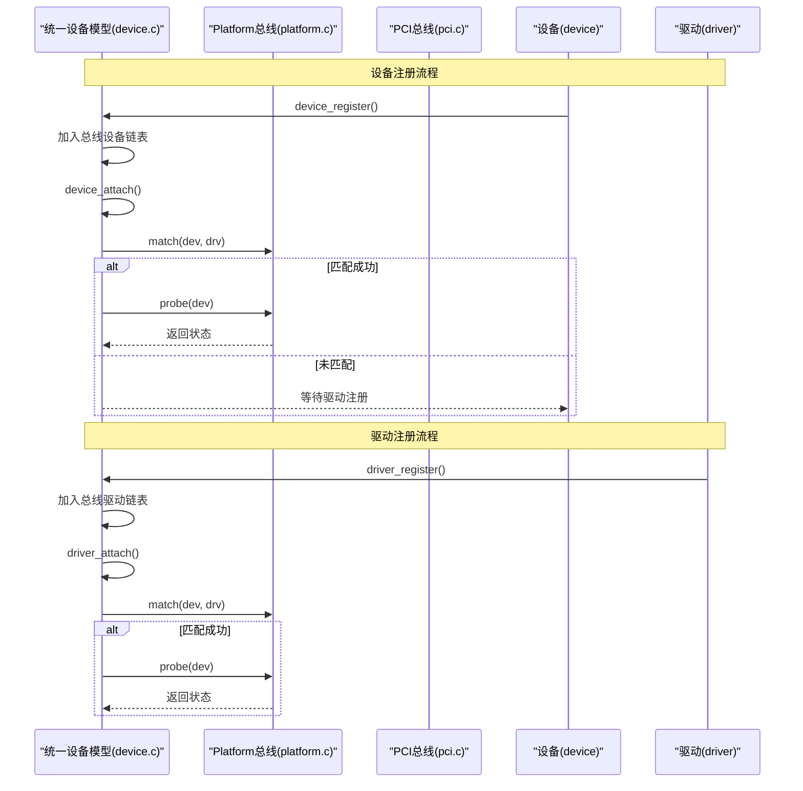
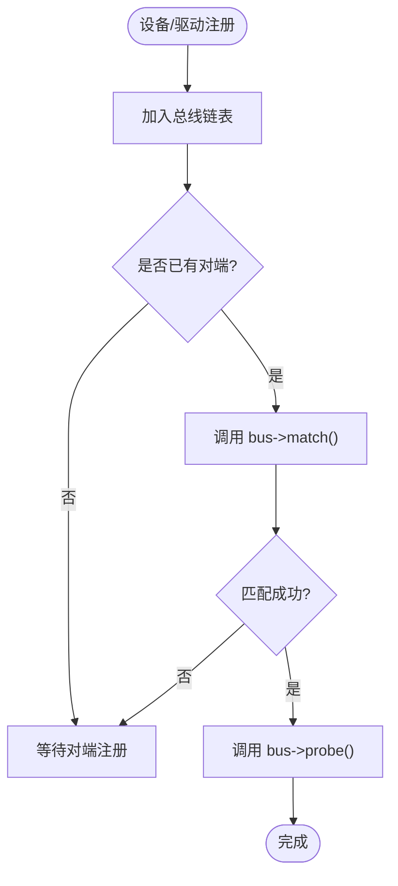
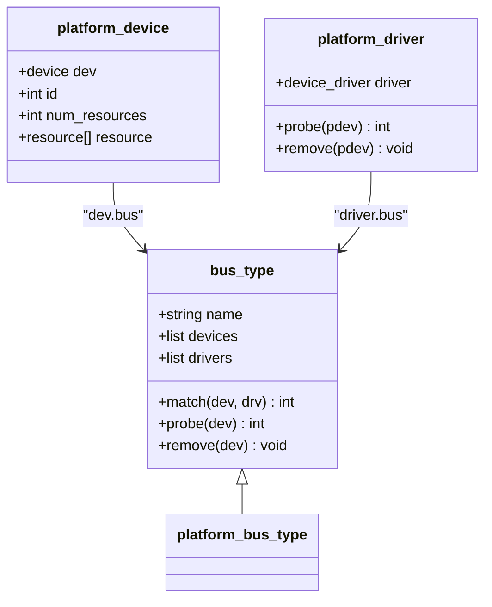
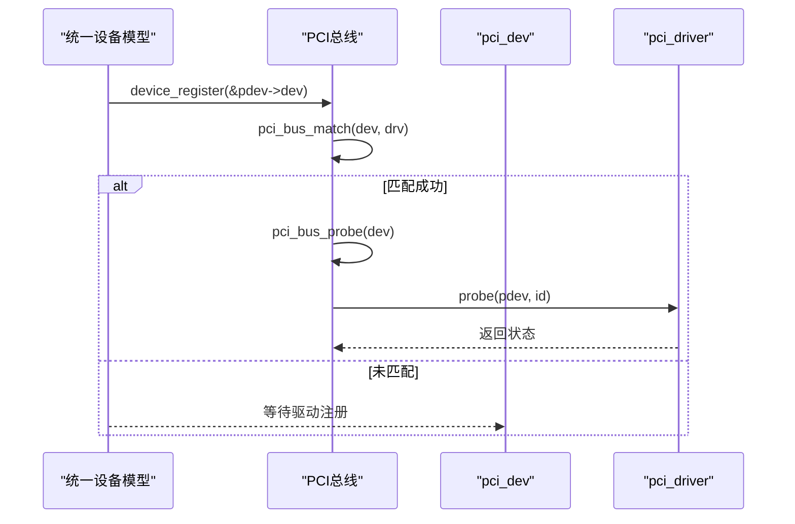
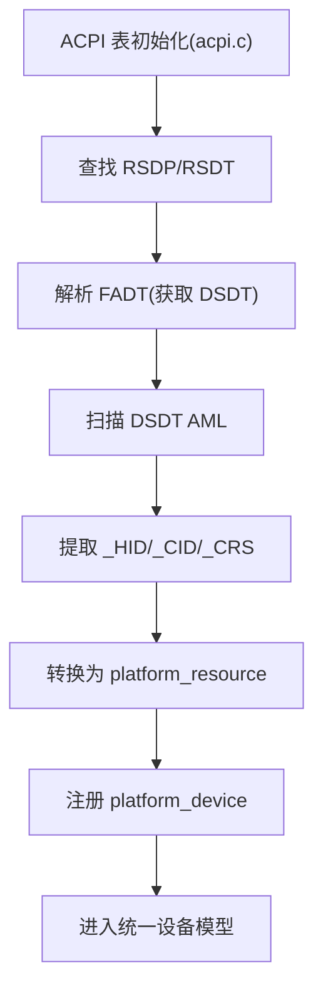
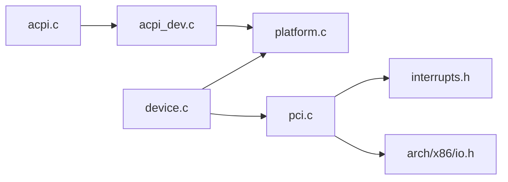

# 设备驱动框架

<cite>
**本文引用的文件**
- [includes/device/device.h](file://includes/device/device.h)
- [kernel/device/device.c](file://kernel/device/device.c)
- [includes/device/platform.h](file://includes/device/platform.h)
- [kernel/device/platform.c](file://kernel/device/platform.c)
- [includes/pci/pci.h](file://includes/pci/pci.h)
- [kernel/pci/pci.c](file://kernel/pci/pci.c)
- [includes/arch/x86/acpi.h](file://includes/arch/x86/acpi.h)
- [arch/x86/kernel/acpi.c](file://arch/x86/kernel/acpi.c)
- [kernel/device/acpi_dev.c](file://kernel/device/acpi_dev.c)
</cite>

## 目录
1. [简介](#简介)
2. [项目结构](#项目结构)
3. [核心组件](#核心组件)
4. [架构总览](#架构总览)
5. [详细组件分析](#详细组件分析)
6. [依赖关系分析](#依赖关系分析)
7. [性能与可扩展性](#性能与可扩展性)
8. [故障排查指南](#故障排查指南)
9. [结论](#结论)
10. [附录：驱动开发指南与最佳实践](#附录驱动开发指南与最佳实践)

## 简介
本文件系统性地阐述 LulaOS 的统一设备模型与驱动框架，覆盖以下目标：
- 统一设备模型的设计理念：总线类型抽象、设备-驱动匹配机制、设备生命周期管理。
- Platform 总线与 PCI 总线的实现差异与各自职责。
- 设备驱动的注册、探测（probe）和移除（remove）流程。
- ACPI 设备发现机制：从 DSDT 扫描到平台设备注册。
- 面向驱动开发者的完整开发指南与最佳实践。

该框架以“总线-设备-驱动”为核心，将不同硬件抽象为统一的设备对象，并通过总线提供的 match/probe/remove 钩子完成自动匹配与生命周期管理。Platform 总线用于非热插拔的固定资源设备（如 SoC 外设、PS/2、中断控制器等），PCI 总线用于枚举并管理 PCI 设备。ACPI 子系统负责解析固件描述的设备树，将其转化为 Platform 设备，从而接入统一设备模型。

## 项目结构
LulaOS 设备驱动相关代码主要分布在如下位置：
- 统一设备模型核心：includes/device/device.h、kernel/device/device.c
- Platform 总线：includes/device/platform.h、kernel/device/platform.c
- PCI 总线：includes/pci/pci.h、kernel/pci/pci.c
- ACPI 表与 DSDT 扫描：includes/arch/x86/acpi.h、arch/x86/kernel/acpi.c、kernel/device/acpi_dev.c

图表来源
- [kernel/device/device.c:22-34](file://kernel/device/device.c#L22-L34)
- [kernel/device/platform.c:15-77](file://kernel/device/platform.c#L15-L77)
- [kernel/pci/pci.c:28-241](file://kernel/pci/pci.c#L28-L241)
- [arch/x86/kernel/acpi.c:203-277](file://arch/x86/kernel/acpi.c#L203-L277)
- [kernel/device/acpi_dev.c:749-796](file://kernel/device/acpi_dev.c#L749-L796)

章节来源
- [includes/device/device.h:26-77](file://includes/device/device.h#L26-L77)
- [kernel/device/device.c:22-165](file://kernel/device/device.c#L22-L165)
- [includes/device/platform.h:28-81](file://includes/device/platform.h#L28-L81)
- [kernel/device/platform.c:15-160](file://kernel/device/platform.c#L15-L160)
- [includes/pci/pci.h:78-169](file://includes/pci/pci.h#L78-L169)
- [kernel/pci/pci.c:28-493](file://kernel/pci/pci.c#L28-L493)
- [includes/arch/x86/acpi.h:202-250](file://includes/arch/x86/acpi.h#L202-L250)
- [arch/x86/kernel/acpi.c:16-277](file://arch/x86/kernel/acpi.c#L16-L277)
- [kernel/device/acpi_dev.c:22-797](file://kernel/device/acpi_dev.c#L22-L797)

## 核心组件
- 总线类型 bus_type：定义 name、devices/drivers 链表以及 match/probe/remove 回调，是统一设备模型的抽象核心。
- 设备 device：各总线设备的基础嵌入结构，包含名称、所属总线、绑定驱动指针及私有数据。
- 驱动 device_driver：各总线驱动的基础嵌入结构，包含名称与所属总线。
- Platform 总线：通过名称字符串匹配 platform_device 与 platform_driver，提供资源访问接口。
- PCI 总线：通过 vendor/device/class 与 id_table 匹配，支持 BAR 资源解析与中断信息读取。
- ACPI 子系统：解析 RSDP/RSDT/FADT/MADT，扫描 DSDT AML 提取 _HID/_CID/_CRS，生成 Platform 设备并注册。

章节来源
- [includes/device/device.h:26-77](file://includes/device/device.h#L26-L77)
- [includes/device/platform.h:28-81](file://includes/device/platform.h#L28-L81)
- [includes/pci/pci.h:78-169](file://includes/pci/pci.h#L78-L169)
- [kernel/device/device.c:22-165](file://kernel/device/device.c#L22-L165)
- [kernel/device/platform.c:15-160](file://kernel/device/platform.c#L15-L160)
- [kernel/pci/pci.c:28-493](file://kernel/pci/pci.c#L28-L493)
- [includes/arch/x86/acpi.h:202-250](file://includes/arch/x86/acpi.h#L202-L250)
- [arch/x86/kernel/acpi.c:203-277](file://arch/x86/kernel/acpi.c#L203-L277)
- [kernel/device/acpi_dev.c:22-797](file://kernel/device/acpi_dev.c#L22-L797)

## 架构总览
统一设备模型通过 bus_type 将设备与驱动解耦。设备注册时加入总线设备链表并尝试匹配已注册驱动；驱动注册时加入总线驱动链表并尝试匹配已注册设备。匹配成功后调用总线特定的 probe，完成初始化；注销或驱动卸载时调用 remove 进行清理。

图表来源
- [kernel/device/device.c:42-87](file://kernel/device/device.c#L42-L87)
- [kernel/device/platform.c:25-77](file://kernel/device/platform.c#L25-L77)
- [kernel/pci/pci.c:194-241](file://kernel/pci/pci.c#L194-L241)

## 详细组件分析

### 统一设备模型（bus_type/device/driver）
- bus_type：维护 devices/drivers 链表，并提供 match/probe/remove 回调。
- device_register：将设备加入总线设备链表，随后尝试匹配已注册驱动。
- driver_register：将驱动加入总线驱动链表，随后尝试匹配所有未绑定的设备。
- device_attach/driver_attach：遍历对端链表，调用 match，成功后设置绑定并调用 probe。
- device_unregister/driver_unregister：移除链表节点，必要时调用 remove 清理。

图表来源
- [kernel/device/device.c:22-165](file://kernel/device/device.c#L22-L165)

章节来源
- [includes/device/device.h:26-77](file://includes/device/device.h#L26-L77)
- [kernel/device/device.c:22-165](file://kernel/device/device.c#L22-L165)

### Platform 总线
- 匹配策略：比较 platform_device.dev.name 与 platform_driver.driver.name。
- probe/remove 转发：将统一设备模型的 probe/remove 转发到 platform_driver 的对应函数。
- 资源访问：提供 platform_get_resource 按类型与序号获取 I/O/MEM/IRQ 资源。
- 设备查找：platform_find_device 按名称查找设备。

图表来源
- [includes/device/platform.h:28-81](file://includes/device/platform.h#L28-L81)
- [kernel/device/platform.c:15-160](file://kernel/device/platform.c#L15-L160)

章节来源
- [includes/device/platform.h:28-81](file://includes/device/platform.h#L28-L81)
- [kernel/device/platform.c:15-160](file://kernel/device/platform.c#L15-L160)

### PCI 总线
- 匹配策略：通过 pci_device_id 表（vendor/device/class）匹配 pci_dev。
- probe/remove 转发：匹配成功后调用 pci_driver->probe，传入匹配的 id 项。
- 设备枚举：从 Bus 0 开始扫描 Device/Function，读取 Vendor ID、Class、Revision、BAR、中断信息等。
- BAR 解析：写全 1 计算大小，区分 IO/MEM，处理 64 位 BAR。
- 设备使能：开启命令寄存器的 IO 与 MEM 响应。

图表来源
- [kernel/pci/pci.c:194-241](file://kernel/pci/pci.c#L194-L241)
- [kernel/pci/pci.c:251-349](file://kernel/pci/pci.c#L251-L349)
- [kernel/pci/pci.c:417-439](file://kernel/pci/pci.c#L417-L439)

章节来源
- [includes/pci/pci.h:78-169](file://includes/pci/pci.h#L78-L169)
- [kernel/pci/pci.c:28-493](file://kernel/pci/pci.c#L28-L493)

### ACPI 设备发现机制
- 表解析：从 RSDP 找到 RSDT，遍历表项，解析 FADT（获取 DSDT 地址）、MADT（解析 LAPIC/IOAPIC/中断覆盖）。
- DSDT 扫描：最小 AML 遍历器，识别 Scope/Device/Name，提取 _HID/_CID/_CRS。
- 资源转换：将 _CRS 中的 IRQ/I/O/Memory 描述符转换为 platform_resource。
- 平台设备注册：将 ACPI 发现的设备转为 platform_device 并注册，进入统一设备模型。

图表来源
- [arch/x86/kernel/acpi.c:203-277](file://arch/x86/kernel/acpi.c#L203-L277)
- [kernel/device/acpi_dev.c:632-740](file://kernel/device/acpi_dev.c#L632-L740)
- [kernel/device/acpi_dev.c:749-796](file://kernel/device/acpi_dev.c#L749-L796)

章节来源
- [includes/arch/x86/acpi.h:202-250](file://includes/arch/x86/acpi.h#L202-L250)
- [arch/x86/kernel/acpi.c:16-277](file://arch/x86/kernel/acpi.c#L16-L277)
- [kernel/device/acpi_dev.c:22-797](file://kernel/device/acpi_dev.c#L22-L797)

## 依赖关系分析
- 统一设备模型依赖 list 操作与 printk。
- Platform 总线依赖字符串比较与资源访问。
- PCI 总线依赖底层 I/O 端口访问、内存映射与中断子系统。
- ACPI 子系统依赖页映射工具与字符串/内存操作。

图表来源
- [kernel/device/device.c:9-11](file://kernel/device/device.c#L9-L11)
- [kernel/device/platform.c:9-12](file://kernel/device/platform.c#L9-L12)
- [kernel/pci/pci.c:16-23](file://kernel/pci/pci.c#L16-L23)
- [kernel/device/acpi_dev.c:13-20](file://kernel/device/acpi_dev.c#L13-L20)
- [arch/x86/kernel/acpi.c:1-7](file://arch/x86/kernel/acpi.c#L1-L7)

章节来源
- [kernel/device/device.c:9-11](file://kernel/device/device.c#L9-L11)
- [kernel/device/platform.c:9-12](file://kernel/device/platform.c#L9-L12)
- [kernel/pci/pci.c:16-23](file://kernel/pci/pci.c#L16-L23)
- [kernel/device/acpi_dev.c:13-20](file://kernel/device/acpi_dev.c#L13-L20)
- [arch/x86/kernel/acpi.c:1-7](file://arch/x86/kernel/acpi.c#L1-L7)

## 性能与可扩展性
- 匹配复杂度：设备/驱动注册时的匹配为线性遍历总线链表，时间复杂度 O(N)。在设备数量较少时开销可接受；若扩展大量设备，可考虑引入索引或哈希加速匹配。
- 资源解析：PCI BAR 解析需多次配置空间读写，注意减少不必要的写回；ACPI _CRS 解析为只读扫描，避免执行 Method，降低风险与开销。
- 可扩展性：新增总线只需实现 bus_type 的 match/probe/remove，并遵循统一设备模型接口；新增 ACPI 资源类型可在 _CRS 解析处扩展。

[本节为通用指导，不直接分析具体文件]

## 故障排查指南
- 设备未匹配：检查设备名称或驱动名称是否一致（Platform），或 id_table 是否正确（PCI）。
- probe 失败：确认资源可用（I/O/MEM/IRQ），并在 probe 中正确启用设备（如 PCI 命令寄存器）。
- ACPI 未发现设备：验证 RSDP/RSDT/FADT 解析是否成功，DSDT 扫描路径是否正确，_HID/_CID/_CRS 是否存在。
- 资源冲突：确保 platform_resource 或 PCI BAR 范围无重叠，必要时调整设备描述。

章节来源
- [kernel/device/platform.c:25-77](file://kernel/device/platform.c#L25-L77)
- [kernel/pci/pci.c:194-241](file://kernel/pci/pci.c#L194-L241)
- [kernel/device/acpi_dev.c:632-740](file://kernel/device/acpi_dev.c#L632-L740)
- [arch/x86/kernel/acpi.c:203-277](file://arch/x86/kernel/acpi.c#L203-L277)

## 结论
LulaOS 的统一设备模型以 bus_type 为核心，实现了设备与驱动的解耦与自动化匹配。Platform 总线适用于固定资源设备，PCI 总线适用于动态枚举设备；两者均通过统一接口接入系统。ACPI 子系统将固件描述的设备转化为 Platform 设备，进一步融入统一模型。该设计简洁清晰，便于扩展新总线与新设备类型，并为驱动开发者提供了稳定的开发基座。

[本节为总结，不直接分析具体文件]

## 附录：驱动开发指南与最佳实践

### 编写新的 Platform 设备驱动
- 定义 platform_device：设置 dev.name、id、num_resources 与 resource 数组（I/O/MEM/IRQ）。
- 定义 platform_driver：设置 driver.name 与 probe/remove 回调。
- 注册顺序：先 platform_bus_init()，再 platform_device_register() 与 platform_driver_register()。
- 资源访问：使用 platform_get_resource 获取资源，按需映射或请求中断。
- 错误处理：probe 中遇到资源不可用应返回错误码，避免部分初始化导致的不稳定。

章节来源
- [includes/device/platform.h:28-81](file://includes/device/platform.h#L28-L81)
- [kernel/device/platform.c:84-114](file://kernel/device/platform.c#L84-L114)
- [kernel/device/platform.c:142-159](file://kernel/device/platform.c#L142-L159)

### 编写新的 PCI 设备驱动
- 定义 pci_device_id 表：列出支持的 vendor/device/class，以 {0} 结尾。
- 定义 pci_driver：设置 driver.name 与 probe/remove 回调。
- 注册：调用 pci_register_driver()，系统将自动匹配并调用 probe。
- 设备使能与资源使用：在 probe 中启用设备（pci_enable_device），并使用 BAR 资源。
- 中断处理：读取中断引脚与线号，必要时与中断子系统集成。

章节来源
- [includes/pci/pci.h:115-169](file://includes/pci/pci.h#L115-L169)
- [kernel/pci/pci.c:166-241](file://kernel/pci/pci.c#L166-L241)
- [kernel/pci/pci.c:400-439](file://kernel/pci/pci.c#L400-L439)

### ACPI 设备发现与调试
- 表初始化：确保 acpi_tables_init() 被调用，解析 RSDP/RSDT/FADT/MADT。
- DSDT 扫描：确认 DSDT 映射成功，AML 解析路径正确，_HID/_CID/_CRS 存在。
- 平台设备注册：acpi_register_platform_devices() 将设备转为 platform_device 并注册。
- 日志定位：查看打印输出，确认设备名、HID/CID、资源范围是否正确。

章节来源
- [arch/x86/kernel/acpi.c:203-277](file://arch/x86/kernel/acpi.c#L203-L277)
- [kernel/device/acpi_dev.c:632-740](file://kernel/device/acpi_dev.c#L632-L740)
- [kernel/device/acpi_dev.c:749-796](file://kernel/device/acpi_dev.c#L749-L796)

### 最佳实践
- 命名一致性：Platform 设备与驱动的名称必须一致以确保匹配。
- 资源合法性：确保资源范围有效且不与其它设备冲突。
- 错误返回：probe 中任何初始化失败都应尽早返回错误码，避免半初始化状态。
- 最小化副作用：ACPI 扫描仅做只读解析，不执行 Method，保证稳定性。
- 可扩展设计：新增总线或资源类型时，尽量复用统一设备模型接口，保持耦合度低。

[本节为通用指导，不直接分析具体文件]