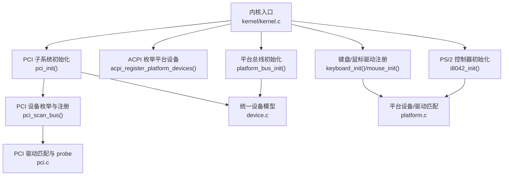
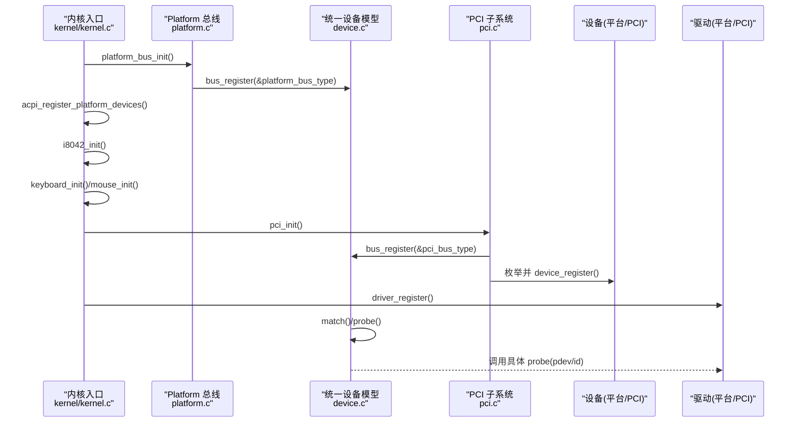
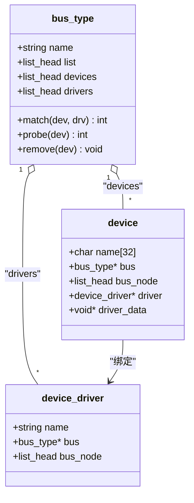
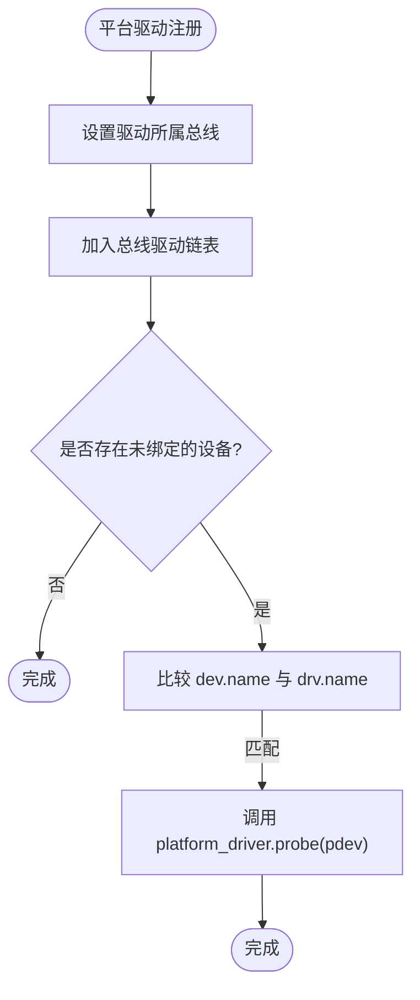
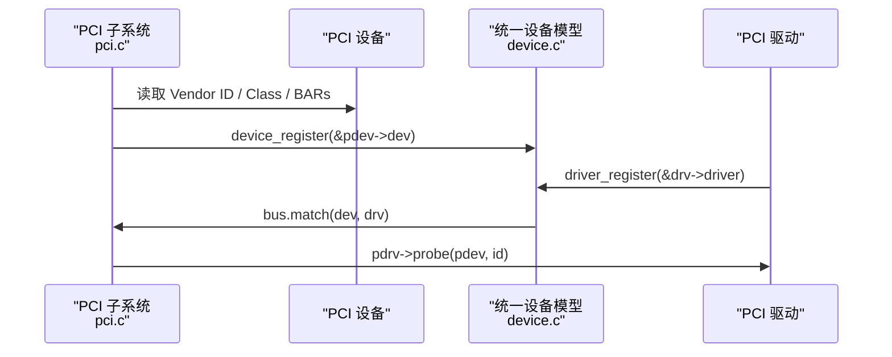
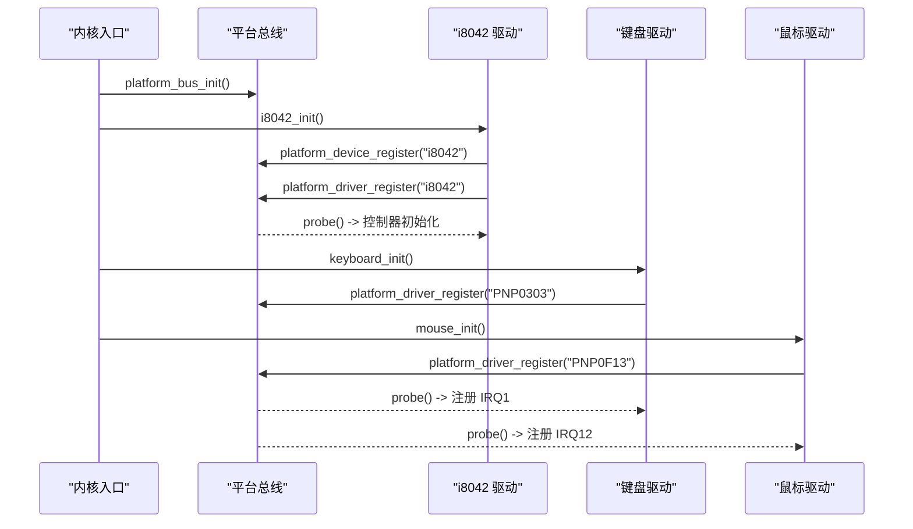
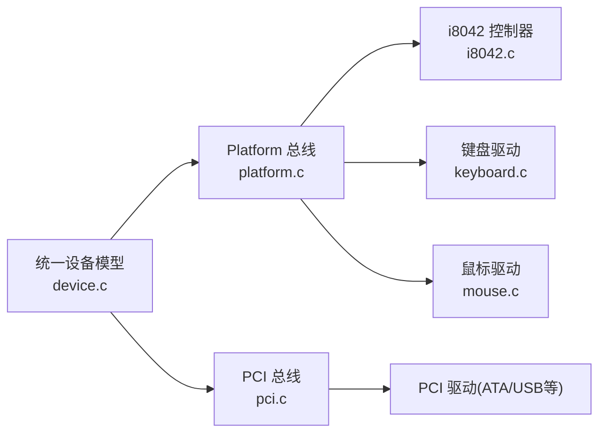

# 驱动程序开发指南

<cite>
**本文引用的文件**
- [README.md](file://README.md)
- [Makefile](file://Makefile)
- [linker.lds](file://linker.lds)
- [kernel.c](file://kernel/kernel.c)
- [device.h](file://includes/device/device.h)
- [platform.h](file://includes/device/platform.h)
- [device.c](file://kernel/device/device.c)
- [platform.c](file://kernel/device/platform.c)
- [pci.h](file://includes/pci/pci.h)
- [pci.c](file://kernel/pci/pci.c)
- [i8042.c](file://kernel/i8042.c)
- [keyboard.c](file://kernel/keyboard.c)
- [mouse.c](file://kernel/mouse.c)
</cite>

## 目录
1. [简介](#简介)
2. [项目结构](#项目结构)
3. [核心组件](#核心组件)
4. [架构总览](#架构总览)
5. [详细组件分析](#详细组件分析)
6. [依赖关系分析](#依赖关系分析)
7. [性能考虑](#性能考虑)
8. [故障排查指南](#故障排查指南)
9. [结论](#结论)
10. [附录](#附录)

## 简介
本指南面向从零开始为 LulaOS 编写设备驱动的开发者，覆盖驱动模型、总线类型（Platform、PCI）、编译与调试、加载顺序与依赖管理、常见设备模板、测试与调试工具、性能优化、版本与兼容性以及最佳实践。文档基于仓库现有实现进行系统化梳理，帮助读者快速上手并写出可维护、可扩展的驱动代码。

## 项目结构
LulaOS 采用分层组织：内核初始化入口统一在 kernel/kernel.c；设备模型抽象位于 includes/device 与 kernel/device；总线实现包括 Platform（kernel/device/platform.c）与 PCI（kernel/pci/pci.c）；具体设备驱动如 PS/2 控制器 i8042、键盘、鼠标分别位于 kernel/i8042.c、kernel/keyboard.c、kernel/mouse.c；构建系统由 Makefile 与 linker.lds 控制；README 提供环境与运行说明。

图表来源
- [kernel.c:96-133](file://kernel/kernel.c#L96-L133)
- [platform.c:70-114](file://kernel/device/platform.c#L70-L114)
- [pci.c:469-511](file://kernel/pci/pci.c#L469-L511)
- [device.c:94-139](file://kernel/device/device.c#L94-L139)

章节来源
- [README.md:1-84](file://README.md#L1-L84)
- [Makefile:1-138](file://Makefile#L1-L138)
- [linker.lds:1-103](file://linker.lds#L1-L103)
- [kernel.c:73-139](file://kernel/kernel.c#L73-L139)

## 核心组件
- 统一设备模型：bus_type、device、device_driver 定义与注册/注销、匹配与 probe 转发机制。
- Platform 总线：名称匹配策略、资源描述（IO/MEM/IRQ）、设备与驱动注册、probe/remove 转发。
- PCI 总线：配置空间访问、BAR 解析、设备扫描、id_table 匹配、驱动注册与 probe。
- 典型设备驱动：i8042 控制器初始化、键盘/鼠标中断处理与数据解析。

章节来源
- [device.h:26-77](file://includes/device/device.h#L26-L77)
- [platform.h:28-83](file://includes/device/platform.h#L28-L83)
- [pci.h:78-169](file://includes/pci/pci.h#L78-L169)
- [device.c:22-165](file://kernel/device/device.c#L22-L165)
- [platform.c:15-160](file://kernel/device/platform.c#L15-L160)
- [pci.c:28-241](file://kernel/pci/pci.c#L28-L241)

## 架构总览
LulaOS 的设备驱动体系围绕“统一设备模型 + 多总线”展开。内核启动时先初始化基础子系统（GDT/IDT/中断/调度/内存），随后注册 Platform 总线，通过 ACPI 或控制器回退注册平台设备；再初始化 PCI 子系统枚举设备；最后注册各类驱动，由总线完成匹配与 probe。

图表来源
- [kernel.c:96-133](file://kernel/kernel.c#L96-L133)
- [platform.c:70-114](file://kernel/device/platform.c#L70-L114)
- [device.c:94-139](file://kernel/device/device.c#L94-L139)
- [pci.c:469-511](file://kernel/pci/pci.c#L469-L511)

## 详细组件分析

### 统一设备模型（bus/device/driver）
- 设计要点
  - bus_type 定义 name、match/probe/remove 回调，维护 devices/drivers 链表。
  - device 嵌入 bus_node、driver、driver_data，用于绑定与私有数据传递。
  - device_driver 嵌入 bus_node，用于驱动侧遍历与匹配。
  - 注册流程：设备注册加入总线设备链表并尝试匹配已注册驱动；驱动注册加入总线驱动链表并尝试匹配已注册设备。
  - 注销流程：按 remove 回调清理后从链表移除。

图表来源
- [device.h:26-77](file://includes/device/device.h#L26-L77)
- [device.c:22-165](file://kernel/device/device.c#L22-L165)

章节来源
- [device.h:26-77](file://includes/device/device.h#L26-L77)
- [device.c:22-165](file://kernel/device/device.c#L22-L165)

### Platform 总线
- 匹配规则：platform_device.dev.name == platform_driver.driver.name。
- 资源模型：platform_resource 支持 IORESOURCE_IO / IORESOURCE_MEM / IORESOURCE_IRQ。
- 关键 API：platform_bus_init、platform_device_register、platform_driver_register、platform_find_device、platform_get_resource。
- 典型用法：i8042 控制器作为平台设备，键盘/鼠标作为平台驱动，通过 IRQ 资源获取中断号并注册中断处理函数。

图表来源
- [platform.c:70-114](file://kernel/device/platform.c#L70-L114)
- [platform.c:117-160](file://kernel/device/platform.c#L117-L160)

章节来源
- [platform.h:28-83](file://includes/device/platform.h#L28-L83)
- [platform.c:15-160](file://kernel/device/platform.c#L15-L160)
- [i8042.c:267-303](file://kernel/i8042.c#L267-L303)
- [keyboard.c:190-235](file://kernel/keyboard.c#L190-L235)
- [mouse.c:122-167](file://kernel/mouse.c#L122-L167)

### PCI 总线
- 配置空间访问：通过 I/O 端口 0xCF8/0xCFC 以 Type 1 方式读写。
- BAR 解析：识别 IO/MEM 类型，写全 1 计算大小，处理 64 位 BAR 占用相邻 BAR。
- 设备扫描：遍历 Bus/Device/Function，读取 Vendor ID、Class、Revision、Interrupt Line/Pin，生成设备名并注册到统一设备模型。
- 驱动匹配：通过 pci_device_id id_table 匹配 vendor/device/class。
- 驱动框架：pci_register_driver/pci_unregister_driver 将驱动挂入 pci_bus_type 并触发匹配。

图表来源
- [pci.c:46-91](file://kernel/pci/pci.c#L46-L91)
- [pci.c:105-157](file://kernel/pci/pci.c#L105-L157)
- [pci.c:166-241](file://kernel/pci/pci.c#L166-L241)
- [pci.c:331-368](file://kernel/pci/pci.c#L331-L368)
- [pci.c:436-458](file://kernel/pci/pci.c#L436-L458)

章节来源
- [pci.h:19-169](file://includes/pci/pci.h#L19-L169)
- [pci.c:28-241](file://kernel/pci/pci.c#L28-L241)
- [pci.c:269-368](file://kernel/pci/pci.c#L269-L368)
- [pci.c:436-511](file://kernel/pci/pci.c#L436-L511)

### 典型设备驱动：PS/2 控制器与键鼠
- i8042 控制器
  - 自检、键盘端口检测、启用 AUX、配置字节更新（开启 KBD/AUX IRQ）、鼠标 SET_DEFAULTS/ENABLE。
  - 若 ACPI 未发现键盘/鼠标设备，则回退注册平台设备（PNP0303/PNP0F13）。
- 键盘驱动
  - 通过 platform_get_resource 获取 IRQ，计算向量并注册中断处理函数。
  - 中断顶半部读取扫描码，忽略 Break Code，转换 ASCII 输出。
- 鼠标驱动
  - 同样通过平台资源获取 IRQ，注册中断处理函数。
  - 中断顶半部解析 3 字节数据包，输出位移与按键状态。

图表来源
- [kernel.c:96-133](file://kernel/kernel.c#L96-L133)
- [i8042.c:128-220](file://kernel/i8042.c#L128-L220)
- [i8042.c:253-263](file://kernel/i8042.c#L253-L263)
- [keyboard.c:190-235](file://kernel/keyboard.c#L190-L235)
- [mouse.c:122-167](file://kernel/mouse.c#L122-L167)

章节来源
- [i8042.c:18-303](file://kernel/i8042.c#L18-L303)
- [keyboard.c:16-235](file://kernel/keyboard.c#L16-L235)
- [mouse.c:1-167](file://kernel/mouse.c#L1-L167)

## 依赖关系分析
- 初始化顺序依赖
  - 必须先完成内存分配器（kmem_cache_init）后再进行需要动态分配的 PCI 枚举。
  - Platform 总线需早于平台设备/驱动注册。
  - USB 子系统需在 UHCI 驱动之前初始化。
- 组件耦合
  - 统一设备模型被 Platform 与 PCI 共同依赖。
  - i8042 控制器为键盘/鼠标提供硬件能力，二者通过平台资源共享 IRQ。
  - PCI 子系统依赖 arch/x86/io 与中断子系统。

图表来源
- [device.c:94-139](file://kernel/device/device.c#L94-L139)
- [platform.c:70-114](file://kernel/device/platform.c#L70-L114)
- [pci.c:469-511](file://kernel/pci/pci.c#L469-L511)
- [i8042.c:267-303](file://kernel/i8042.c#L267-L303)
- [keyboard.c:190-235](file://kernel/keyboard.c#L190-L235)
- [mouse.c:122-167](file://kernel/mouse.c#L122-L167)

章节来源
- [kernel.c:88-133](file://kernel/kernel.c#L88-L133)
- [pci.c:13-23](file://kernel/pci/pci.c#L13-L23)

## 性能考虑
- 减少不必要的打印：在热路径（如中断顶半部）避免频繁 printk，必要时使用条件输出或批量日志。
- 中断处理尽量短小：仅做必要的数据采集与状态机推进，复杂逻辑下沉到底半部或工作队列（若后续引入）。
- 合理设置 BAR：PCI 驱动应尽早使能设备并正确映射 BAR，避免重复配置。
- 资源查找优化：对频繁使用的平台资源可在 probe 阶段缓存指针或索引。
- 避免忙等待：控制器初始化中的超时循环应设置合理阈值，防止阻塞初始化流程。

## 故障排查指南
- 设备未匹配
  - 检查 platform_device.dev.name 与 platform_driver.driver.name 是否一致。
  - 确认 platform_bus_init 已在设备/驱动注册前调用。
- 中断不触发
  - 核对 platform_get_resource 获取的 IRQ 是否正确，向量计算是否符合 FIRST_DEVICE_VECTOR + IRQ。
  - 确认 i8042 控制器已启用对应端口与中断（配置字节 bit0/bit1）。
- PCI 设备不可用
  - 检查命令寄存器是否使能了 IO/MEM 响应（pci_enable_device）。
  - 验证 BAR 解析结果是否有效，地址范围是否冲突。
- 构建与调试
  - 使用 all-debug 目标生成带符号的镜像，配合 QEMU/GDB 或 Bochs 调试。
  - 利用 objdump 导出反汇编辅助定位问题。

章节来源
- [platform.c:70-114](file://kernel/device/platform.c#L70-L114)
- [keyboard.c:190-235](file://kernel/keyboard.c#L190-L235)
- [mouse.c:122-167](file://kernel/mouse.c#L122-L167)
- [pci.c:419-426](file://kernel/pci/pci.c#L419-L426)
- [Makefile:88-112](file://Makefile#L88-L112)

## 结论
LulaOS 提供了清晰统一的设备模型与两条常用总线（Platform、PCI）的实现，结合 i8042、键盘、鼠标等示例驱动，形成了完整的驱动开发闭环。遵循本文的加载顺序、匹配规则与调试方法，可以快速扩展新的设备驱动，并在模拟器环境中高效验证。建议在实际项目中持续完善错误处理、资源管理与日志策略，以提升稳定性与可维护性。

## 附录

### 从零开始编写驱动的步骤
- 确定总线类型
  - 非 PCI 固定地址/板级设备：选择 Platform 总线。
  - 可插拔总线设备：选择 PCI 总线。
- 定义设备与驱动
  - Platform：构造 platform_device（含资源数组）与 platform_driver（name、probe/remove）。
  - PCI：构造 pci_driver（name、id_table、probe/remove），并确保设备已被枚举。
- 注册与匹配
  - 确保总线已初始化（platform_bus_init/pci_init）。
  - 注册设备与驱动，系统将自动匹配并调用 probe。
- 资源与中断
  - 通过 platform_get_resource 获取 IO/MEM/IRQ，或在 PCI 驱动中启用设备并映射 BAR。
  - 使用 request_irq 注册中断处理函数。
- 测试与调试
  - 使用 make all-debug 构建调试镜像，配合 QEMU/GDB 或 Bochs 进行断点与单步调试。
  - 观察 printk 输出，确认匹配与 probe 成功。

章节来源
- [platform.h:28-83](file://includes/device/platform.h#L28-L83)
- [pci.h:78-169](file://includes/pci/pci.h#L78-L169)
- [platform.c:70-160](file://kernel/device/platform.c#L70-L160)
- [pci.c:436-511](file://kernel/pci/pci.c#L436-L511)
- [Makefile:88-112](file://Makefile#L88-L112)

### 不同总线类型的差异与共同模式
- 共同模式
  - 均基于统一设备模型：bus_type/device/device_driver。
  - 注册设备与驱动后，由总线 match 回调进行匹配，成功后调用 probe。
  - 提供 remove 回调用于资源释放。
- 差异点
  - Platform：名称字符串匹配，资源通过 platform_resource 描述。
  - PCI：id_table 匹配（vendor/device/class），资源通过 BAR 解析获得。

章节来源
- [device.h:26-77](file://includes/device/device.h#L26-L77)
- [platform.c:25-50](file://kernel/device/platform.c#L25-L50)
- [pci.c:166-241](file://kernel/pci/pci.c#L166-L241)

### 驱动程序的加载顺序与依赖管理
- 推荐顺序
  - 初始化基础子系统（GDT/IDT/中断/调度/内存）。
  - 注册 Platform 总线。
  - 通过 ACPI 或控制器回退注册平台设备。
  - 初始化 i8042 控制器。
  - 注册键盘/鼠标驱动。
  - 初始化 PCI 子系统并枚举设备。
  - 注册 ATA/USB 等 PCI 驱动。
  - 初始化 DRM 图形栈。
- 依赖约束
  - PCI 枚举依赖 kmalloc 可用。
  - USB 主机控制器驱动依赖 usb 总线初始化。
  - 键盘/鼠标依赖 i8042 控制器就绪。

章节来源
- [kernel.c:88-133](file://kernel/kernel.c#L88-L133)
- [pci.c:13-23](file://kernel/pci/pci.c#L13-L23)
- [i8042.c:253-263](file://kernel/i8042.c#L253-L263)

### 常见设备类型的驱动模板与示例代码路径
- Platform 设备/驱动模板
  - 设备：定义 platform_resource 数组与 platform_device，包含 IO/MEM/IRQ。
  - 驱动：定义 platform_driver，实现 probe/remove，使用 platform_get_resource 获取资源。
  - 参考路径：[i8042.c:267-303](file://kernel/i8042.c#L267-L303)、[keyboard.c:190-235](file://kernel/keyboard.c#L190-L235)、[mouse.c:122-167](file://kernel/mouse.c#L122-L167)
- PCI 设备/驱动模板
  - 设备：由 pci_init 自动枚举，无需手动创建。
  - 驱动：定义 pci_driver，填写 id_table 与 probe/remove，使用 pci_enable_device 与 BAR 映射。
  - 参考路径：[pci.c:436-511](file://kernel/pci/pci.c#L436-L511)

### 测试方法与调试工具使用
- 构建与运行
  - 使用 make all 构建镜像，make run-qemu/debug-bochs 启动调试。
  - 使用 all-debug 目标生成带符号镜像，配合 GDB 远程调试。
- 常用技巧
  - 在 probe 与中断处理中添加条件打印，逐步缩小问题范围。
  - 使用 objdump 查看反汇编，定位崩溃位置。
  - 在 QEMU 监控端口下执行命令，观察设备状态。

章节来源
- [README.md:15-84](file://README.md#L15-L84)
- [Makefile:88-112](file://Makefile#L88-L112)

### 版本管理与兼容性考虑
- 接口稳定
  - 保持 bus_type/device/device_driver 接口不变，新增功能通过扩展字段或回调实现。
- 向后兼容
  - PCI id_table 支持通配字段，便于新设备复用旧驱动。
  - Platform 名称匹配需保持稳定命名约定。
- 环境差异
  - 针对模拟器（Bochs/QEMU）与真实硬件的差异，增加 quirk 处理（如已知多功能设备白名单）。

章节来源
- [pci.c:246-261](file://kernel/pci/pci.c#L246-L261)
- [platform.c:25-50](file://kernel/device/platform.c#L25-L50)

### 最佳实践与设计模式
- 分层与解耦
  - 将硬件相关逻辑封装在驱动层，通过统一设备模型向上暴露稳定接口。
- 资源管理
  - 在 probe 中申请并缓存资源指针，在 remove 中释放。
- 错误处理
  - 所有外部调用（I/O、中断注册、内存分配）均需检查返回值，失败时返回错误码并记录日志。
- 可测试性
  - 将复杂逻辑拆分为可独立测试的小函数，便于单元测试与回归测试。