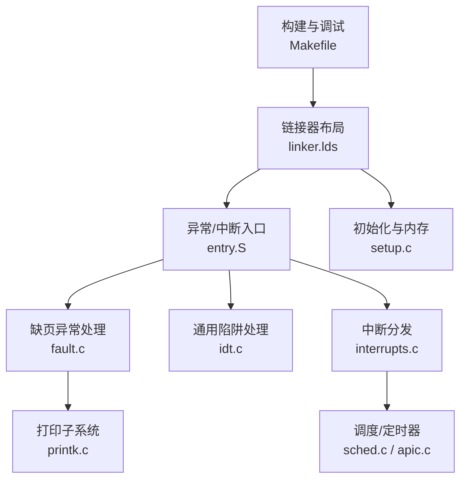
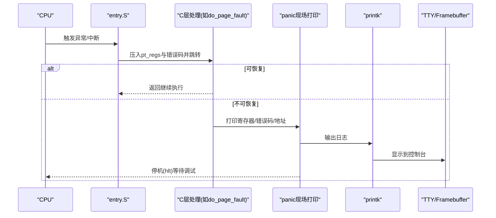
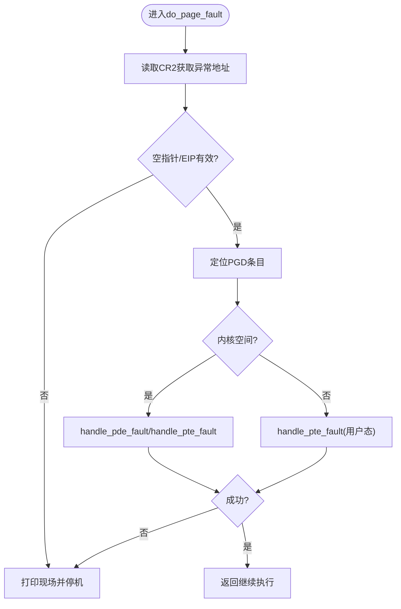
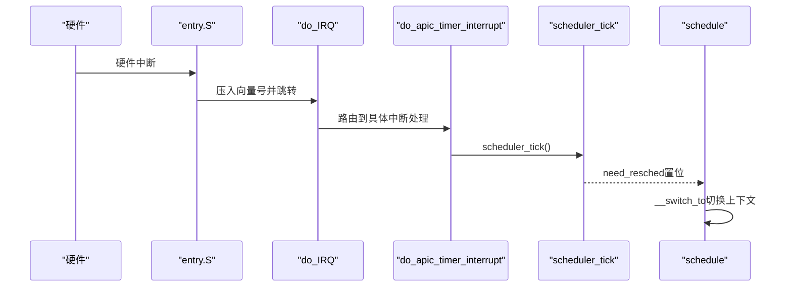
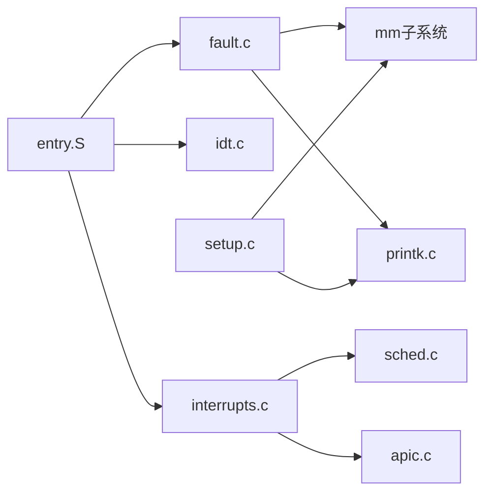

# 调试与故障排除

<cite>
**本文引用的文件**
- [README.md](file://README.md)
- [Makefile](file://Makefile)
- [bochs.cfg](file://bochs.cfg)
- [bochsrc.bxrc](file://bochsrc.bxrc)
- [linker.lds](file://linker.lds)
- [entry.S](file://arch/x86/entry.S)
- [fault.c](file://arch/x86/kernel/mm/fault.c)
- [printk.c](file://kernel/printk.c)
- [printk.h](file://includes/printk.h)
- [interrupts.c](file://kernel/interrupts/interrupts.c)
- [idt.c](file://arch/x86/kernel/idt.c)
- [ptrace.h](file://includes/arch/x86/ptrace.h)
- [setup.c](file://arch/x86/kernel/setup.c)
- [sched.c](file://kernel/sched.c)
- [apic.c](file://arch/x86/kernel/apic.c)
</cite>

## 目录
1. [简介](#简介)
2. [项目结构](#项目结构)
3. [核心组件](#核心组件)
4. [架构总览](#架构总览)
5. [详细组件分析](#详细组件分析)
6. [依赖关系分析](#依赖关系分析)
7. [性能考虑](#性能考虑)
8. [故障排除指南](#故障排除指南)
9. [结论](#结论)
10. [附录](#附录)

## 简介
本指南面向LulaOS开发者，提供系统化的内核调试与故障排除方法。内容涵盖：
- 使用GDB进行内核级调试（断点、变量查看、堆栈跟踪）
- Bochs模拟器的调试功能与配置要点
- 常见内核错误诊断与修复思路（空指针异常、页错误、死锁等）
- 日志输出技巧与性能分析手段
- 从问题定位到解决的标准流程

## 项目结构
LulaOS的调试相关能力由构建脚本、链接器布局、中断/异常入口、内存管理、打印子系统共同构成。关键路径如下：
- 构建与调试目标：通过Makefile提供debug-qemu与debug-bochs目标，生成带调试符号的内核镜像并启动调试会话
- 链接器布局：定义内核加载地址与各段边界，便于在调试器中解析符号与段信息
- 异常/中断入口：entry.S统一封装异常向量与硬件中断入口，转发至C层处理函数
- 缺页异常：fault.c实现按需分配、写时复制与panic现场打印
- 打印子系统：printk.c提供SMP安全的内核日志输出
- 调度与定时器：sched.c与interrupts.c配合APIC Timer驱动时间片与调度
- 初始化与内存：setup.c完成内存映射与页表建立，为后续调试提供稳定环境

图表来源
- [Makefile:88-112](file://Makefile#L88-L112)
- [linker.lds:1-103](file://linker.lds#L1-L103)
- [entry.S:158-160](file://arch/x86/entry.S#L158-L160)
- [fault.c:182-251](file://arch/x86/kernel/mm/fault.c#L182-L251)
- [printk.c:21-35](file://kernel/printk.c#L21-L35)
- [interrupts.c:84-108](file://kernel/interrupts/interrupts.c#L84-L108)
- [sched.c:136-213](file://kernel/sched.c#L136-L213)
- [setup.c:201-214](file://arch/x86/kernel/setup.c#L201-L214)

章节来源
- [Makefile:88-112](file://Makefile#L88-L112)
- [linker.lds:1-103](file://linker.lds#L1-L103)
- [entry.S:158-160](file://arch/x86/entry.S#L158-L160)
- [fault.c:182-251](file://arch/x86/kernel/mm/fault.c#L182-L251)
- [printk.c:21-35](file://kernel/printk.c#L21-L35)
- [interrupts.c:84-108](file://kernel/interrupts/interrupts.c#L84-L108)
- [sched.c:136-213](file://kernel/sched.c#L136-L213)
- [setup.c:201-214](file://arch/x86/kernel/setup.c#L201-L214)

## 核心组件
- 构建与调试目标
  - all-debug：以-O0和-g编译，生成可调试镜像并导出反汇编
  - debug-qemu：启动QEMU监听端口1234，自动连接GDB远程调试
  - debug-bochs：以Bochs运行并启用调试接口
- 链接器布局
  - 内核加载基址与段划分清晰，便于在调试器中定位代码与数据段
- 异常与中断
  - entry.S将各类异常与中断统一包装，压入pt_regs与错误码后调用C层处理
  - idt.c提供通用陷阱处理，打印寄存器与指令片段
- 缺页异常
  - fault.c实现PTE缺失按需分配、写保护写访问的写时复制、以及无法处理时的panic现场打印
- 打印子系统
  - printk.c使用自旋锁与关中断保证SMP安全输出
- 调度与定时器
  - sched.c实现时间片轮转与上下文切换；interrupts.c中的APIC Timer tick驱动调度
- 初始化与内存
  - setup.c负责拷贝Multiboot信息、建立页表与帧缓冲控制台，为调试提供稳定的I/O环境

章节来源
- [Makefile:88-112](file://Makefile#L88-L112)
- [linker.lds:1-103](file://linker.lds#L1-L103)
- [entry.S:158-160](file://arch/x86/entry.S#L158-L160)
- [idt.c:173-205](file://arch/x86/kernel/idt.c#L173-L205)
- [fault.c:96-171](file://arch/x86/kernel/mm/fault.c#L96-L171)
- [printk.c:21-35](file://kernel/printk.c#L21-L35)
- [interrupts.c:116-128](file://kernel/interrupts/interrupts.c#L116-L128)
- [sched.c:223-237](file://kernel/sched.c#L223-L237)
- [setup.c:201-214](file://arch/x86/kernel/setup.c#L201-L214)

## 架构总览
下图展示从异常触发到内核处理的完整链路，包括GDB/Bochs调试接入点。

图表来源
- [entry.S:158-160](file://arch/x86/entry.S#L158-L160)
- [fault.c:182-251](file://arch/x86/kernel/mm/fault.c#L182-L251)
- [printk.c:21-35](file://kernel/printk.c#L21-L35)
- [setup.c:201-214](file://arch/x86/kernel/setup.c#L201-L214)

## 详细组件分析

### 使用GDB进行内核调试
- 准备阶段
  - 使用all-debug目标编译，确保包含调试符号
  - 使用debug-qemu目标启动QEMU并在1234端口监听GDB远程连接
- 连接与基础操作
  - 启动GDB并连接到localhost:1234
  - 设置断点：在内核函数或异常入口处设置断点（例如缺页处理入口）
  - 单步执行：使用step/next逐步执行
  - 查看变量：在断点处查看寄存器与局部变量
  - 堆栈跟踪：使用backtrace查看调用链
- 关键断点建议
  - 缺页异常入口：entry.S中的page_fault桩
  - 缺页主处理：do_page_fault
  - 通用陷阱处理：idt.c中的do_trap
  - APIC Timer中断：do_apic_timer_interrupt
  - 调度器：schedule与scheduler_tick
- 常见问题定位
  - 若崩溃发生在早期初始化阶段，优先检查setup_arch与页表建立
  - 若频繁触发缺页，关注handle_pte_fault分支与内存分配失败路径

章节来源
- [Makefile:88-112](file://Makefile#L88-L112)
- [entry.S:158-160](file://arch/x86/entry.S#L158-L160)
- [fault.c:182-251](file://arch/x86/kernel/mm/fault.c#L182-L251)
- [idt.c:173-205](file://arch/x86/kernel/idt.c#L173-L205)
- [interrupts.c:116-128](file://kernel/interrupts/interrupts.c#L116-L128)
- [sched.c:136-213](file://kernel/sched.c#L136-L213)

### Bochs模拟器调试与配置
- 配置文件
  - bochs.cfg：指定磁盘镜像、内存大小、VGA扩展、日志输出与显示库
  - bochsrc.bxrc：更详细的Bochs配置，包含插件控制、PCI、CPU特性、调试选项等
- 调试功能
  - 启用调试器与GUI调试界面
  - 支持magic_break与端口调试
  - 可通过命令行参数选择配置文件
- 常用命令
  - 启动：make debug-bochs
  - 在Bochs GUI中设置断点、查看寄存器、单步执行
  - 查看日志：bochs.log记录Bochs内部事件

章节来源
- [bochs.cfg:1-7](file://bochs.cfg#L1-L7)
- [bochsrc.bxrc:1-59](file://bochsrc.bxrc#L1-L59)
- [Makefile:111-112](file://Makefile#L111-L112)

### 缺页异常处理流程
- 触发路径
  - CPU触发#PF，entry.S的page_fault桩跳转到do_page_fault
- 处理逻辑
  - 读取CR2获取异常地址
  - 快速校验空指针与EIP有效性
  - 定位PGD条目，分派到handle_pde_fault或handle_pte_fault
  - PTE缺失：按需分配物理页并建立映射
  - 写保护写访问：写时复制新页并替换PTE
  - 无法处理：打印完整现场并停机
- 调试要点
  - 在do_page_fault与handle_pte_fault设置断点
  - 观察error_code位域判断读/写、用户态/内核态、是否取指
  - 检查内存分配失败路径与TLB刷新

图表来源
- [fault.c:182-251](file://arch/x86/kernel/mm/fault.c#L182-L251)
- [fault.c:96-171](file://arch/x86/kernel/mm/fault.c#L96-L171)

章节来源
- [fault.c:96-171](file://arch/x86/kernel/mm/fault.c#L96-L171)
- [fault.c:182-251](file://arch/x86/kernel/mm/fault.c#L182-L251)

### 中断与调度协作
- 中断入口
  - entry.S为每个外部中断向量生成独立入口，压入向量号并调用do_IRQ
  - do_IRQ发送EOI、查找并调用注册的handler，未注册则打印警告
- 定时器Tick
  - APIC Timer中断调用scheduler_tick递减时间片，必要时置need_resched
- 调度器
  - schedule在ret_from_intr或cpu_idle中被调用，选择counter最大的任务并执行__switch_to
- 调试要点
  - 在do_IRQ、scheduler_tick、schedule设置断点
  - 观察need_resched标志与runqueue状态
  - 检查APIC Timer校准与中断使能

图表来源
- [entry.S:191-206](file://arch/x86/entry.S#L191-L206)
- [interrupts.c:84-108](file://kernel/interrupts/interrupts.c#L84-L108)
- [interrupts.c:116-128](file://kernel/interrupts/interrupts.c#L116-L128)
- [sched.c:136-213](file://kernel/sched.c#L136-L213)

章节来源
- [entry.S:191-206](file://arch/x86/entry.S#L191-L206)
- [interrupts.c:84-108](file://kernel/interrupts/interrupts.c#L84-L108)
- [interrupts.c:116-128](file://kernel/interrupts/interrupts.c#L116-L128)
- [sched.c:136-213](file://kernel/sched.c#L136-L213)

### 打印子系统与日志技巧
- SMP安全
  - printk使用spinlock_irqsave/restore避免多核并发破坏缓冲区与TTY
- 输出目标
  - 通过tty_put_string输出到Framebuffer或串口
- 调试技巧
  - 在关键路径插入printk，注意关闭中断与加锁
  - 利用Bochs日志与QEMU监控输出辅助定位
  - 结合GDB查看寄存器与内存快照

章节来源
- [printk.c:21-35](file://kernel/printk.c#L21-L35)
- [setup.c:201-214](file://arch/x86/kernel/setup.c#L201-L214)

## 依赖关系分析
- 模块耦合
  - entry.S强依赖各异常处理函数符号（do_page_fault、do_*_trap等）
  - fault.c依赖mm子系统（页表操作、内存分配）与printk
  - interrupts.c依赖APIC与调度器
  - sched.c依赖底层原子操作与页表切换
- 外部依赖
  - QEMU/Bochs用于仿真与调试
  - GDB用于远程调试与分析
- 潜在循环依赖
  - 初始化顺序需严格遵循：先建立页表与打印，再注册设备与驱动

图表来源
- [entry.S:158-160](file://arch/x86/entry.S#L158-L160)
- [fault.c:182-251](file://arch/x86/kernel/mm/fault.c#L182-L251)
- [interrupts.c:84-108](file://kernel/interrupts/interrupts.c#L84-L108)
- [setup.c:201-214](file://arch/x86/kernel/setup.c#L201-L214)

章节来源
- [entry.S:158-160](file://arch/x86/entry.S#L158-L160)
- [fault.c:182-251](file://arch/x86/kernel/mm/fault.c#L182-L251)
- [interrupts.c:84-108](file://kernel/interrupts/interrupts.c#L84-L108)
- [setup.c:201-214](file://arch/x86/kernel/setup.c#L201-L214)

## 性能考虑
- 编译优化
  - 调试构建使用-O0与-g，便于源码级调试；生产构建可使用更高优化级别
- 调度开销
  - scheduler_tick每次tick可能触发调度，需避免在ISR中进行耗时操作
- 内存分配
  - 缺页处理中的页面分配失败会直接panic，需关注内存压力与碎片
- I/O瓶颈
  - printk在高频率下可能阻塞，建议在热点路径减少日志输出或使用异步方式

[本节为通用指导，不直接分析具体文件]

## 故障排除指南

### 空指针异常
- 现象
  - 触发通用陷阱或页错误，EIP指向空地址附近
- 定位
  - 在do_trap或do_page_fault设置断点，查看regs->eip与错误码
  - 检查调用链，确认解引用前的指针来源
- 修复
  - 增加空指针校验与错误返回
  - 确保数据结构初始化顺序正确

章节来源
- [idt.c:173-205](file://arch/x86/kernel/idt.c#L173-L205)
- [fault.c:182-251](file://arch/x86/kernel/mm/fault.c#L182-L251)

### 页错误
- 现象
  - #PF触发，error_code指示读/写、用户/内核、是否存在
- 定位
  - 在do_page_fault与handle_pte_fault设置断点
  - 检查CR2地址、PGD/PTE状态与内存分配结果
- 修复
  - 按需分配缺失页面或修正映射
  - 对写时复制场景确保旧页内容正确复制

章节来源
- [fault.c:96-171](file://arch/x86/kernel/mm/fault.c#L96-L171)
- [fault.c:182-251](file://arch/x86/kernel/mm/fault.c#L182-L251)

### 死锁问题
- 现象
  - 系统无响应，可能因自旋锁持有期间再次尝试获取同一把锁
- 定位
  - 在printk与调度器中检查锁持有范围
  - 使用GDB查看当前任务状态与锁持有者
- 修复
  - 缩短临界区，避免在持有锁时调用可能阻塞的函数
  - 使用irqsave/restore防止同CPU中断重入导致死锁

章节来源
- [printk.c:21-35](file://kernel/printk.c#L21-L35)
- [sched.c:136-213](file://kernel/sched.c#L136-L213)

### 中断未注册或丢失
- 现象
  - 设备无响应，do_IRQ打印未注册警告
- 定位
  - 检查request/free_irq调用与IOAPIC使能
  - 在do_IRQ与具体handler设置断点
- 修复
  - 确保驱动正确注册中断并释放资源
  - 检查硬件中断线与优先级配置

章节来源
- [interrupts.c:84-108](file://kernel/interrupts/interrupts.c#L84-L108)

### 定时器与调度异常
- 现象
  - 系统不切换任务，或idle循环不退出
- 定位
  - 在scheduler_tick与cpu_idle设置断点
  - 检查APIC Timer校准与中断使能
- 修复
  - 修正定时器初始化与LVT配置
  - 确保need_resched被正确置位与清除

章节来源
- [interrupts.c:116-128](file://kernel/interrupts/interrupts.c#L116-L128)
- [sched.c:223-237](file://kernel/sched.c#L223-L237)
- [apic.c:136-174](file://arch/x86/kernel/apic.c#L136-L174)

## 结论
LulaOS提供了完善的内核调试基础设施：通过Makefile目标快速搭建GDB/Bochs调试环境，借助entry.S的统一异常入口与fault.c的缺页处理，结合printk的SMP安全日志，能够高效定位与解决问题。建议开发者在关键路径设置断点与日志，结合寄存器与内存快照进行分析，遵循“最小化变更、逐步验证”的原则修复问题。

[本节为总结性内容，不直接分析具体文件]

## 附录
- 常用调试命令
  - GDB：break、continue、step、next、print、bt、info registers、x/10i $eip
  - QEMU：monitor telnet端口查看状态
  - Bochs：GUI断点、寄存器窗口、日志文件
- 参考目标
  - make all-debug：生成调试镜像
  - make debug-qemu：启动QEMU+GDB
  - make debug-bochs：启动Bochs

章节来源
- [Makefile:88-112](file://Makefile#L88-L112)
- [README.md:15-81](file://README.md#L15-L81)