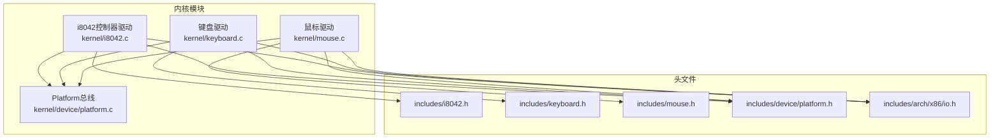
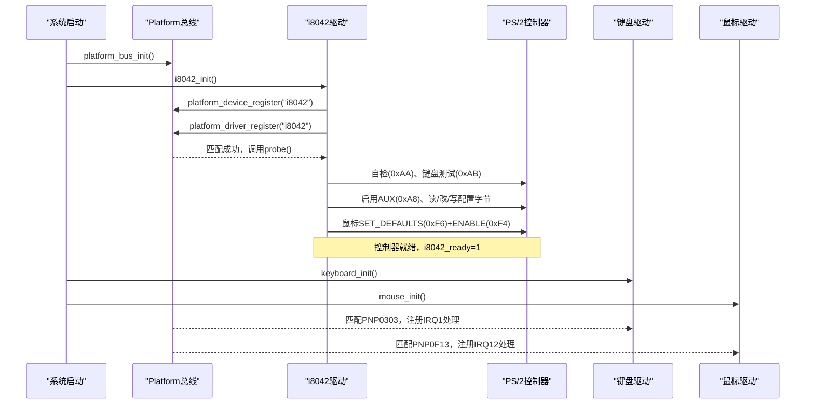
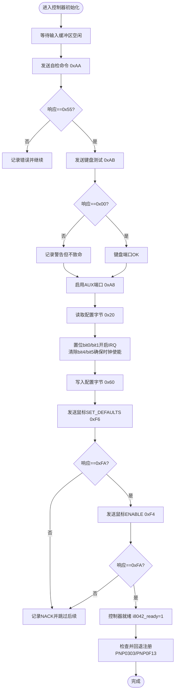
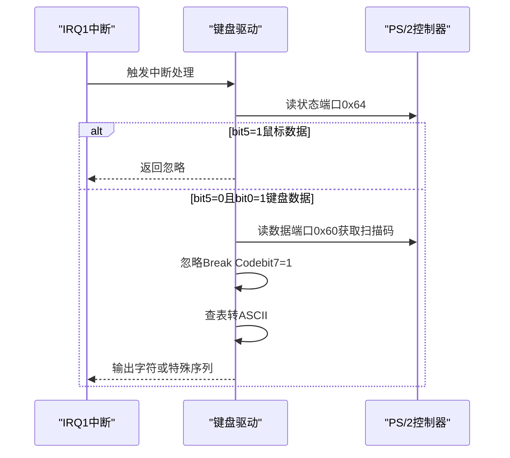
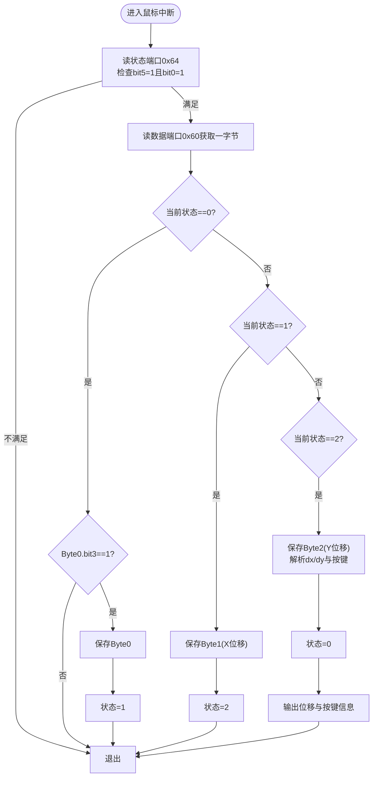
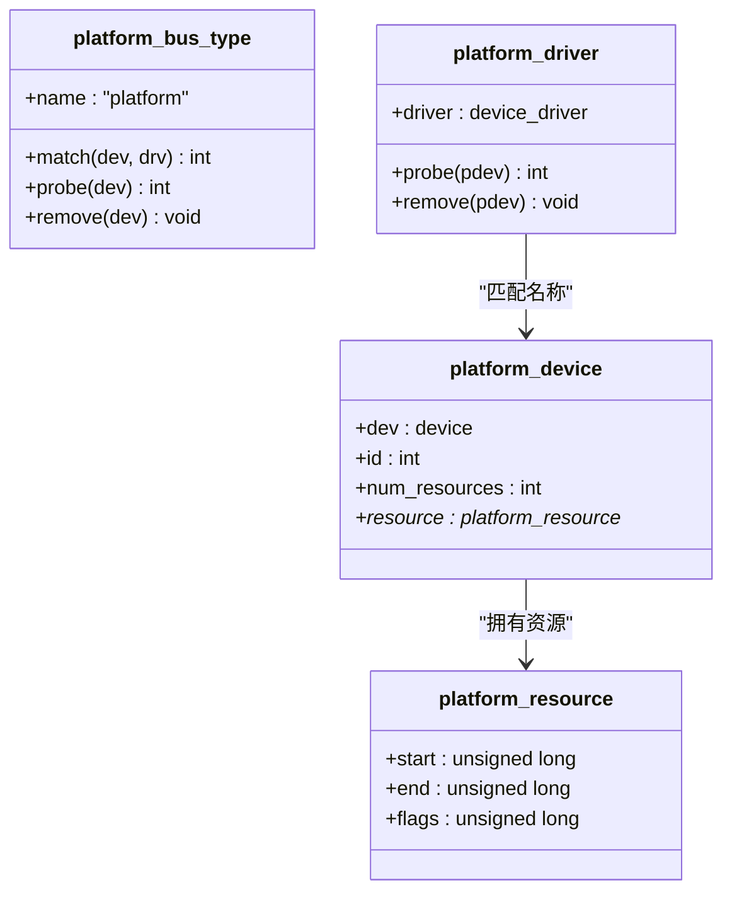
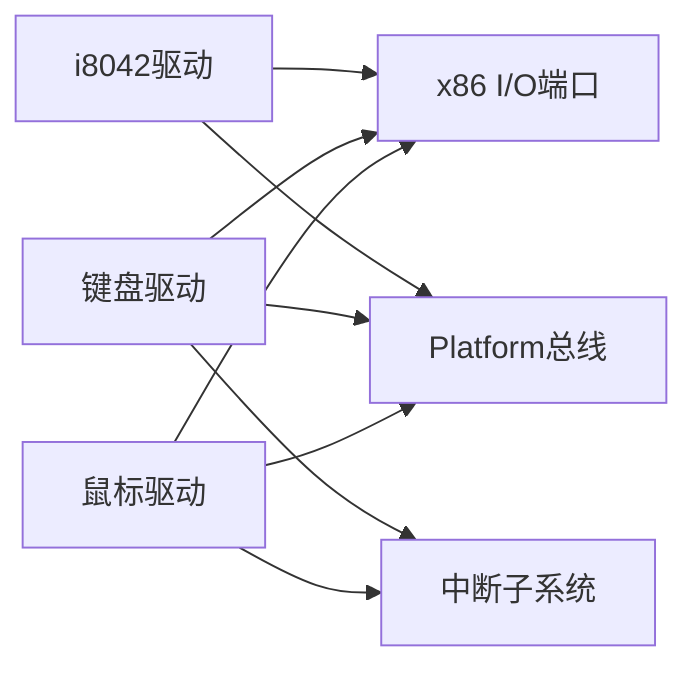

# PS/2控制器驱动

<cite>
**本文引用的文件**
- [kernel/i8042.c](file://kernel/i8042.c)
- [includes/i8042.h](file://includes/i8042.h)
- [kernel/keyboard.c](file://kernel/keyboard.c)
- [includes/keyboard.h](file://includes/keyboard.h)
- [kernel/mouse.c](file://kernel/mouse.c)
- [includes/mouse.h](file://includes/mouse.h)
- [kernel/device/platform.c](file://kernel/device/platform.c)
- [includes/device/platform.h](file://includes/device/platform.h)
- [includes/arch/x86/io.h](file://includes/arch/x86/io.h)
</cite>

## 目录
1. [简介](#简介)
2. [项目结构](#项目结构)
3. [核心组件](#核心组件)
4. [架构总览](#架构总览)
5. [详细组件分析](#详细组件分析)
6. [依赖关系分析](#依赖关系分析)
7. [性能考虑](#性能考虑)
8. [故障排除指南](#故障排除指南)
9. [结论](#结论)
10. [附录](#附录)

## 简介
本文件为LulaOS中PS/2控制器（i8042）驱动的完整技术文档。内容涵盖：
- PS/2控制器的硬件架构与端口定义（数据端口0x60、状态/命令端口0x64）
- 控制器初始化流程：自检、键盘端口检测、AUX端口启用、配置字节修改、鼠标初始化
- 键盘与鼠标通信协议：命令发送、响应读取、超时处理机制
- 控制器调试方法与常见故障排除
- Platform设备注册与设备发现机制的实现细节

该驱动采用Platform总线模型，将i8042作为平台设备注册，在probe阶段完成全部硬件初始化；键盘与鼠标分别以独立的Platform驱动匹配ACPI或回退设备，并在probe中注册中断处理函数。

## 项目结构
与PS/2相关的关键文件组织如下：
- i8042控制器驱动：kernel/i8042.c，接口声明 includes/i8042.h
- 键盘驱动：kernel/keyboard.c，接口声明 includes/keyboard.h
- 鼠标驱动：kernel/mouse.c，接口声明 includes/mouse.h
- Platform总线实现：kernel/device/platform.c，接口声明 includes/device/platform.h
- x86 I/O端口访问：includes/arch/x86/io.h

图表来源
- [kernel/i8042.c:18-22](file://kernel/i8042.c#L18-L22)
- [kernel/device/platform.c:9-12](file://kernel/device/platform.c#L9-L12)
- [includes/arch/x86/io.h:5-13](file://includes/arch/x86/io.h#L5-L13)

章节来源
- [kernel/i8042.c:1-303](file://kernel/i8042.c#L1-L303)
- [kernel/device/platform.c:1-160](file://kernel/device/platform.c#L1-L160)
- [includes/device/platform.h:1-84](file://includes/device/platform.h#L1-L84)
- [includes/arch/x86/io.h:1-36](file://includes/arch/x86/io.h#L1-L36)

## 核心组件
- i8042控制器驱动：负责PS/2控制器的I/O端口访问、命令下发、状态轮询、超时处理、配置字节读写、鼠标初始化，以及子设备回退注册。
- 键盘驱动：匹配PNP0303设备，从资源获取IRQ并注册中断处理函数，读取扫描码转换为ASCII输出。
- 鼠标驱动：匹配PNP0F13设备，从资源获取IRQ并注册中断处理函数，解析3字节数据包并输出位移和按键状态。
- Platform总线：提供设备/驱动注册、名称匹配、probe转发和资源查询能力。
- x86 I/O端口访问：通过内联汇编提供inb/outb等底层I/O操作。

章节来源
- [kernel/i8042.c:24-46](file://kernel/i8042.c#L24-L46)
- [kernel/keyboard.c:24-31](file://kernel/keyboard.c#L24-L31)
- [kernel/mouse.c:26-32](file://kernel/mouse.c#L26-L32)
- [includes/device/platform.h:23-81](file://includes/device/platform.h#L23-L81)
- [includes/arch/x86/io.h:5-13](file://includes/arch/x86/io.h#L5-L13)

## 架构总览
PS/2控制器通过共享的I/O端口0x60（数据）和0x64（状态/命令）管理键盘与鼠标两个通道。控制器在启动时执行自检与端口检测，启用AUX端口，修改配置字节开启中断，并对鼠标进行默认设置与启用。键盘与鼠标驱动通过Platform总线匹配设备后注册各自的中断处理函数，在中断服务程序中读取端口数据并进行相应处理。

图表来源
- [kernel/i8042.c:283-302](file://kernel/i8042.c#L283-L302)
- [kernel/device/platform.c:70-114](file://kernel/device/platform.c#L70-L114)
- [kernel/keyboard.c:197-234](file://kernel/keyboard.c#L197-L234)
- [kernel/mouse.c:129-166](file://kernel/mouse.c#L129-L166)

## 详细组件分析

### i8042控制器驱动
职责与关键点：
- I/O端口定义：数据端口0x60，状态/命令端口0x64
- 控制器命令：自检0xAA、键盘测试0xAB、启用AUX 0xA8、读/写配置字节0x20/0x60、向鼠标发送命令前缀0xD4
- 等待与超时：输入缓冲区空闲（bit1=1表示满）、输出缓冲区就绪（bit0=1表示有数据），使用固定超时计数避免死等
- 初始化流程：
  - 控制器自检，期望响应0x55
  - 键盘端口检测，期望响应0x00（失败不致命）
  - 启用AUX端口
  - 读取配置字节，置位bit0/bit1开启键盘IRQ1与鼠标IRQ12，并确保时钟未禁用
  - 鼠标初始化：SET_DEFAULTS(0xF6)与ENABLE(0xF4)，期望响应0xFA
- 子设备回退注册：若ACPI未发现PNP0303/PNP0F13，则动态注册回退设备，确保键盘/鼠标可用
- Platform设备/驱动：注册名为“i8042”的设备与驱动，probe中执行控制器初始化

图表来源
- [kernel/i8042.c:56-109](file://kernel/i8042.c#L56-L109)
- [kernel/i8042.c:128-220](file://kernel/i8042.c#L128-L220)
- [kernel/i8042.c:253-263](file://kernel/i8042.c#L253-L263)

章节来源
- [kernel/i8042.c:24-46](file://kernel/i8042.c#L24-L46)
- [kernel/i8042.c:56-109](file://kernel/i8042.c#L56-L109)
- [kernel/i8042.c:128-220](file://kernel/i8042.c#L128-L220)
- [kernel/i8042.c:253-263](file://kernel/i8042.c#L253-L263)
- [includes/i8042.h:21-30](file://includes/i8042.h#L21-L30)

### 键盘驱动
职责与关键点：
- 端口访问：通过状态端口0x64判断数据来源（bit5=1为鼠标，应忽略），数据端口0x60读取扫描码
- 中断处理：在IRQ1向量处注册处理函数，读取扫描码，忽略Break Code（bit7=1），查表转换为ASCII并输出
- 扫描码映射：Set 1编码，Make Code范围0x01~0x58，功能键/修饰键静默忽略
- Platform驱动：匹配PNP0303，从资源获取IRQ并计算中断向量，注册中断处理函数

图表来源
- [kernel/keyboard.c:140-182](file://kernel/keyboard.c#L140-L182)
- [kernel/keyboard.c:197-234](file://kernel/keyboard.c#L197-L234)

章节来源
- [kernel/keyboard.c:24-31](file://kernel/keyboard.c#L24-L31)
- [kernel/keyboard.c:140-182](file://kernel/keyboard.c#L140-L182)
- [kernel/keyboard.c:197-234](file://kernel/keyboard.c#L197-L234)
- [includes/keyboard.h:14-22](file://includes/keyboard.h#L14-L22)

### 鼠标驱动
职责与关键点：
- 端口访问：状态端口0x64判断数据来源（bit5=1且bit0=1为鼠标数据），数据端口0x60读取字节
- 数据包解析：标准3字节包，Byte0包含溢出/符号/按键信息，Byte1为X位移，Byte2为Y位移；Byte0.bit3必须为1用于同步
- 状态机：按0/1/2循环收集三字节，收齐后解析位移与按键并输出
- Platform驱动：匹配PNP0F13，从资源获取IRQ并计算中断向量，注册中断处理函数

图表来源
- [kernel/mouse.c:52-113](file://kernel/mouse.c#L52-L113)
- [kernel/mouse.c:129-166](file://kernel/mouse.c#L129-L166)

章节来源
- [kernel/mouse.c:26-32](file://kernel/mouse.c#L26-L32)
- [kernel/mouse.c:52-113](file://kernel/mouse.c#L52-L113)
- [kernel/mouse.c:129-166](file://kernel/mouse.c#L129-L166)
- [includes/mouse.h:14-22](file://includes/mouse.h#L14-L22)

### Platform设备注册与设备发现
- Platform总线：提供bus_type、match/probe/remove、设备/驱动注册、资源查询等能力
- i8042设备/驱动：注册名为“i8042”的平台设备与驱动，probe中执行控制器初始化
- 键盘/鼠标设备：优先由ACPI DSDT枚举；若未发现，则由i8042控制器驱动回退注册PNP0303/PNP0F13设备
- 资源描述：I/O端口范围与IRQ号通过platform_resource描述，驱动通过platform_get_resource获取

图表来源
- [kernel/device/platform.c:15-77](file://kernel/device/platform.c#L15-L77)
- [kernel/device/platform.c:84-114](file://kernel/device/platform.c#L84-L114)
- [includes/device/platform.h:28-81](file://includes/device/platform.h#L28-L81)

章节来源
- [kernel/device/platform.c:15-160](file://kernel/device/platform.c#L15-L160)
- [includes/device/platform.h:1-84](file://includes/device/platform.h#L1-L84)
- [kernel/i8042.c:253-263](file://kernel/i8042.c#L253-L263)

## 依赖关系分析
- i8042驱动依赖：
  - Platform总线：设备/驱动注册与匹配
  - x86 I/O端口：inb/outb访问控制器端口
  - 打印接口：printk用于调试与日志
- 键盘/鼠标驱动依赖：
  - Platform总线：匹配设备并获取IRQ资源
  - 中断子系统：request_irq注册中断处理
  - x86 I/O端口：读取状态与数据端口
- 耦合与内聚：
  - i8042与键盘/鼠标通过共享端口与中断解耦，仅通过全局标志i8042_ready协调
  - Platform总线提供统一设备模型，降低具体设备与驱动之间的耦合

图表来源
- [kernel/i8042.c:18-22](file://kernel/i8042.c#L18-L22)
- [kernel/keyboard.c:16-22](file://kernel/keyboard.c#L16-L22)
- [kernel/mouse.c:18-24](file://kernel/mouse.c#L18-L24)
- [includes/arch/x86/io.h:5-13](file://includes/arch/x86/io.h#L5-L13)

章节来源
- [kernel/i8042.c:18-22](file://kernel/i8042.c#L18-L22)
- [kernel/keyboard.c:16-22](file://kernel/keyboard.c#L16-L22)
- [kernel/mouse.c:18-24](file://kernel/mouse.c#L18-L24)
- [includes/arch/x86/io.h:5-13](file://includes/arch/x86/io.h#L5-L13)

## 性能考虑
- 超时机制：所有等待操作均使用固定超时计数，避免无限阻塞导致系统挂起
- 最小化中断负载：键盘驱动仅输出可打印字符与必要控制序列；鼠标驱动仅在位移或按键变化时输出
- 状态寄存器快速判断：通过bit5区分数据来源，减少不必要的数据读取
- 配置字节一次性修改：集中开启中断与时钟，减少多次I/O开销

[本节为通用性能建议，不直接分析具体文件]

## 故障排除指南
常见问题与定位方法：
- 控制器自检失败（响应非0x55）：检查控制器是否就绪、I/O端口是否被占用、BIOS/固件是否禁用PS/2控制器
- 键盘端口测试失败（响应非0x00）：可能无键盘连接或控制器异常，不影响后续流程但需关注
- AUX端口启用失败：确认AUX未被禁用，检查配置字节与时钟位
- 配置字节读写失败：确认读/写顺序正确，先读再改再写，注意bit4/bit5时钟使能位
- 鼠标初始化NACK（非0xFA）：可能无鼠标或鼠标不支持默认命令，可跳过后续步骤
- 键盘中断无响应：确认IRQ1已注册、状态寄存器bit5不为1（避免误取鼠标数据）、扫描码映射是否正确
- 鼠标数据包不同步：确认Byte0.bit3为1，否则丢弃；检查状态机状态切换逻辑

调试建议：
- 启用详细日志：观察各阶段输出，定位失败点
- 检查Platform设备匹配：确认PNP0303/PNP0F13设备是否存在（ACPI或回退注册）
- 验证中断向量：确认FIRST_DEVICE_VECTOR与IRQ组合得到的向量正确
- 使用Bochs/QEMU仿真环境：便于观察I/O端口与中断行为

章节来源
- [kernel/i8042.c:133-220](file://kernel/i8042.c#L133-L220)
- [kernel/keyboard.c:150-182](file://kernel/keyboard.c#L150-L182)
- [kernel/mouse.c:63-113](file://kernel/mouse.c#L63-L113)

## 结论
LulaOS的PS/2控制器驱动基于Platform总线模型，实现了完整的控制器初始化、键盘与鼠标通信协议支持以及设备发现与回退机制。通过严格的超时处理与状态检查，保证了系统的稳定性与可调试性。键盘与鼠标驱动职责清晰，仅负责中断处理与数据解析，降低了耦合度。整体设计简洁可靠，适合在嵌入式或教学操作系统环境中使用。

[本节为总结性内容，不直接分析具体文件]

## 附录
- 端口定义：
  - 数据端口：0x60
  - 状态/命令端口：0x64
- 关键命令：
  - 自检：0xAA → 期望0x55
  - 键盘测试：0xAB → 期望0x00
  - 启用AUX：0xA8
  - 读配置：0x20
  - 写配置：0x60
  - 鼠标命令前缀：0xD4
  - 鼠标SET_DEFAULTS：0xF6 → 期望0xFA
  - 鼠标ENABLE：0xF4 → 期望0xFA
- 中断与向量：
  - 键盘：IRQ1 → 向量FIRST_DEVICE_VECTOR+1
  - 鼠标：IRQ12 → 向量FIRST_DEVICE_VECTOR+12

[本节为参考信息汇总，不直接分析具体文件]