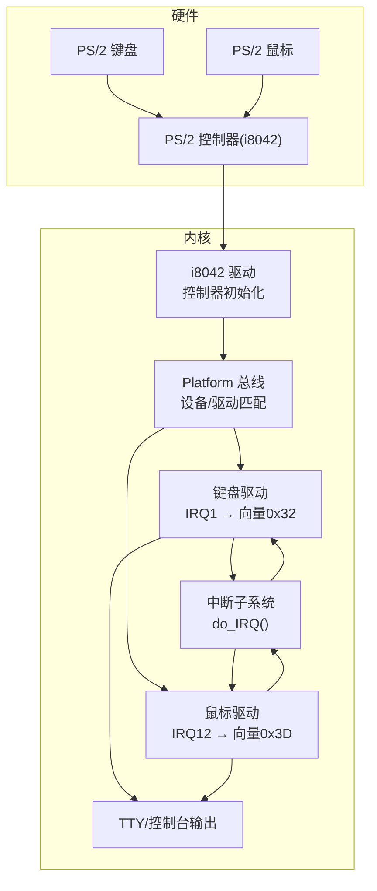
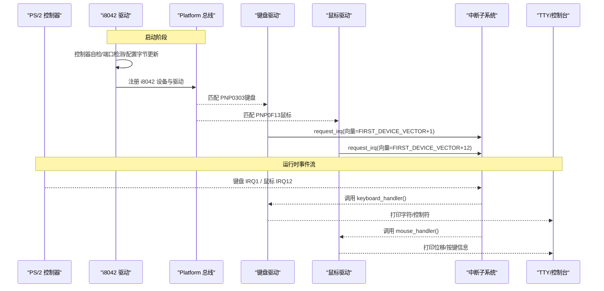
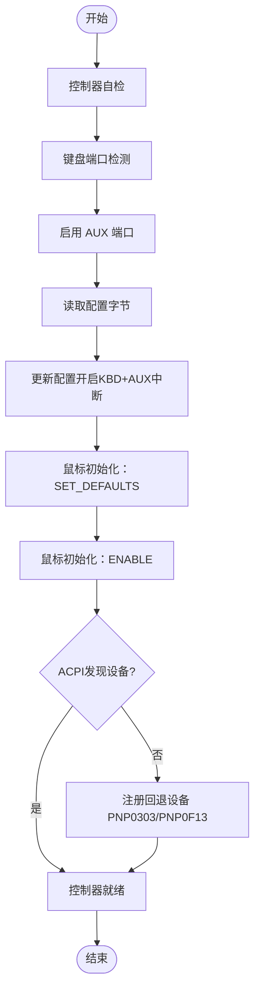
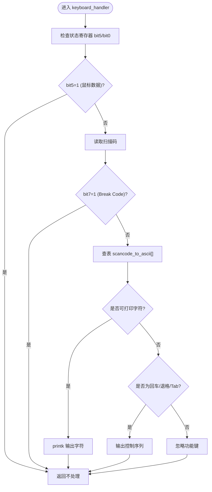
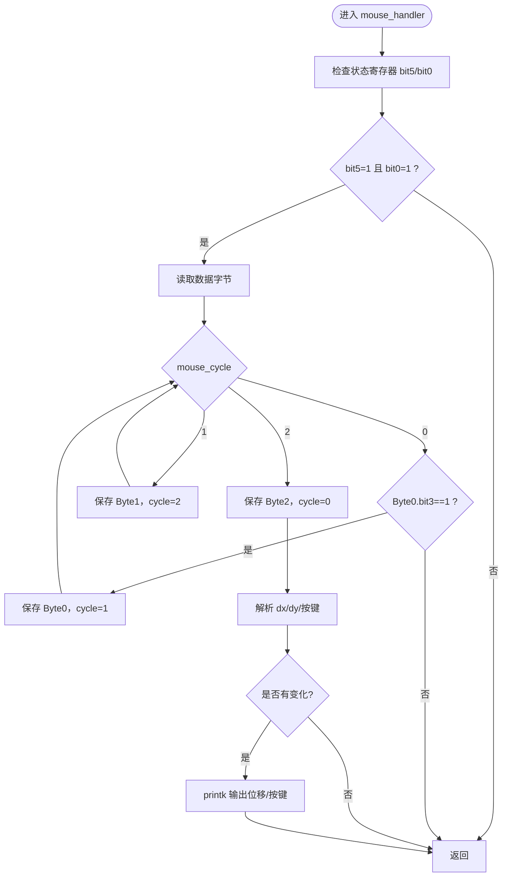
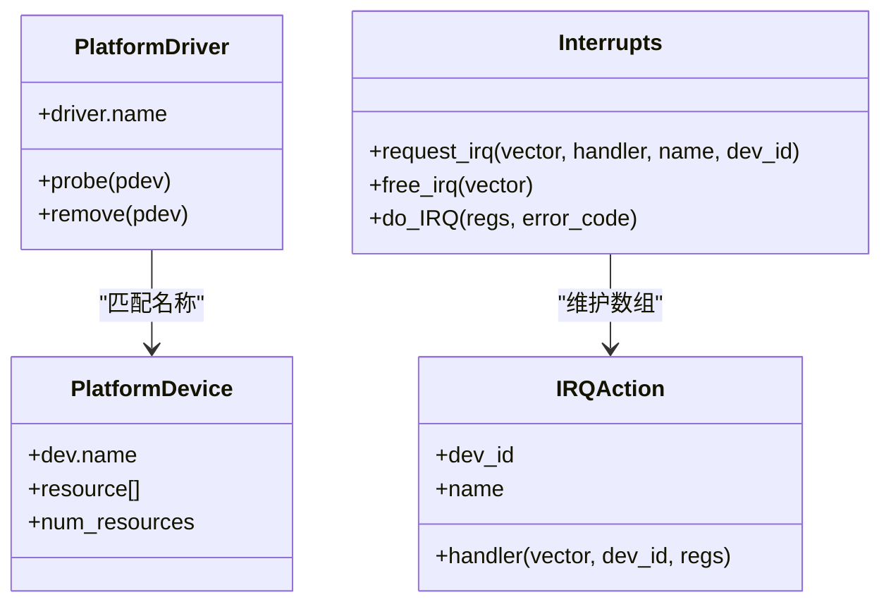
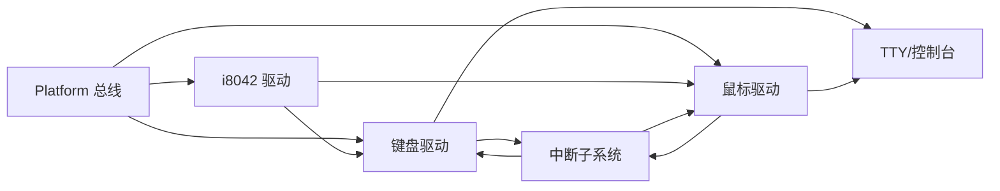

# 输入子系统

<cite>
**本文引用的文件**
- [kernel/i8042.c](file://kernel/i8042.c)
- [includes/i8042.h](file://includes/i8042.h)
- [kernel/keyboard.c](file://kernel/keyboard.c)
- [includes/keyboard.h](file://includes/keyboard.h)
- [kernel/mouse.c](file://kernel/mouse.c)
- [includes/mouse.h](file://includes/mouse.h)
- [kernel/interrupts/interrupts.c](file://kernel/interrupts/interrupts.c)
- [kernel/tty/tty.c](file://kernel/tty/tty.c)
- [includes/tty/tty.h](file://includes/tty/tty.h)
- [kernel/kernel.c](file://kernel/kernel.c)
- [kernel/device/platform.c](file://kernel/device/platform.c)
- [includes/device/platform.h](file://includes/device/platform.h)
</cite>

## 目录
1. [简介](#简介)
2. [项目结构](#项目结构)
3. [核心组件](#核心组件)
4. [架构总览](#架构总览)
5. [详细组件分析](#详细组件分析)
6. [依赖关系分析](#依赖关系分析)
7. [性能考虑](#性能考虑)
8. [故障排查指南](#故障排查指南)
9. [结论](#结论)
10. [附录：扩展开发与调试示例](#附录：扩展开发与调试示例)

## 简介
本文件为 LulaOS 输入子系统的完整技术文档，聚焦 PS/2 控制器（i8042）驱动与键盘、鼠标驱动的协同工作。内容涵盖：
- PS/2 控制器的初始化流程（自检、端口检测、配置字节读写、鼠标默认设置与启用）
- 键盘中断处理、扫描码到 ASCII 的转换机制
- 鼠标数据包解析、移动与点击事件捕获
- 输入设备的中断分发路径与平台总线匹配机制
- 用户态接口现状与扩展建议
- 面向设备开发者的扩展指南、示例与调试技巧

## 项目结构
输入子系统由三层组成：
- 硬件抽象层：PS/2 控制器 i8042 驱动，负责控制器自检、端口启用、配置字节读写、鼠标初始化
- 设备驱动层：键盘与鼠标 Platform 驱动，注册中断处理函数，完成数据读取与解析
- 系统支撑层：Platform 总线、中断子系统、TTY/控制台输出

图表来源
- [kernel/i8042.c:128-220](file://kernel/i8042.c#L128-L220)
- [kernel/keyboard.c:140-182](file://kernel/keyboard.c#L140-L182)
- [kernel/mouse.c:52-113](file://kernel/mouse.c#L52-L113)
- [kernel/interrupts/interrupts.c:84-108](file://kernel/interrupts/interrupts.c#L84-L108)
- [kernel/device/platform.c:25-50](file://kernel/device/platform.c#L25-L50)

章节来源
- [kernel/kernel.c:95-108](file://kernel/kernel.c#L95-L108)
- [kernel/device/platform.c:65-114](file://kernel/device/platform.c#L65-L114)

## 核心组件
- PS/2 控制器驱动（i8042）：完成控制器自检、键盘/AUX 端口检测、配置字节读写、鼠标默认设置与启用，并回退注册键盘/鼠标设备
- 键盘驱动：注册 IRQ1 中断处理，读取扫描码，查表转换为 ASCII，输出到控制台
- 鼠标驱动：注册 IRQ12 中断处理，按状态机解析 3 字节数据包，提取位移与按键状态
- 中断子系统：提供 request_irq/free_irq、do_IRQ 调度至具体 handler
- Platform 总线：通过名称匹配设备与驱动，统一设备模型管理

章节来源
- [kernel/i8042.c:128-220](file://kernel/i8042.c#L128-L220)
- [kernel/keyboard.c:197-218](file://kernel/keyboard.c#L197-L218)
- [kernel/mouse.c:129-150](file://kernel/mouse.c#L129-L150)
- [kernel/interrupts/interrupts.c:40-58](file://kernel/interrupts/interrupts.c#L40-L58)
- [kernel/device/platform.c:25-50](file://kernel/device/platform.c#L25-L50)

## 架构总览
PS/2 控制器作为 Platform 设备注册，probe 时完成全部硬件初始化；键盘与鼠标作为 Platform 驱动，匹配 ACPI 或回退设备后注册中断处理函数。中断到达后，经由 do_IRQ 分发到对应 handler，完成数据读取与解析，并通过 printk/TTY 输出。

图表来源
- [kernel/i8042.c:128-220](file://kernel/i8042.c#L128-L220)
- [kernel/keyboard.c:197-218](file://kernel/keyboard.c#L197-L218)
- [kernel/mouse.c:129-150](file://kernel/mouse.c#L129-L150)
- [kernel/interrupts/interrupts.c:84-108](file://kernel/interrupts/interrupts.c#L84-L108)

## 详细组件分析

### PS/2 控制器（i8042）驱动
职责：
- 控制器自检（期望响应 0x55）
- 键盘端口检测（期望响应 0x00）
- 启用 AUX（鼠标）端口
- 读-改-写配置字节，开启键盘 IRQ1 与鼠标 IRQ12 中断
- 鼠标初始化：SET_DEFAULTS + ENABLE
- 若 ACPI 未发现键盘/鼠标设备，则回退注册 PNP0303/PNP0F13 设备

关键流程：
- 等待输入/输出缓冲区就绪
- 通过命令端口发送指令并读取响应
- 向鼠标发送命令需先写 0xD4 前缀

图表来源
- [kernel/i8042.c:128-220](file://kernel/i8042.c#L128-L220)
- [kernel/i8042.c:253-263](file://kernel/i8042.c#L253-L263)

章节来源
- [kernel/i8042.c:56-109](file://kernel/i8042.c#L56-L109)
- [kernel/i8042.c:128-220](file://kernel/i8042.c#L128-L220)
- [kernel/i8042.c:253-263](file://kernel/i8042.c#L253-L263)
- [includes/i8042.h:21-30](file://includes/i8042.h#L21-L30)

### 键盘驱动
职责：
- 匹配 Platform 设备（PNP0303），从资源获取 IRQ 号并计算中断向量
- 注册 IRQ1 中断处理函数
- 中断中读取扫描码，区分键盘与鼠标数据（状态寄存器 bit5）
- 忽略 Break Code（松开），仅处理 Make Code（按下）
- 将扫描码映射为 ASCII，特殊键（回车、退格、Tab）做相应处理

扫描码到 ASCII 转换：
- 使用 Set 1 扫描码映射表，索引为扫描码值，值为 ASCII 字符
- 功能键/修饰键映射为空字符，静默忽略

图表来源
- [kernel/keyboard.c:140-182](file://kernel/keyboard.c#L140-L182)
- [kernel/keyboard.c:38-128](file://kernel/keyboard.c#L38-L128)

章节来源
- [kernel/keyboard.c:140-182](file://kernel/keyboard.c#L140-L182)
- [kernel/keyboard.c:197-218](file://kernel/keyboard.c#L197-L218)
- [includes/keyboard.h:14-22](file://includes/keyboard.h#L14-L22)

### 鼠标驱动
职责：
- 匹配 Platform 设备（PNP0F13），从资源获取 IRQ 号并计算中断向量
- 注册 IRQ12 中断处理函数
- 中断中读取状态寄存器，确认数据来源为鼠标且有数据可读
- 使用状态机解析 3 字节数据包：
  - Byte 0：同步位 bit3 必须为 1，包含溢出/符号/按键位
  - Byte 1：X 位移（有符号，符号扩展来自 Byte0.bit4）
  - Byte 2：Y 位移（有符号，符号扩展来自 Byte0.bit5）
- 解析按键状态（左/右/中键）

图表来源
- [kernel/mouse.c:52-113](file://kernel/mouse.c#L52-L113)

章节来源
- [kernel/mouse.c:52-113](file://kernel/mouse.c#L52-L113)
- [kernel/mouse.c:129-150](file://kernel/mouse.c#L129-L150)
- [includes/mouse.h:14-22](file://includes/mouse.h#L14-L22)

### 中断分发与平台总线
- 中断子系统维护 irq_action 数组，request_irq 注册 handler 并解除 IOAPIC RTE 屏蔽
- do_IRQ 根据向量号查找 handler 并调用
- Platform 总线通过名称匹配设备与驱动，触发 probe

图表来源
- [kernel/interrupts/interrupts.c:10-17](file://kernel/interrupts/interrupts.c#L10-L17)
- [kernel/interrupts/interrupts.c:40-58](file://kernel/interrupts/interrupts.c#L40-L58)
- [kernel/interrupts/interrupts.c:84-108](file://kernel/interrupts/interrupts.c#L84-L108)
- [includes/device/platform.h:44-83](file://includes/device/platform.h#L44-L83)
- [kernel/device/platform.c:25-50](file://kernel/device/platform.c#L25-L50)

章节来源
- [kernel/interrupts/interrupts.c:40-58](file://kernel/interrupts/interrupts.c#L40-L58)
- [kernel/interrupts/interrupts.c:84-108](file://kernel/interrupts/interrupts.c#L84-L108)
- [kernel/device/platform.c:25-50](file://kernel/device/platform.c#L25-L50)
- [includes/device/platform.h:44-83](file://includes/device/platform.h#L44-L83)

### 输出与用户态接口
- 当前实现通过 printk 将输入事件输出到 TTY/控制台（VGA 文本或 framebuffer）
- 尚未提供用户态输入事件接口（如 /dev/input/* 或 evdev）
- 扩展建议：在驱动中封装输入事件结构体，通过系统调用或字符设备节点上报给用户态

章节来源
- [kernel/printk.c:21-35](file://kernel/printk.c#L21-L35)
- [kernel/tty/tty.c:33-67](file://kernel/tty/tty.c#L33-L67)
- [includes/tty/tty.h:24-31](file://includes/tty/tty.h#L24-L31)

## 依赖关系分析
- i8042 驱动依赖 Platform 总线进行设备/驱动注册与匹配
- 键盘/鼠标驱动依赖中断子系统注册 IRQ 处理函数
- 所有输入事件最终通过 printk/TTY 输出
- 启动顺序：platform_bus_init → acpi_register_platform_devices → i8042_init → keyboard_init → mouse_init

图表来源
- [kernel/kernel.c:95-108](file://kernel/kernel.c#L95-L108)
- [kernel/device/platform.c:65-114](file://kernel/device/platform.c#L65-L114)
- [kernel/interrupts/interrupts.c:84-108](file://kernel/interrupts/interrupts.c#L84-L108)

章节来源
- [kernel/kernel.c:95-108](file://kernel/kernel.c#L95-L108)
- [kernel/device/platform.c:65-114](file://kernel/device/platform.c#L65-L114)

## 性能考虑
- 中断顶半部尽量短小：键盘/鼠标驱动在中断中只做必要的数据读取与解析，避免阻塞
- 状态机解析减少重复判断：鼠标驱动使用 cycle 状态机确保数据包同步
- 输出节流：鼠标仅在位移或按键变化时输出，避免刷屏
- 超时保护：i8042 驱动对 I/O 操作设置超时计数，防止死锁

[本节为通用指导，不直接分析具体文件]

## 故障排查指南
常见问题与定位方法：
- 控制器自检失败：检查 I/O 端口访问与时序，确认 BIOS/固件未禁用 PS/2
- 键盘无响应：确认 IRQ1 已注册且未被占用；检查状态寄存器 bit5 是否误判为鼠标数据
- 鼠标无响应：确认 IRQ12 已注册；检查数据包同步位 bit3 是否正确；确认 SET_DEFAULTS/ENABLE 成功
- 输出异常：检查 printk 锁与 TTY 模式切换（VGA 文本 vs framebuffer）

章节来源
- [kernel/i8042.c:133-156](file://kernel/i8042.c#L133-L156)
- [kernel/keyboard.c:150-168](file://kernel/keyboard.c#L150-L168)
- [kernel/mouse.c:63-79](file://kernel/mouse.c#L63-L79)
- [kernel/printk.c:21-35](file://kernel/printk.c#L21-L35)

## 结论
LulaOS 输入子系统以 PS/2 控制器为核心，采用 Platform 总线统一管理设备与驱动，结合中断子系统完成高效的事件处理。键盘与鼠标驱动分别实现扫描码到 ASCII 的转换与鼠标数据包解析，并通过 TTY/控制台输出。当前版本聚焦于内核态输入事件采集与显示，后续可扩展用户态接口以实现更丰富的交互能力。

[本节为总结性内容，不直接分析具体文件]

## 附录：扩展开发与调试示例

### 扩展开发指南
- 新增输入设备类型：
  - 定义新的 Platform 设备与驱动，遵循现有命名与资源描述规范
  - 在 probe 中获取 IRQ 资源，调用 request_irq 注册 handler
  - 在 handler 中读取设备数据，封装为输入事件结构体
- 输入事件上报：
  - 建议在驱动中维护事件队列，通过系统调用或字符设备节点上报给用户态
  - 参考现有 TTY 输出路径，设计统一的 event 格式（类型、时间戳、参数）

章节来源
- [kernel/device/platform.c:84-114](file://kernel/device/platform.c#L84-L114)
- [kernel/interrupts/interrupts.c:40-58](file://kernel/interrupts/interrupts.c#L40-L58)

### 调试技巧
- 启用详细日志：在 i8042 初始化各阶段添加 printk，观察自检/端口检测/配置更新结果
- 验证中断路径：确认 request_irq 返回值，检查 do_IRQ 是否调用到预期 handler
- 数据包同步：对于鼠标，打印每个字节的原始值，验证 Byte0.bit3 同步位
- 输出节流：调整鼠标输出条件，避免频繁刷屏影响调试

章节来源
- [kernel/i8042.c:133-210](file://kernel/i8042.c#L133-L210)
- [kernel/mouse.c:63-113](file://kernel/mouse.c#L63-L113)
- [kernel/interrupts/interrupts.c:84-108](file://kernel/interrupts/interrupts.c#L84-L108)