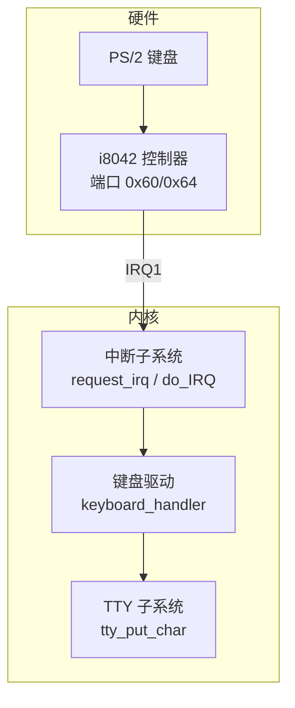
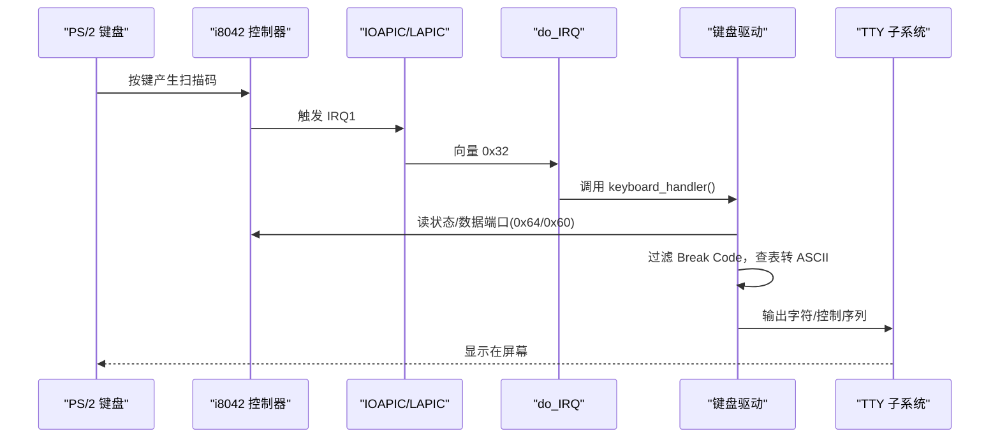
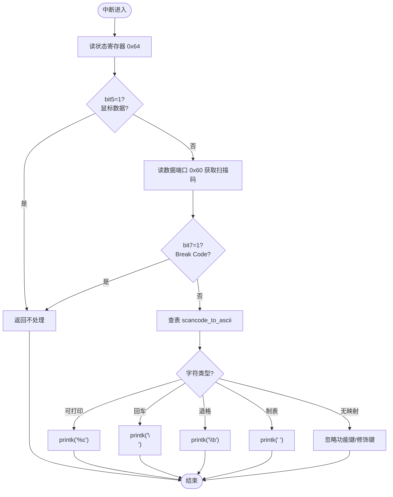
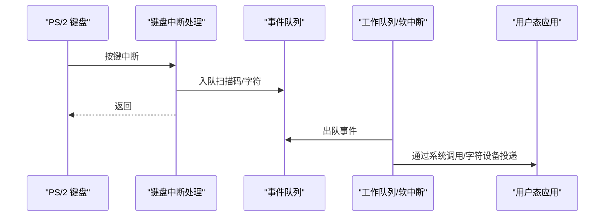
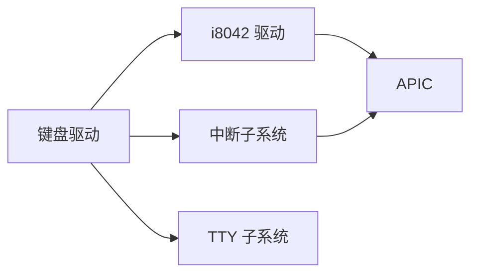

# 键盘驱动

<cite>
**本文引用的文件**
- [kernel/keyboard.c](file://kernel/keyboard.c)
- [includes/keyboard.h](file://includes/keyboard.h)
- [kernel/i8042.c](file://kernel/i8042.c)
- [includes/i8042.h](file://includes/i8042.h)
- [kernel/interrupts/interrupts.c](file://kernel/interrupts/interrupts.c)
- [includes/interrupts/interrupts.h](file://includes/interrupts/interrupts.h)
- [kernel/tty/tty.c](file://kernel/tty/tty.c)
- [includes/tty/tty.h](file://includes/tty/tty.h)
</cite>

## 目录
1. [简介](#简介)
2. [项目结构](#项目结构)
3. [核心组件](#核心组件)
4. [架构总览](#架构总览)
5. [详细组件分析](#详细组件分析)
6. [依赖关系分析](#依赖关系分析)
7. [性能考虑](#性能考虑)
8. [故障排查指南](#故障排查指南)
9. [结论](#结论)
10. [附录](#附录)

## 简介
本文件为 LulaOS 的 PS/2 键盘驱动技术文档，覆盖以下主题：
- 扫描码到 ASCII 字符的转换过程（标准键位映射与修饰键处理现状）
- 键盘中断处理流程（从 IRQ1 到字符输出的完整路径）
- 键盘事件分发机制（当前实现直接输出至控制台；扩展建议包括事件队列与用户态接口）
- 扩展开发指南（支持特殊功能键、自定义键位映射）
- 测试方法与调试技巧

## 项目结构
LulaOS 的键盘子系统由以下关键部分组成：
- i8042 控制器驱动：完成 PS/2 控制器的自检、端口检测、配置字节读写、鼠标初始化，并回退注册键盘/鼠标设备
- 键盘驱动：匹配平台设备（PNP0303），注册 IRQ1 中断处理函数，读取扫描码并转换为 ASCII，直接输出到控制台
- 中断子系统：提供 request_irq/free_irq、do_IRQ 调度、APIC EOI 等基础设施
- TTY 子系统：负责将字符写入 VGA 文本缓冲区或帧缓冲，并提供早期输出缓存重放

图表来源
- [kernel/i8042.c:128-220](file://kernel/i8042.c#L128-L220)
- [kernel/interrupts/interrupts.c:84-108](file://kernel/interrupts/interrupts.c#L84-L108)
- [kernel/keyboard.c:140-182](file://kernel/keyboard.c#L140-L182)
- [kernel/tty/tty.c:33-67](file://kernel/tty/tty.c#L33-L67)

章节来源
- [kernel/i8042.c:1-303](file://kernel/i8042.c#L1-L303)
- [kernel/keyboard.c:1-235](file://kernel/keyboard.c#L1-L235)
- [kernel/interrupts/interrupts.c:1-145](file://kernel/interrupts/interrupts.c#L1-L145)
- [kernel/tty/tty.c:1-123](file://kernel/tty/tty.c#L1-L123)

## 核心组件
- i8042 控制器驱动
  - 完成控制器自检、键盘端口检测、AUX 端口启用、配置字节读写（开启键盘 IRQ1 与鼠标 IRQ12）、鼠标默认设置与数据上报启用
  - 若 ACPI 未枚举键盘/鼠标设备，则回退注册 PNP0303/PNP0F13 平台设备
- 键盘驱动
  - 匹配平台设备名称 PNP0303，获取 IRQ 资源，计算中断向量并注册中断处理函数
  - 中断处理中读取状态寄存器区分键盘/鼠标数据，读取扫描码，忽略 Break Code，查表转 ASCII 后输出
- 中断子系统
  - 维护中断描述符表，提供 request_irq/free_irq，统一入口 do_IRQ 调用具体 handler
- TTY 子系统
  - 将字符写入 VGA 文本缓冲区或帧缓冲，支持模式切换与早期输出重放

章节来源
- [kernel/i8042.c:128-220](file://kernel/i8042.c#L128-L220)
- [kernel/keyboard.c:197-234](file://kernel/keyboard.c#L197-L234)
- [kernel/interrupts/interrupts.c:40-108](file://kernel/interrupts/interrupts.c#L40-L108)
- [kernel/tty/tty.c:33-123](file://kernel/tty/tty.c#L33-L123)

## 架构总览
下图展示了从硬件中断到字符显示的完整链路。

图表来源
- [kernel/i8042.c:128-220](file://kernel/i8042.c#L128-L220)
- [kernel/interrupts/interrupts.c:84-108](file://kernel/interrupts/interrupts.c#L84-L108)
- [kernel/keyboard.c:140-182](file://kernel/keyboard.c#L140-L182)
- [kernel/tty/tty.c:33-67](file://kernel/tty/tty.c#L33-L67)

## 详细组件分析

### 键盘中断处理流程（IRQ1 → 字符输入）
- 启动阶段
  - i8042 控制器初始化：自检、键盘端口检测、启用 AUX、配置字节更新（开启键盘 IRQ1）、鼠标初始化
  - 若 ACPI 未发现键盘设备，回退注册 PNP0303 平台设备
- 驱动注册
  - 键盘驱动匹配 PNP0303，获取 IRQ 资源，计算向量 = FIRST_DEVICE_VECTOR + IRQ（IRQ1 → 0x32），调用 request_irq 注册 keyboard_handler
- 中断路径
  - 硬件中断经 IOAPIC/LAPIC 路由到 do_IRQ，发送 EOI，查找对应 handler 并调用
  - keyboard_handler：检查状态寄存器 bit5 区分鼠标数据，读取扫描码，忽略 Break Code（bit7=1），查表转 ASCII，输出到 TTY
- 输出路径
  - TTY 根据当前模式写入 VGA 文本缓冲区或帧缓冲，支持换行、滚动、清屏等

图表来源
- [kernel/keyboard.c:140-182](file://kernel/keyboard.c#L140-L182)

章节来源
- [kernel/i8042.c:128-220](file://kernel/i8042.c#L128-L220)
- [kernel/keyboard.c:140-234](file://kernel/keyboard.c#L140-L234)
- [kernel/interrupts/interrupts.c:84-108](file://kernel/interrupts/interrupts.c#L84-L108)

### 扫描码到 ASCII 的转换与键位映射
- 映射表
  - 使用静态数组 scancode_to_ascii[128]，索引为 Make Code（0x01~0x58），值为对应 ASCII 字符或空字符
  - 空字符表示无对应字符（如 ESC、功能键 F1-F12、修饰键等）
- 转换逻辑
  - 仅处理 Make Code（按下），忽略 Break Code（松开）
  - 对特殊控制字符进行专门处理：回车、退格、制表
- 修饰键与功能键
  - 当前实现未维护修饰键状态（Shift/Ctrl/Alt），也未处理 CapsLock、NumLock 等状态切换
  - 功能键（F1-F12）及方向键、小键盘导航键在当前映射表中为空，不会输出字符

章节来源
- [kernel/keyboard.c:32-128](file://kernel/keyboard.c#L32-L128)
- [kernel/keyboard.c:167-181](file://kernel/keyboard.c#L167-L181)

### 键盘事件分发机制（当前与扩展）
- 当前实现
  - 键盘中断顶半部直接读取扫描码并输出到 TTY，没有事件队列或用户态接口
  - 所有按键事件在内核空间处理并立即显示
- 扩展建议（设计思路）
  - 引入事件队列：在中断中仅入队原始扫描码或已转换字符，避免长耗时操作
  - 底半部/工作队列：将字符消费、修饰键组合、功能键处理移至进程上下文
  - 用户态接口：通过系统调用或字符设备节点暴露 read/write/ioctl，供应用层读取键盘事件
  - 事件模型：定义事件结构体（时间戳、扫描码、ASCII、修饰键状态、是否按下/释放）

说明：以下为概念性设计，非现有代码实现。

[此图为概念流程图，不对应具体源码文件]

### i8042 控制器初始化与设备注册
- 控制器初始化步骤
  - 自检（期望响应 0x55）
  - 键盘端口检测（期望响应 0x00）
  - 启用 AUX 端口
  - 读取配置字节并更新（开启键盘 IRQ1 与鼠标 IRQ12，确保时钟使能）
  - 鼠标初始化（SET_DEFAULTS 与 ENABLE）
- 子设备回退注册
  - 若 ACPI 未发现键盘/鼠标设备，注册 PNP0303/PNP0F13 平台设备以启用键盘/鼠标

章节来源
- [kernel/i8042.c:128-220](file://kernel/i8042.c#L128-L220)
- [kernel/i8042.c:229-263](file://kernel/i8042.c#L229-L263)

### TTY 输出与显示
- 早期输出缓冲
  - 在 fbcon 初始化前记录输出，切换到帧缓冲时重放
- 显示模式
  - 支持 VGA 文本模式与帧缓冲模式
  - 支持换行、滚动、清屏、主题颜色设置

章节来源
- [kernel/tty/tty.c:8-123](file://kernel/tty/tty.c#L8-L123)
- [includes/tty/tty.h:1-32](file://includes/tty/tty.h#L1-L32)

## 依赖关系分析
- 键盘驱动依赖
  - 平台设备框架：匹配 PNP0303，获取 IRQ 资源
  - 中断子系统：request_irq 注册中断，do_IRQ 调度
  - I/O 端口访问：inb/outb 访问 0x60/0x64
  - TTY：输出字符
- i8042 驱动依赖
  - 平台设备框架：注册控制器设备与驱动
  - I/O 端口访问：控制器命令与数据端口
  - 中断子系统：间接通过配置字节启用 IRQ
- 中断子系统依赖
  - APIC：EOI、RTE 屏蔽/使能
  - 调度器：irq_enter/irq_exit、软中断执行

图表来源
- [kernel/keyboard.c:16-22](file://kernel/keyboard.c#L16-L22)
- [kernel/i8042.c:18-22](file://kernel/i8042.c#L18-L22)
- [kernel/interrupts/interrupts.c:1-7](file://kernel/interrupts/interrupts.c#L1-L7)

章节来源
- [kernel/keyboard.c:16-22](file://kernel/keyboard.c#L16-L22)
- [kernel/i8042.c:18-22](file://kernel/i8042.c#L18-L22)
- [kernel/interrupts/interrupts.c:1-7](file://kernel/interrupts/interrupts.c#L1-L7)

## 性能考虑
- 中断顶半部应尽量短小
  - 当前实现已在中断中完成扫描码读取、过滤、查表与输出，适合早期简单场景
  - 在高负载下，建议将字符消费与复杂处理移至底半部或工作队列，减少中断延迟
- 端口访问与超时
  - i8042 控制器操作包含等待输入/输出缓冲口的循环，需确保超时合理以避免死锁
- 映射表查找
  - 使用静态数组 O(1) 查找，效率高；如需多布局支持，可引入布局表与查询优化

[本节为通用性能建议，不直接分析具体文件]

## 故障排查指南
- 键盘无响应
  - 检查 i8042 控制器自检与键盘端口检测结果
  - 确认配置字节已更新（开启键盘 IRQ1）
  - 验证键盘驱动是否成功匹配 PNP0303 并注册中断
- 中断重复或丢失
  - 确认中断向量未被占用（request_irq 返回值）
  - 检查 do_IRQ 是否正确调用 handler 并发送 EOI
- 字符显示异常
  - 检查 TTY 模式与缓冲区基址设置
  - 确认 early_buf 重放逻辑正常
- 调试技巧
  - 在 keyboard_handler 中增加日志，记录状态寄存器与扫描码
  - 在 i8042 初始化各阶段打印响应值，定位失败点
  - 使用 printk 输出中断向量与 handler 名称，确认中断路径

章节来源
- [kernel/i8042.c:128-220](file://kernel/i8042.c#L128-L220)
- [kernel/keyboard.c:140-182](file://kernel/keyboard.c#L140-L182)
- [kernel/interrupts/interrupts.c:84-108](file://kernel/interrupts/interrupts.c#L84-L108)
- [kernel/tty/tty.c:8-123](file://kernel/tty/tty.c#L8-L123)

## 结论
LulaOS 的键盘驱动基于 PS/2 控制器与 i8042 驱动，实现了从 IRQ1 中断到字符输出的基本路径。当前版本专注于单字符按键的扫描码到 ASCII 转换与直接输出，未实现修饰键状态管理与功能键处理。为支持更复杂的交互需求，建议引入事件队列、底半部处理与用户态接口，并扩展键位映射与布局支持。

[本节为总结性内容，不直接分析具体文件]

## 附录

### 扩展开发指南
- 支持特殊功能键
  - 在映射表中为 F1-F12、方向键、小键盘导航键添加事件编码
  - 在中断中记录事件类型（按下/释放），并在底半部分发
- 自定义键位映射
  - 引入布局表（如 QWERTY、AZERTY），根据系统设置选择映射
  - 支持 Shift/Ctrl/Alt 组合键，维护修饰键状态机
- 事件队列与用户态接口
  - 定义事件结构体（时间戳、扫描码、ASCII、修饰键状态、事件类型）
  - 实现环形队列与生产者/消费者模型
  - 通过字符设备或系统调用暴露 read/write/ioctl，供应用层读取事件

[本节为概念性指导，不直接分析具体文件]

### 测试方法
- 基础按键测试
  - 验证字母、数字、符号键是否能正确输出
  - 验证回车、退格、制表行为是否符合预期
- 功能键与修饰键测试
  - 记录 F1-F12、CapsLock、NumLock 的扫描码与事件
  - 验证 Shift/Ctrl/Alt 组合键的映射结果
- 压力测试
  - 快速连续按键，观察是否有丢键或卡顿
  - 结合鼠标同时操作，验证中断与数据源区分逻辑

[本节为通用测试建议，不直接分析具体文件]