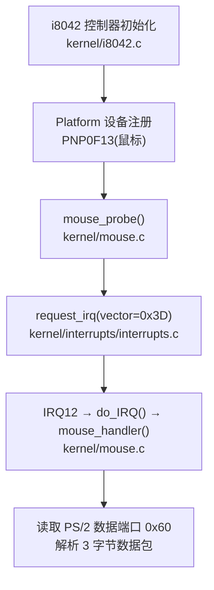
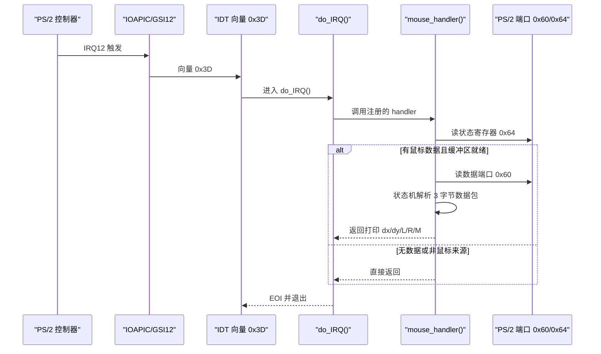
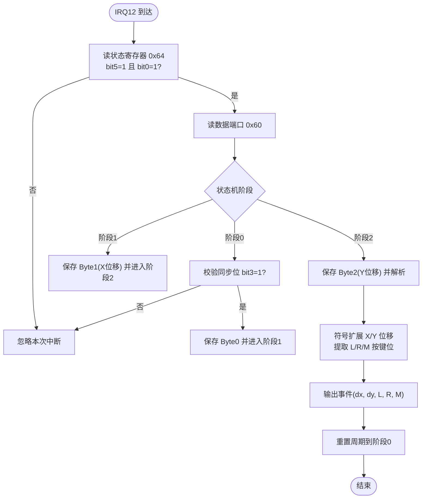
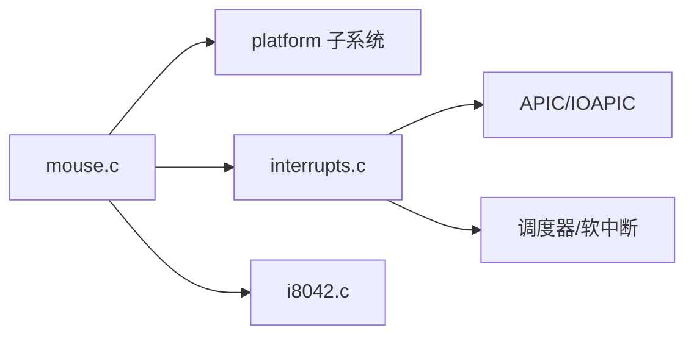

# 鼠标驱动

<cite>
**本文引用的文件**
- [includes/mouse.h](file://includes/mouse.h)
- [kernel/mouse.c](file://kernel/mouse.c)
- [includes/i8042.h](file://includes/i8042.h)
- [kernel/i8042.c](file://kernel/i8042.c)
- [includes/interrupts/interrupts.h](file://includes/interrupts/interrupts.h)
- [kernel/interrupts/interrupts.c](file://kernel/interrupts/interrupts.c)
</cite>

## 目录
1. [简介](#简介)
2. [项目结构](#项目结构)
3. [核心组件](#核心组件)
4. [架构总览](#架构总览)
5. [详细组件分析](#详细组件分析)
6. [依赖关系分析](#依赖关系分析)
7. [性能考虑](#性能考虑)
8. [故障排查指南](#故障排查指南)
9. [结论](#结论)
10. [附录](#附录)

## 简介
本文件为 LulaOS 的 PS/2 鼠标驱动技术文档，覆盖以下主题：
- 鼠标数据包格式（移动坐标、按钮状态与数据包结构）
- 中断处理流程（从 IRQ12 到鼠标事件）
- 移动与点击事件的捕获机制（含坐标变换与事件过滤）
- 扩展开发指南（滚轮支持与高级功能）
- 校准方法与性能优化技巧

该驱动基于 i8042 PS/2 控制器，通过 ACPI 或回退方式枚举设备，注册 Platform 驱动并在 probe 时绑定 IRQ12 的中断处理函数。

## 项目结构
与鼠标驱动直接相关的代码分布在以下位置：
- includes/mouse.h：鼠标驱动的对外接口声明
- kernel/mouse.c：鼠标驱动实现（Platform 驱动、中断处理、数据包解析）
- includes/i8042.h / kernel/i8042.c：PS/2 控制器初始化与子设备回退注册
- includes/interrupts/interrupts.h / kernel/interrupts/interrupts.c：中断子系统（IRQ 描述符、request_irq/free_irq、do_IRQ）

图表来源
- [kernel/i8042.c:128-220](file://kernel/i8042.c#L128-L220)
- [kernel/mouse.c:129-166](file://kernel/mouse.c#L129-L166)
- [kernel/interrupts/interrupts.c:40-58](file://kernel/interrupts/interrupts.c#L40-L58)

章节来源
- [kernel/i8042.c:128-220](file://kernel/i8042.c#L128-L220)
- [kernel/mouse.c:129-166](file://kernel/mouse.c#L129-L166)
- [kernel/interrupts/interrupts.c:40-58](file://kernel/interrupts/interrupts.c#L40-L58)

## 核心组件
- PS/2 控制器驱动（i8042）
  - 完成控制器自检、键盘/AUX 端口检测、配置字节读写、鼠标默认设置与启用上报
  - 在 ACPI 未发现设备时，回退注册 PNP0303（键盘）与 PNP0F13（鼠标）
- 鼠标驱动（mouse）
  - 注册 Platform 驱动名称“PNP0F13”，匹配成功后执行 probe
  - 从平台资源获取 IRQ 号并计算向量（FIRST_DEVICE_VECTOR + IRQ），调用 request_irq 注册 handler
  - 中断顶半部读取 PS/2 数据端口，按状态机解析 3 字节数据包，输出位移与按键信息
- 中断子系统
  - 维护 irq_desc 表，提供 request_irq/free_irq
  - do_IRQ 统一入口，分发到具体 handler，负责 EOI 与软中断退出

章节来源
- [kernel/i8042.c:128-220](file://kernel/i8042.c#L128-L220)
- [kernel/mouse.c:52-113](file://kernel/mouse.c#L52-L113)
- [kernel/interrupts/interrupts.c:9-17](file://kernel/interrupts/interrupts.c#L9-L17)
- [kernel/interrupts/interrupts.c:40-58](file://kernel/interrupts/interrupts.c#L40-L58)
- [kernel/interrupts/interrupts.c:84-108](file://kernel/interrupts/interrupts.c#L84-L108)

## 架构总览
下图展示了从硬件中断到鼠标事件处理的完整路径，以及关键模块间的交互。

图表来源
- [kernel/interrupts/interrupts.c:84-108](file://kernel/interrupts/interrupts.c#L84-L108)
- [kernel/mouse.c:52-113](file://kernel/mouse.c#L52-L113)

## 详细组件分析

### 鼠标数据包格式
- 标准 3 字节数据包：
  - Byte 0：包含溢出标志、X/Y 方向位、符号位、左/中/右键状态位；其中 bit3 为同步位，必须为 1 才视为有效包起始
  - Byte 1：X 位移（8 位有符号数），符号由 Byte 0 的某一位扩展
  - Byte 2：Y 位移（8 位有符号数），符号由 Byte 0 的另一位扩展
- 按键状态：
  - 最低三位分别对应左键、右键、中键的状态位
- 数据来源区分：
  - 与键盘共享 PS/2 控制器端口（0x60/0x64），通过状态寄存器 bit5 判断是否为鼠标数据

章节来源
- [kernel/mouse.c:9-16](file://kernel/mouse.c#L9-L16)
- [kernel/mouse.c:63-113](file://kernel/mouse.c#L63-L113)

### 中断处理流程（IRQ12 → 鼠标事件）
- 启动阶段：
  - i8042 控制器初始化完成后，若 ACPI 未枚举鼠标设备，则回退注册 PNP0F13 设备
  - 鼠标 Platform 驱动匹配设备后执行 probe，从资源获取 IRQ 号并计算向量（FIRST_DEVICE_VECTOR + IRQ）
  - 调用 request_irq 注册 mouse_handler，并解除 IOAPIC RTE 屏蔽使能硬件中断
- 运行阶段：
  - PS/2 鼠标产生 IRQ12，经 IOAPIC 映射到向量 0x3D
  - do_IRQ 查找已注册的 handler 并调用 mouse_handler
  - mouse_handler 检查状态寄存器，确认是鼠标数据且有可读字节后，从 0x60 读取一个字节
  - 使用状态机按 3 字节一组解析，收齐后提取位移与按键状态并输出

图表来源
- [kernel/mouse.c:52-113](file://kernel/mouse.c#L52-L113)

章节来源
- [kernel/mouse.c:52-113](file://kernel/mouse.c#L52-L113)
- [kernel/interrupts/interrupts.c:40-58](file://kernel/interrupts/interrupts.c#L40-L58)
- [kernel/interrupts/interrupts.c:84-108](file://kernel/interrupts/interrupts.c#L84-L108)

### 移动与点击事件捕获机制
- 移动事件：
  - 每次收到完整数据包即解析出 dx/dy，进行符号扩展得到有符号位移
  - 仅当存在位移或按键变化时才输出，避免刷屏
- 点击事件：
  - 从 Byte 0 的低三位提取左/右/中键状态位
  - 上层可通过日志或后续扩展将事件转发至输入子系统
- 坐标变换：
  - 当前实现以相对位移为主，未做绝对坐标转换；如需绝对坐标，可在上层根据屏幕分辨率与 DPI 进行缩放与偏移
- 事件过滤：
  - 可结合时间戳与阈值过滤抖动与微小移动
  - 可合并多次移动为一个合成事件以降低开销

章节来源
- [kernel/mouse.c:92-113](file://kernel/mouse.c#L92-L113)

### 扩展开发指南（滚轮与高级功能）
- 滚轮支持：
  - 标准 PS/2 鼠标通常不支持滚轮；若需滚轮，建议使用 USB HID 鼠标并通过现有 USB 栈接入
  - 若坚持 PS/2 扩展，需查阅特定厂商协议，可能涉及额外命令与数据包扩展，当前驱动未实现
- 高级功能：
  - 采样率与分辨率调整：可通过 PS/2 命令修改鼠标报告速率与计数分辨率，但不同设备支持程度不一
  - 多模态输入：可将鼠标事件与键盘事件统一封装为输入事件，供上层 UI 框架消费
- 集成建议：
  - 在 mouse_handler 中构造统一的事件结构体，放入环形队列或软中断上下文，避免在中断上下文中做重操作
  - 增加事件过滤与去抖逻辑，提升用户体验

[本节为概念性指导，不直接分析具体文件]

### 校准方法
- 相对位移校准：
  - 通过软件层对 dx/dy 进行缩放与偏置，适配不同 DPI 与屏幕分辨率
- 绝对坐标校准：
  - 若实现绝对模式，需在启动时记录原点与边界，并在移动时进行线性映射
- 传感器偏差校正：
  - 采集静止时的噪声分布，设定阈值过滤微小抖动

[本节为通用校准策略，不直接分析具体文件]

### 性能优化技巧
- 中断上下文最小化：
  - 在 mouse_handler 中只做必要的数据读取与解析，复杂处理下推至软中断或工作队列
- 减少 I/O 访问：
  - 仅在状态寄存器指示有数据时读取 0x60，避免无效访问
- 事件合并与节流：
  - 合并短时间内的多次移动，降低输出频率
- 日志控制：
  - 生产环境关闭 printk 或降低频率，避免 I/O 阻塞

[本节为通用优化建议，不直接分析具体文件]

## 依赖关系分析
- 鼠标驱动依赖：
  - Platform 子系统（设备/驱动模型）
  - 中断子系统（request_irq/free_irq、do_IRQ）
  - i8042 控制器驱动（完成硬件初始化与设备回退注册）
- 中断子系统依赖：
  - APIC/IOAPIC（向量映射、RTE 使能/屏蔽）
  - 调度器与软中断（irq_enter/irq_exit）

图表来源
- [kernel/mouse.c:129-166](file://kernel/mouse.c#L129-L166)
- [kernel/interrupts/interrupts.c:40-58](file://kernel/interrupts/interrupts.c#L40-L58)
- [kernel/i8042.c:253-263](file://kernel/i8042.c#L253-L263)

章节来源
- [kernel/mouse.c:129-166](file://kernel/mouse.c#L129-L166)
- [kernel/interrupts/interrupts.c:40-58](file://kernel/interrupts/interrupts.c#L40-L58)
- [kernel/i8042.c:253-263](file://kernel/i8042.c#L253-L263)

## 性能考虑
- 中断延迟与吞吐：
  - 保持 handler 短小精悍，避免阻塞 I/O 与锁竞争
- 内存与缓存：
  - 使用局部变量与静态缓冲减少分配开销
- 日志与调试：
  - 动态开关日志级别，生产环境禁用冗余输出
- 事件批处理：
  - 将多个移动事件合并为一次更新，降低上层处理压力

[本节提供通用性能指导，不直接分析具体文件]

## 故障排查指南
- 无法检测到鼠标：
  - 检查 i8042 是否完成初始化并成功启用 AUX 端口
  - 确认 ACPI 是否枚举 PNP0F13；若未枚举，回退注册应生效
- 中断未触发：
  - 确认 request_irq 返回值与 IOAPIC RTE 是否已使能
  - 检查状态寄存器 bit5 与 bit0 是否符合预期
- 数据包错位：
  - 确保 Byte 0 的同步位 bit3 为 1，否则丢弃并等待下一个包
  - 验证状态机周期是否正确复位
- 输出刷屏：
  - 仅在存在位移或按键变化时输出，避免频繁 printk

章节来源
- [kernel/i8042.c:128-220](file://kernel/i8042.c#L128-L220)
- [kernel/mouse.c:63-113](file://kernel/mouse.c#L63-L113)
- [kernel/interrupts/interrupts.c:40-58](file://kernel/interrupts/interrupts.c#L40-L58)

## 结论
LulaOS 的 PS/2 鼠标驱动通过 i8042 控制器完成硬件初始化，采用 Platform 驱动模型与中断子系统协作，实现了稳定的鼠标事件捕获。当前实现聚焦于标准 3 字节数据包与基本移动/点击事件，具备良好扩展基础。未来可结合 USB HID 栈引入滚轮与更丰富的鼠标功能，并在上层实现坐标变换、事件过滤与性能优化。

## 附录
- 关键常量与端口：
  - PS/2 数据端口：0x60
  - PS/2 状态/命令端口：0x64
  - 鼠标命令：SET_DEFAULTS、ENABLE（通过 0xD4 前缀发送）
- 中断向量映射：
  - FIRST_DEVICE_VECTOR + IRQ12 = 0x3D
- 参考实现路径：
  - 控制器初始化与回退注册：[kernel/i8042.c:128-220](file://kernel/i8042.c#L128-L220)、[kernel/i8042.c:253-263](file://kernel/i8042.c#L253-L263)
  - 鼠标驱动与中断处理：[kernel/mouse.c:52-113](file://kernel/mouse.c#L52-L113)、[kernel/mouse.c:129-166](file://kernel/mouse.c#L129-L166)
  - 中断子系统：[kernel/interrupts/interrupts.c:40-58](file://kernel/interrupts/interrupts.c#L40-L58)、[kernel/interrupts/interrupts.c:84-108](file://kernel/interrupts/interrupts.c#L84-L108)