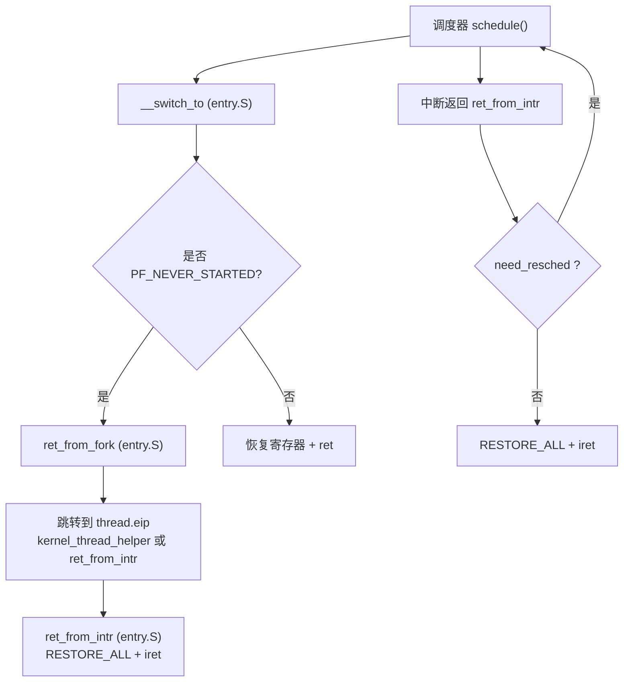
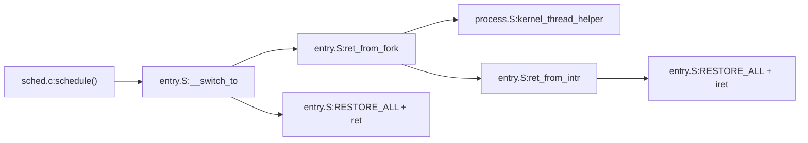

# 上下文切换机制

<cite>
**本文引用的文件**
- [arch/x86/entry.S](file://arch/x86/entry.S)
- [arch/x86/kernel/process.S](file://arch/x86/kernel/process.S)
- [kernel/sched.c](file://kernel/sched.c)
- [includes/kernel/sched.h](file://includes/kernel/sched.h)
- [includes/arch/x86/thread_info.h](file://includes/arch/x86/thread_info.h)
</cite>

## 目录
1. [简介](#简介)
2. [项目结构](#项目结构)
3. [核心组件](#核心组件)
4. [架构总览](#架构总览)
5. [详细组件分析](#详细组件分析)
6. [依赖关系分析](#依赖关系分析)
7. [性能考量](#性能考量)
8. [故障排查指南](#故障排查指南)
9. [结论](#结论)

## 简介
本文面向LulaOS的x86实现，系统性阐述进程上下文切换机制。重点包括：
- __switch_to汇编函数的寄存器保存/恢复、内核栈切换与页表切换流程
- ret_from_fork与ret_from_intr的处理路径差异（新进程首次执行 vs 中断返回）
- 调度器schedule()如何触发并进入__switch_to
- 与x86寄存器、系统调用int 0x80及中断返回iret的集成
- PF_NEVER_STARTED标志的作用与首次执行特殊处理
- 切换开销分析与优化建议

## 项目结构
围绕上下文切换的关键代码分布在以下位置：
- 汇编入口与切换：arch/x86/entry.S（包含__switch_to、ret_from_fork、ret_from_intr、系统调用入口等）
- 新线程启动辅助：arch/x86/kernel/process.S（kernel_thread_helper）
- 调度器与进程创建：kernel/sched.c（schedule、sys_fork、kernel_thread、cpu_idle等）
- 数据结构定义：includes/kernel/sched.h（task_struct、thread_union、current宏、PF_*标志等）
- 线程信息常量：includes/arch/x86/thread_info.h（THREAD_SIZE）



图表来源
- [arch/x86/entry.S:41-58](file://arch/x86/entry.S#L41-L58)
- [arch/x86/entry.S:520-610](file://arch/x86/entry.S#L520-L610)
- [kernel/sched.c:136-213](file://kernel/sched.c#L136-L213)

章节来源
- [arch/x86/entry.S:41-58](file://arch/x86/entry.S#L41-L58)
- [arch/x86/entry.S:520-610](file://arch/x86/entry.S#L520-L610)
- [kernel/sched.c:136-213](file://kernel/sched.c#L136-L213)

## 核心组件
- 调度器schedule()：选择下一个任务，通过内联汇编将prev/next压栈后调用__switch_to
- __switch_to：保存prev上下文、切换到next栈、切换CR3、根据PF_NEVER_STARTED分支到ret_from_fork或正常返回
- ret_from_fork：清除PF_NEVER_STARTED，跳转到thread.eip（新进程/线程的首次执行入口）
- ret_from_intr：中断返回前检查need_resched，必要时调度后再RESTORE_ALL+iret
- kernel_thread_helper：新内核线程首次执行的C函数入口，弹出fn/arg并调用fn(arg)，结束后do_exit
- task_struct与thread_union：合并task_struct与8KB内核栈，current通过esp屏蔽低13位直接定位

章节来源
- [kernel/sched.c:136-213](file://kernel/sched.c#L136-L213)
- [arch/x86/entry.S:520-610](file://arch/x86/entry.S#L520-L610)
- [arch/x86/kernel/process.S:10-24](file://arch/x86/kernel/process.S#L10-L24)
- [includes/kernel/sched.h:45-106](file://includes/kernel/sched.h#L45-L106)
- [includes/arch/x86/thread_info.h:4-6](file://includes/arch/x86/thread_info.h#L4-L6)

## 架构总览
下图展示从调度到上下文切换再到新任务首次执行的完整时序：

```mermaid
sequenceDiagram
participant S as "调度器 schedule()"
participant SW as "__switch_to"
participant RF as "ret_from_fork"
participant RI as "ret_from_intr"
participant KTH as "kernel_thread_helper"
participant OS as "用户态/内核态继续执行"
S->>SW : 压入 prev, next; call __switch_to
SW->>SW : 保存 eflags/callee-saved regs<br/>保存 prev->thread.esp/eip
SW->>SW : %esp = next->thread.esp<br/>加载 CR3 = next->thread.pgd
alt 新任务首次执行 (PF_NEVER_STARTED)
SW->>RF : jmp ret_from_fork
RF->>RF : 清除 PF_NEVER_STARTED
RF->>KTH : 跳转 thread.eip (kernel_thread_helper)
KTH->>OS : 调用 fn(arg); do_exit()
else 常规切换
SW->>SW : 恢复 callee-saved regs / eflags
SW-->>S : ret (回到 schedule 调用点)
end
Note over RI,OS : 中断返回路径由 ret_from_intr 处理
```

图表来源
- [kernel/sched.c:201-210](file://kernel/sched.c#L201-L210)
- [arch/x86/entry.S:520-610](file://arch/x86/entry.S#L520-L610)
- [arch/x86/kernel/process.S:10-24](file://arch/x86/kernel/process.S#L10-L24)

## 详细组件分析

### __switch_to：上下文切换的核心
职责与步骤：
- 保存当前（prev）上下文：pushfl保存eflags；push ebp/ebx/esi/edi保存被调用者保存寄存器
- 记录prev的返回点：将返回地址写入prev->thread.eip，将当前栈指针保存到prev->thread.esp
- 切换到next：%esp = next->thread.esp；若next->thread.pgd非零则加载CR3完成页表切换
- 首次执行分支：检测next->flags中的PF_NEVER_STARTED，若置位则jmp ret_from_fork
- 常规恢复：pop edi/esi/ebx/ebp；popfl；ret返回到next->thread.eip（即schedule调用点）

关键点：
- current宏基于esp & ~0x1FFF自动更新，无需显式写current
- 仅当next有独立页表时才切换CR3，避免不必要的TLB失效
- 对首次执行的任务不先pop寄存器，防止破坏新任务的初始栈帧

章节来源
- [arch/x86/entry.S:520-583](file://arch/x86/entry.S#L520-L583)
- [includes/kernel/sched.h:93-106](file://includes/kernel/sched.h#L93-L106)

### ret_from_fork：新进程/线程首次执行
职责：
- 通过esp & ~0x1FFF获取当前task_struct
- 清除PF_NEVER_STARTED标志
- 跳转到thread.eip指向的入口（kernel_thread_helper或ret_from_intr）

注意：
- 此路径下不能pop callee-saved寄存器，因为新任务的栈顶不是保存的寄存器帧，而是由创建者构造的初始栈帧

章节来源
- [arch/x86/entry.S:600-610](file://arch/x86/entry.S#L600-L610)
- [includes/kernel/sched.h:38-40](file://includes/kernel/sched.h#L38-L40)

### ret_from_intr：中断返回与调度检查
职责：
- 在RESTORE_ALL之前检查need_resched
- 若需要调度，调用schedule()再RESTORE_ALL+iret
- 否则直接RESTORE_ALL+iret返回用户态或上一级内核态

与系统调用的集成：
- 系统调用入口int 0x80将pt_regs压栈并调用do_syscall，随后将返回值写入eax槽位，最后RESTORE_ALL+iret返回用户态
- 中断/异常统一走interrupt_warpper，设置ds/es为内核段，调用对应处理器后跳转ret_from_intr

章节来源
- [arch/x86/entry.S:41-58](file://arch/x86/entry.S#L41-L58)
- [arch/x86/entry.S:452-486](file://arch/x86/entry.S#L452-L486)
- [arch/x86/entry.S:62-91](file://arch/x86/entry.S#L62-L91)

### kernel_thread_helper：新内核线程入口
职责：
- 开启中断（sti）
- 弹出fn和arg，调用fn(arg)
- 将返回值作为参数调用do_exit()
- do_exit不应返回，若返回则停机

章节来源
- [arch/x86/kernel/process.S:10-24](file://arch/x86/kernel/process.S#L10-L24)

### 调度器schedule()：触发上下文切换
职责：
- 关闭本地中断，获取当前CPU运行队列
- 清理need_resched，处理时间片耗尽的任务
- 选择counter最大的TASK_RUNNING任务作为next
- 若next==prev则直接返回
- 通过内联汇编将prev/next压栈并调用__switch_to
- 恢复中断

触发时机：
- 中断返回前ret_from_intr检查need_resched
- cpu_idle循环中检测到need_resched
- 主动调用（如do_exit、interruptible_sleep）

章节来源
- [kernel/sched.c:136-213](file://kernel/sched.c#L136-L213)
- [kernel/sched.c:250-259](file://kernel/sched.c#L250-L259)

### 进程/线程创建：sys_fork与kernel_thread
sys_fork：
- 分配8KB对齐的thread_union
- 复制父进程基本字段，重置调度状态，设置PF_NEVER_STARTED
- 将父进程的pt_regs复制到子进程栈顶，设置子进程返回值为0
- 设置thread.eip=ret_from_intr，thread.esp=pt_regs首地址
- 加入目标CPU的运行队列（支持负载均衡）

kernel_thread：
- 分配thread_union，复制父进程基本字段，设置PF_NEVER_STARTED
- 构造初始栈帧：[arg, fn]，设置thread.eip=kernel_thread_helper，thread.esp=sp
- 加入目标CPU的运行队列

章节来源
- [kernel/sched.c:275-356](file://kernel/sched.c#L275-L356)
- [kernel/sched.c:369-433](file://kernel/sched.c#L369-L433)

### 数据模型与偏移约定
- task_struct关键字段偏移（供汇编使用）：
  - need_resched: 16 (0x10)
  - thread.esp: 56 (0x38)
  - thread.eip: 60 (0x3C)
  - thread.pgd: 84 (0x54)
  - flags: 92 (0x5C)
- thread_union将task_struct与8KB内核栈合并，保证current宏有效
- THREAD_SIZE=8192，THREAD_MASK=~(THREAD_SIZE-1)

章节来源
- [kernel/sched.c:20-26](file://kernel/sched.c#L20-L26)
- [includes/kernel/sched.h:21-24](file://includes/kernel/sched.h#L21-L24)
- [includes/kernel/sched.h:45-81](file://includes/kernel/sched.h#L45-L81)

## 依赖关系分析


图表来源
- [kernel/sched.c:201-210](file://kernel/sched.c#L201-L210)
- [arch/x86/entry.S:520-610](file://arch/x86/entry.S#L520-L610)
- [arch/x86/kernel/process.S:10-24](file://arch/x86/kernel/process.S#L10-L24)

章节来源
- [kernel/sched.c:201-210](file://kernel/sched.c#L201-L210)
- [arch/x86/entry.S:520-610](file://arch/x86/entry.S#L520-L610)
- [arch/x86/kernel/process.S:10-24](file://arch/x86/kernel/process.S#L10-L24)

## 性能考量
- 切换开销组成：
  - 寄存器保存/恢复：pushfl与4个callee-saved寄存器，pop顺序相反
  - 栈指针切换：movl next->thread.esp, %esp
  - 页表切换：仅在next->thread.pgd非零时写入CR3，减少TLB失效
  - 分支判断：test next->flags & PF_NEVER_STARTED
- 优化技巧：
  - 避免不必要的CR3切换：共享页表的任务可复用pgd
  - 减少context switch频率：合理设置时间片与优先级
  - 利用cache热：优先在当前CPU调度（默认行为），必要时用KT_BALANCE均衡负载
  - 最小化中断嵌套：ret_from_intr快速检查need_resched，避免重复调度
- 首次执行路径优化：
  - PF_NEVER_STARTED分支跳过寄存器恢复，直接跳转到初始化入口，减少一次pop序列

章节来源
- [arch/x86/entry.S:520-583](file://arch/x86/entry.S#L520-L583)
- [kernel/sched.c:136-213](file://kernel/sched.c#L136-L213)

## 故障排查指南
常见问题与定位要点：
- 新进程无法启动：
  - 检查PF_NEVER_STARTED是否正确设置与清除
  - 确认thread.eip与thread.esp指向正确的初始栈帧
  - 参考：[arch/x86/entry.S:600-610](file://arch/x86/entry.S#L600-L610)、[kernel/sched.c:275-356](file://kernel/sched.c#L275-L356)
- 中断返回崩溃：
  - 检查need_resched检查与RESTORE_ALL顺序
  - 确认pt_regs布局与系统调用返回值写入位置
  - 参考：[arch/x86/entry.S:41-58](file://arch/x86/entry.S#L41-L58)、[arch/x86/entry.S:452-486](file://arch/x86/entry.S#L452-L486)
- 上下文切换后寄存器错乱：
  - 核对callee-saved寄存器保存/恢复顺序
  - 确认__switch_to中prev->thread.esp/eip写入正确
  - 参考：[arch/x86/entry.S:520-583](file://arch/x86/entry.S#L520-L583)
- 页表未切换导致访问越界：
  - 检查next->thread.pgd是否为0，避免误切换或未切换
  - 参考：[arch/x86/entry.S:554-559](file://arch/x86/entry.S#L554-L559)

章节来源
- [arch/x86/entry.S:41-58](file://arch/x86/entry.S#L41-L58)
- [arch/x86/entry.S:520-583](file://arch/x86/entry.S#L520-L583)
- [arch/x86/entry.S:600-610](file://arch/x86/entry.S#L600-L610)
- [kernel/sched.c:275-356](file://kernel/sched.c#L275-L356)

## 结论
LulaOS的上下文切换机制以__switch_to为核心，结合ret_from_fork与ret_from_intr实现了高效、清晰的进程切换与中断返回路径。通过thread_union与current宏简化了当前任务定位，通过PF_NEVER_STARTED标志区分首次执行与常规切换，确保新进程/线程的正确启动。调度器schedule()在合适时机触发切换，配合中断返回前的need_resched检查，形成完整的抢占式调度闭环。性能方面，通过条件CR3切换与最小化寄存器操作降低切换开销，同时提供负载均衡选项以在多核环境下提升吞吐。