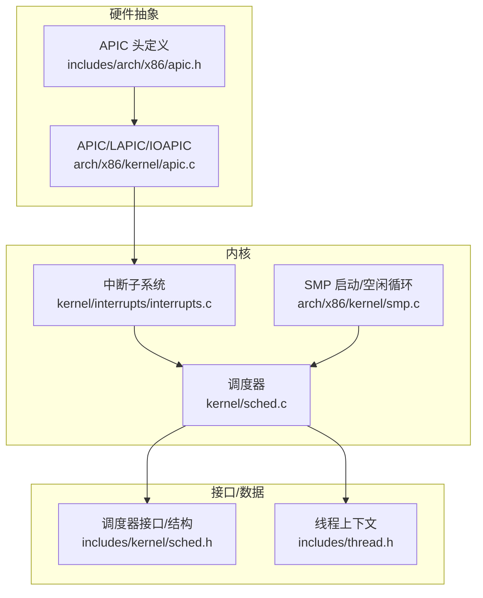
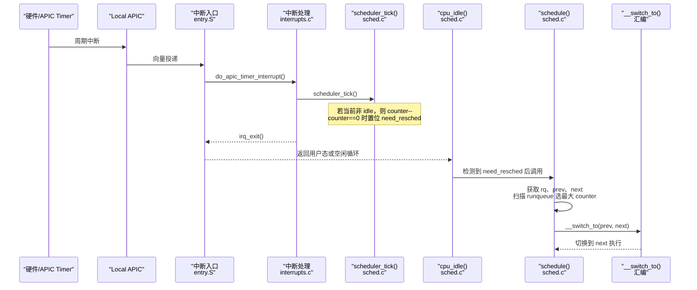
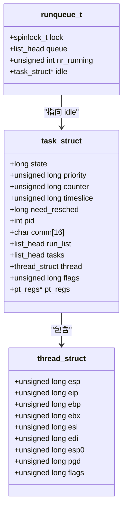
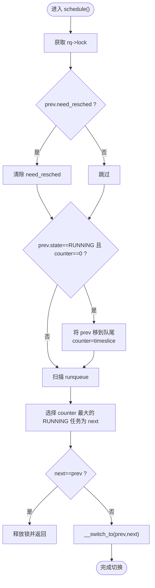
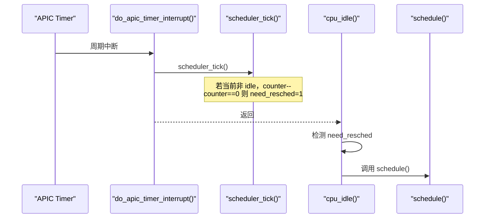
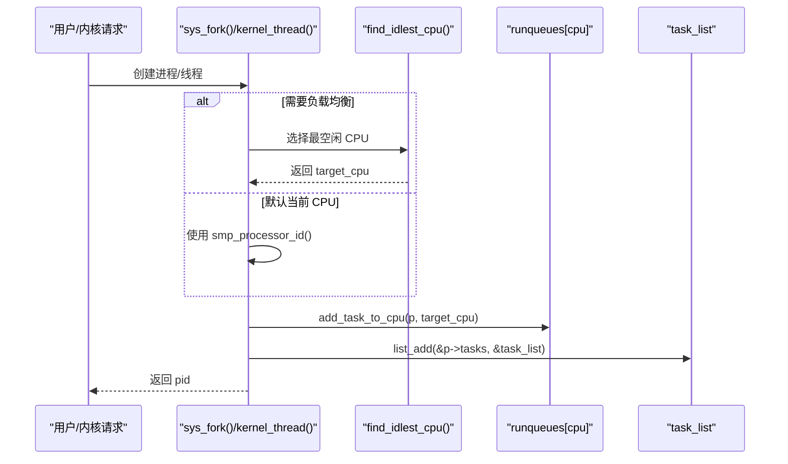
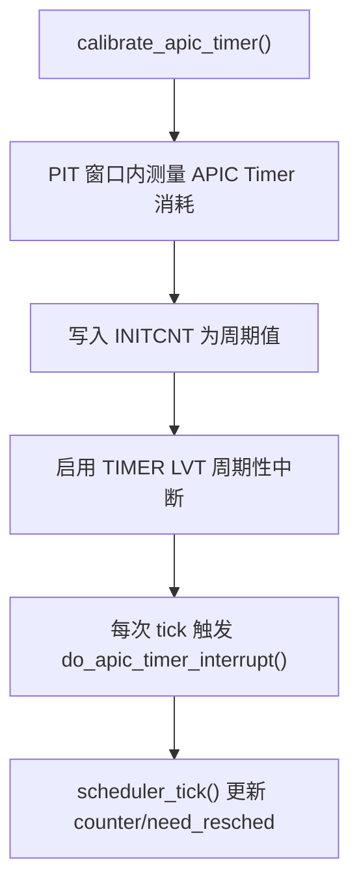
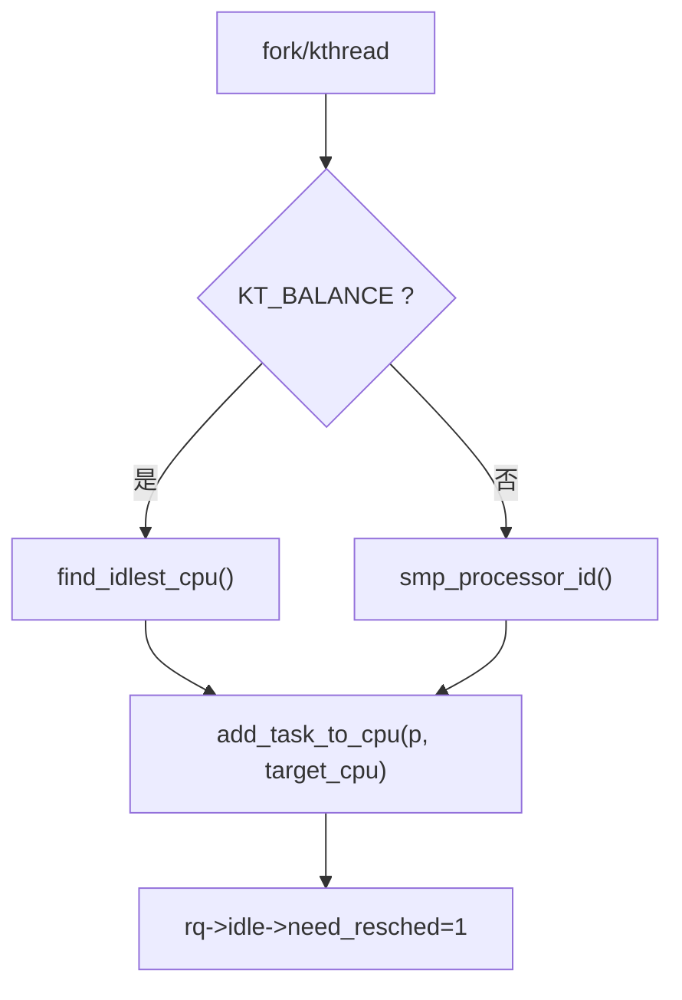
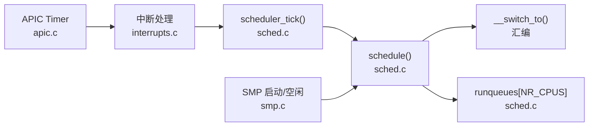

# 调度算法实现

<cite>
**本文引用的文件**
- [kernel/sched.c](file://kernel/sched.c)
- [includes/kernel/sched.h](file://includes/kernel/sched.h)
- [arch/x86/kernel/apic.c](file://arch/x86/kernel/apic.c)
- [includes/arch/x86/apic.h](file://includes/arch/x86/apic.h)
- [kernel/interrupts/interrupts.c](file://kernel/interrupts/interrupts.c)
- [arch/x86/kernel/smp.c](file://arch/x86/kernel/smp.c)
- [includes/thread.h](file://includes/thread.h)
</cite>

## 目录
1. [简介](#简介)
2. [项目结构](#项目结构)
3. [核心组件](#核心组件)
4. [架构总览](#架构总览)
5. [详细组件分析](#详细组件分析)
6. [依赖关系分析](#依赖关系分析)
7. [性能考虑](#性能考虑)
8. [故障排查指南](#故障排查指南)
9. [结论](#结论)
10. [附录](#附录)

## 简介
本文件为 LulaOS 的调度器实现提供系统化、可追溯的技术文档。重点覆盖：
- 时间片轮转调度算法的核心原理（静态优先级机制、时间片计算公式 priority * 10、counter 递减与 need_resched 标志）
- schedule() 的调度决策流程（运行队列扫描、最佳任务选择、时间片重置）
- 调度器初始化、tick 处理、调度决策的完整流程示例（以代码路径引用代替直接代码片段）
- 与 APIC 定时器的集成关系
- SMP 环境下的负载均衡机制
- 性能优化建议与调度延迟分析

## 项目结构
LulaOS 的调度相关代码主要分布在以下位置：
- 调度器核心逻辑与数据结构定义：kernel/sched.c、includes/kernel/sched.h
- 定时器中断与 tick 驱动：kernel/interrupts/interrupts.c
- APIC 初始化、校准与 LVT 配置：arch/x86/kernel/apic.c、includes/arch/x86/apic.h
- SMP 启动与每 CPU idle 任务管理：arch/x86/kernel/smp.c
- 线程上下文结构体：includes/thread.h

图表来源
- [kernel/sched.c:76-97](file://kernel/sched.c#L76-L97)
- [kernel/interrupts/interrupts.c:116-128](file://kernel/interrupts/interrupts.c#L116-L128)
- [arch/x86/kernel/apic.c:125-180](file://arch/x86/kernel/apic.c#L125-L180)
- [includes/arch/x86/apic.h:45-50](file://includes/arch/x86/apic.h#L45-L50)
- [includes/kernel/sched.h:44-89](file://includes/kernel/sched.h#L44-L89)
- [includes/thread.h:7-17](file://includes/thread.h#L7-L17)

章节来源
- [kernel/sched.c:76-97](file://kernel/sched.c#L76-L97)
- [includes/kernel/sched.h:44-89](file://includes/kernel/sched.h#L44-L89)
- [arch/x86/kernel/apic.c:125-180](file://arch/x86/kernel/apic.c#L125-L180)
- [kernel/interrupts/interrupts.c:116-128](file://kernel/interrupts/interrupts.c#L116-L128)
- [arch/x86/kernel/smp.c:233-276](file://arch/x86/kernel/smp.c#L233-L276)
- [includes/thread.h:7-17](file://includes/thread.h#L7-L17)

## 核心组件
- 任务描述符 task_struct：包含状态、优先级、剩余时间片 counter、基础时间片 timeslice、need_resched 标志、链表节点、CPU 上下文等。
- 运行队列 runqueue_t：每个 CPU 一个，含自旋锁、双向链表、nr_running 计数、idle 指针。
- 调度器 API：sched_init()、schedule()、scheduler_tick()、cpu_idle()；进程创建 sys_fork()/kernel_thread()；退出/睡眠 do_exit()/interruptible_sleep()。
- APIC 定时器：calibrate_apic_timer() 设置周期性 tick，do_apic_timer_interrupt() 调用 scheduler_tick()。
- SMP：find_idlest_cpu() 用于负载均衡；start_secondary() 为 AP 建立独立 idle 任务并进入 cpu_idle()。

章节来源
- [includes/kernel/sched.h:44-89](file://includes/kernel/sched.h#L44-L89)
- [kernel/sched.c:76-97](file://kernel/sched.c#L76-L97)
- [kernel/sched.c:136-213](file://kernel/sched.c#L136-L213)
- [kernel/sched.c:223-237](file://kernel/sched.c#L223-L237)
- [kernel/interrupts/interrupts.c:116-128](file://kernel/interrupts/interrupts.c#L116-L128)
- [arch/x86/kernel/apic.c:125-180](file://arch/x86/kernel/apic.c#L125-L180)
- [arch/x86/kernel/smp.c:233-276](file://arch/x86/kernel/smp.c#L233-L276)

## 架构总览
下图展示了从 APIC Timer 触发到调度器切换任务的完整时序。

图表来源
- [arch/x86/kernel/apic.c:125-180](file://arch/x86/kernel/apic.c#L125-L180)
- [kernel/interrupts/interrupts.c:116-128](file://kernel/interrupts/interrupts.c#L116-L128)
- [kernel/sched.c:223-237](file://kernel/sched.c#L223-L237)
- [kernel/sched.c:250-259](file://kernel/sched.c#L250-L259)
- [kernel/sched.c:136-213](file://kernel/sched.c#L136-L213)

## 详细组件分析

### 调度策略与数据结构
- 静态优先级：priority 越高，基础时间片越大。时间片计算公式为 timeslice = priority * 10，并在 MIN_TIMESLICE ~ MAX_TIMESLICE 范围内限制。
- 剩余时间片 counter：每个 tick 递减，当 counter 归零时设置 need_resched，促使下次调度点重新选择任务。
- 运行队列：按 FIFO 维护可运行任务，调度时遍历队列选择 counter 最大的 TASK_RUNNING 任务。
- 上下文切换：通过 __switch_to(prev, next) 完成寄存器与页表切换。

图表来源
- [includes/kernel/sched.h:44-89](file://includes/kernel/sched.h#L44-L89)
- [includes/thread.h:7-17](file://includes/thread.h#L7-L17)

章节来源
- [includes/kernel/sched.h:25-42](file://includes/kernel/sched.h#L25-L42)
- [includes/kernel/sched.h:44-89](file://includes/kernel/sched.h#L44-L89)
- [includes/thread.h:7-17](file://includes/thread.h#L7-L17)

### schedule() 调度决策流程
- 获取当前 CPU 的运行队列与 prev 任务。
- 若 prev 仍为可运行且 counter 耗尽，将其移入队列尾部并重置 counter 为 timeslice。
- 扫描 runqueue，选择状态为 TASK_RUNNING 且 counter 最大的任务作为 next。
- 若 next == prev，直接返回；否则进行上下文切换。

图表来源
- [kernel/sched.c:136-213](file://kernel/sched.c#L136-L213)

章节来源
- [kernel/sched.c:136-213](file://kernel/sched.c#L136-L213)

### 时间片与 tick 处理
- APIC Timer 周期性触发 do_apic_timer_interrupt()，该函数调用 scheduler_tick()。
- scheduler_tick() 对当前任务（非 idle）的 counter 递减；若 counter 归零，则设置 need_resched。
- 在 idle 循环中，cpu_idle() 等待 need_resched 被置位，然后调用 schedule() 进行调度。

图表来源
- [kernel/interrupts/interrupts.c:116-128](file://kernel/interrupts/interrupts.c#L116-L128)
- [kernel/sched.c:223-237](file://kernel/sched.c#L223-L237)
- [kernel/sched.c:250-259](file://kernel/sched.c#L250-L259)

章节来源
- [kernel/interrupts/interrupts.c:116-128](file://kernel/interrupts/interrupts.c#L116-L128)
- [kernel/sched.c:223-237](file://kernel/sched.c#L223-L237)
- [kernel/sched.c:250-259](file://kernel/sched.c#L250-L259)

### 调度器初始化与进程创建
- sched_init()：初始化所有 CPU 的运行队列，设置 idle 指向 init_task，并将 init_task 加入全局任务链表。
- sys_fork()/kernel_thread()：分配 thread_union，复制父进程上下文，设置初始 counter/timeslice/flags，根据 fork_flags 选择目标 CPU（KT_BALANCE 使用 find_idlest_cpu()），将新任务加入目标 CPU 的运行队列。

图表来源
- [kernel/sched.c:76-97](file://kernel/sched.c#L76-L97)
- [kernel/sched.c:275-356](file://kernel/sched.c#L275-L356)
- [kernel/sched.c:369-433](file://kernel/sched.c#L369-L433)
- [kernel/sched.c:108-124](file://kernel/sched.c#L108-L124)

章节来源
- [kernel/sched.c:76-97](file://kernel/sched.c#L76-L97)
- [kernel/sched.c:275-356](file://kernel/sched.c#L275-L356)
- [kernel/sched.c:369-433](file://kernel/sched.c#L369-L433)
- [kernel/sched.c:108-124](file://kernel/sched.c#L108-L124)

### 与 APIC 定时器的集成
- APIC Timer 校准：calibrate_apic_timer() 使用 PIT Channel 2 测量 10ms 内的 tick 数，设置 INITCNT 为周期性模式。
- LVT 配置：apic_setup_lvts() 配置 LINT0/LINT1/错误向量，TIMER LVT 启用周期性中断。
- 中断处理：do_apic_timer_interrupt() 发送 EOI 并调用 scheduler_tick()。

图表来源
- [arch/x86/kernel/apic.c:125-180](file://arch/x86/kernel/apic.c#L125-L180)
- [kernel/interrupts/interrupts.c:116-128](file://kernel/interrupts/interrupts.c#L116-L128)

章节来源
- [arch/x86/kernel/apic.c:125-180](file://arch/x86/kernel/apic.c#L125-L180)
- [kernel/interrupts/interrupts.c:116-128](file://kernel/interrupts/interrupts.c#L116-L128)

### SMP 负载均衡与 idle 任务
- find_idlest_cpu()：遍历在线 CPU，比较 runqueues[i].nr_running，选择最小者；相等优先当前 CPU（缓存亲和）。
- start_secondary()：为 AP 分配独立的 thread_union 作为 idle 任务，设置 rq->idle 并进入 cpu_idle()。
- 添加任务到指定 CPU：add_task_to_cpu() 将任务加入目标 CPU 运行队列，并唤醒其 idle 任务（写 rq->idle->need_resched）。

图表来源
- [kernel/sched.c:108-124](file://kernel/sched.c#L108-L124)
- [includes/kernel/sched.h:172-181](file://includes/kernel/sched.h#L172-L181)
- [arch/x86/kernel/smp.c:118-183](file://arch/x86/kernel/smp.c#L118-L183)
- [arch/x86/kernel/smp.c:233-276](file://arch/x86/kernel/smp.c#L233-L276)

章节来源
- [kernel/sched.c:108-124](file://kernel/sched.c#L108-L124)
- [includes/kernel/sched.h:172-181](file://includes/kernel/sched.h#L172-L181)
- [arch/x86/kernel/smp.c:118-183](file://arch/x86/kernel/smp.c#L118-L183)
- [arch/x86/kernel/smp.c:233-276](file://arch/x86/kernel/smp.c#L233-L276)

## 依赖关系分析
- 调度器依赖 APIC 定时器提供 tick，从而驱动 counter 递减与 need_resched 置位。
- 中断子系统负责将 APIC Timer 中断路由到 scheduler_tick()。
- SMP 模块确保每个 CPU 有独立的 idle 任务与运行队列，并通过负载均衡函数选择目标 CPU。
- 线程上下文结构体 thread_struct 保存切换所需的寄存器与页表信息。

图表来源
- [arch/x86/kernel/apic.c:125-180](file://arch/x86/kernel/apic.c#L125-L180)
- [kernel/interrupts/interrupts.c:116-128](file://kernel/interrupts/interrupts.c#L116-L128)
- [kernel/sched.c:136-213](file://kernel/sched.c#L136-L213)
- [arch/x86/kernel/smp.c:233-276](file://arch/x86/kernel/smp.c#L233-L276)

章节来源
- [arch/x86/kernel/apic.c:125-180](file://arch/x86/kernel/apic.c#L125-L180)
- [kernel/interrupts/interrupts.c:116-128](file://kernel/interrupts/interrupts.c#L116-L128)
- [kernel/sched.c:136-213](file://kernel/sched.c#L136-L213)
- [arch/x86/kernel/smp.c:233-276](file://arch/x86/kernel/smp.c#L233-L276)

## 性能考虑
- 时间片粒度：time slice = priority * 10，范围受 MIN_TIMESLICE/MAX_TIMESLICE 限制。更小的 time slice 提高响应性但增加调度开销；更大的 time slice 降低切换频率但可能增加延迟。
- 扫描复杂度：schedule() 线性扫描 runqueue，O(n)。在高并发场景下，可考虑引入多级队列或基于优先级的就绪队列以降低选择成本。
- 负载均衡开销：find_idlest_cpu() 遍历 NR_CPUS 并读取 nr_running，适合低频率使用；可在进程创建/迁移时缓存最近结果以减少扫描次数。
- 中断开销：APIC Timer 中断频率由校准决定，需平衡 tick 频率与系统负载；过高的 tick 会增加中断与调度开销。
- 上下文切换：__switch_to() 切换寄存器与页表，应尽量减小切换频率；合理设置 time slice 与优先级有助于减少不必要的切换。

[本节为通用性能讨论，不直接分析具体文件]

## 故障排查指南
- APIC Timer 未触发：检查 calibrate_apic_timer() 是否成功写入 INITCNT 并启用周期性模式；确认 do_apic_timer_interrupt() 已注册并正确发送 EOI。
- need_resched 未生效：确认 scheduler_tick() 在非 idle 任务上递减 counter 并在归零时置位 need_resched；检查 cpu_idle() 是否正确检测并调用 schedule()。
- SMP idle 任务异常：确保 start_secondary() 为每个 AP 分配独立 thread_union，设置 rq->idle 并进入 cpu_idle()；避免共享 idle 导致 counter 误减。
- 负载均衡失效：验证 find_idlest_cpu() 能正确遍历在线 CPU 并比较 nr_running；检查 add_task_to_cpu() 是否唤醒目标 CPU 的 idle 任务。

章节来源
- [arch/x86/kernel/apic.c:125-180](file://arch/x86/kernel/apic.c#L125-L180)
- [kernel/interrupts/interrupts.c:116-128](file://kernel/interrupts/interrupts.c#L116-L128)
- [kernel/sched.c:223-237](file://kernel/sched.c#L223-L237)
- [kernel/sched.c:250-259](file://kernel/sched.c#L250-L259)
- [arch/x86/kernel/smp.c:118-183](file://arch/x86/kernel/smp.c#L118-L183)

## 结论
LulaOS 采用静态优先级 + 时间片轮转的调度策略，通过 APIC Timer 提供 tick，驱动 counter 递减与 need_resched 置位，schedule() 在合适的时机扫描运行队列选择最佳任务并进行上下文切换。SMP 环境下，每个 CPU 拥有独立的运行队列与 idle 任务，并通过 find_idlest_cpu() 实现简单有效的负载均衡。整体设计简洁清晰，易于扩展与优化。

[本节为总结性内容，不直接分析具体文件]

## 附录
- 关键常量与宏：THREAD_SIZE、DEF_PRIO、MIN_TIMESLICE、MAX_TIMESLICE、PF_NEVER_STARTED、KT_BALANCE。
- 关键函数路径：
  - 调度器初始化：sched_init()
  - 调度主入口：schedule()
  - tick 处理：scheduler_tick()
  - 空闲循环：cpu_idle()
  - 进程创建：sys_fork()/kernel_thread()
  - 负载均衡：find_idlest_cpu()
  - APIC 定时器校准：calibrate_apic_timer()
  - 定时器中断处理：do_apic_timer_interrupt()
  - SMP 启动：start_secondary()

章节来源
- [includes/kernel/sched.h:21-42](file://includes/kernel/sched.h#L21-L42)
- [kernel/sched.c:76-97](file://kernel/sched.c#L76-L97)
- [kernel/sched.c:136-213](file://kernel/sched.c#L136-L213)
- [kernel/sched.c:223-237](file://kernel/sched.c#L223-L237)
- [kernel/sched.c:250-259](file://kernel/sched.c#L250-L259)
- [kernel/sched.c:275-356](file://kernel/sched.c#L275-L356)
- [kernel/sched.c:369-433](file://kernel/sched.c#L369-L433)
- [kernel/sched.c:108-124](file://kernel/sched.c#L108-L124)
- [arch/x86/kernel/apic.c:125-180](file://arch/x86/kernel/apic.c#L125-L180)
- [kernel/interrupts/interrupts.c:116-128](file://kernel/interrupts/interrupts.c#L116-L128)
- [arch/x86/kernel/smp.c:233-276](file://arch/x86/kernel/smp.c#L233-L276)