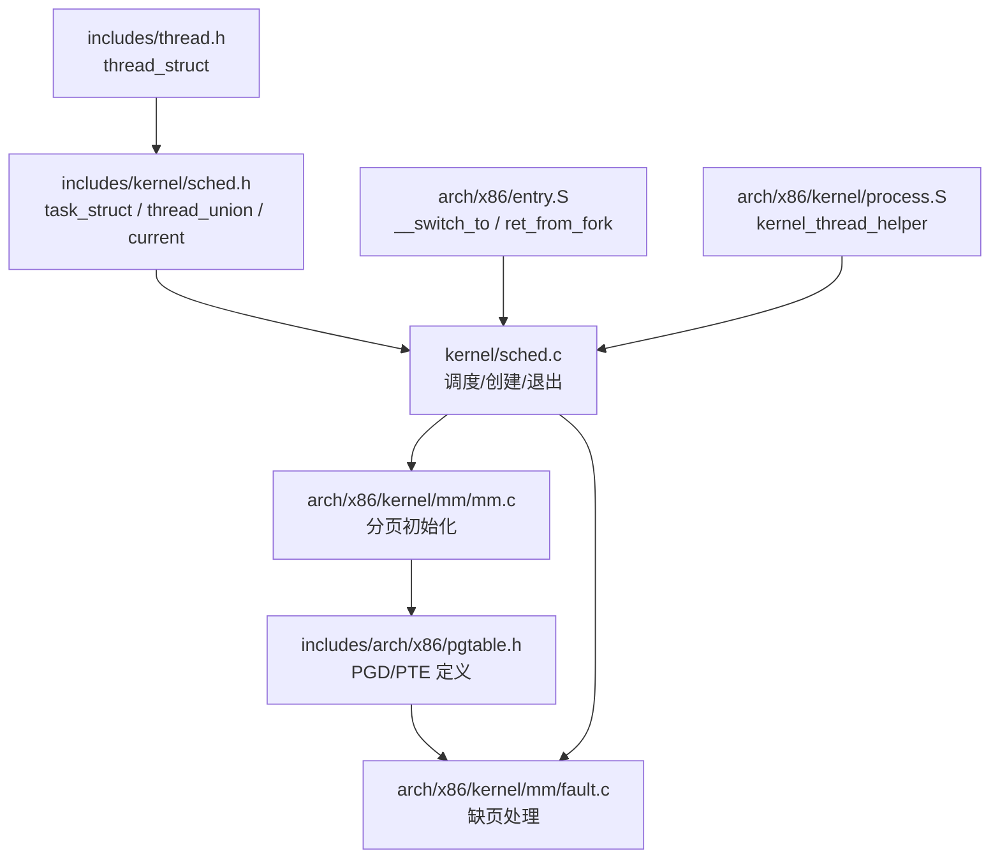
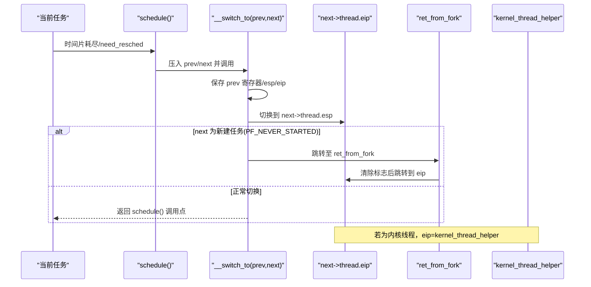
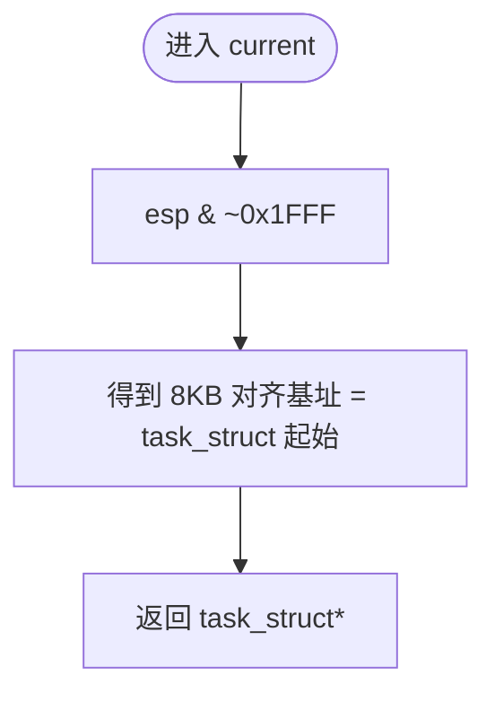
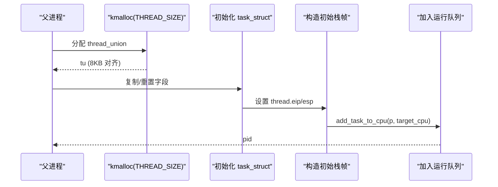
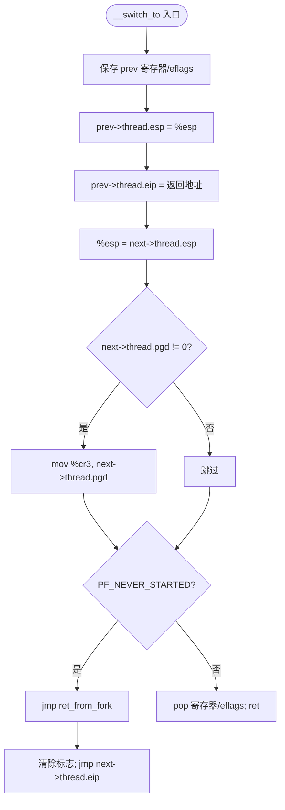
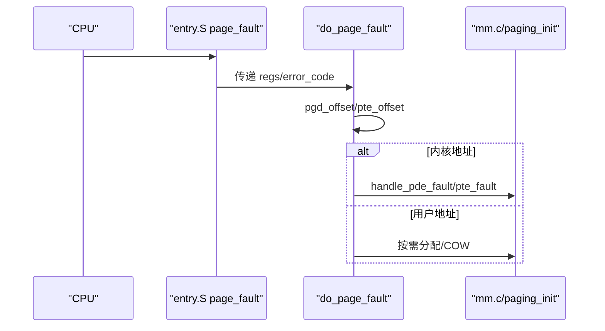
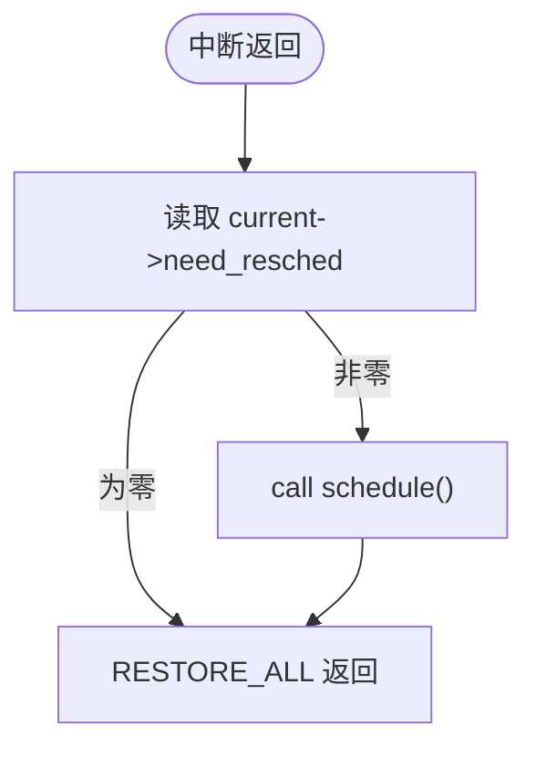
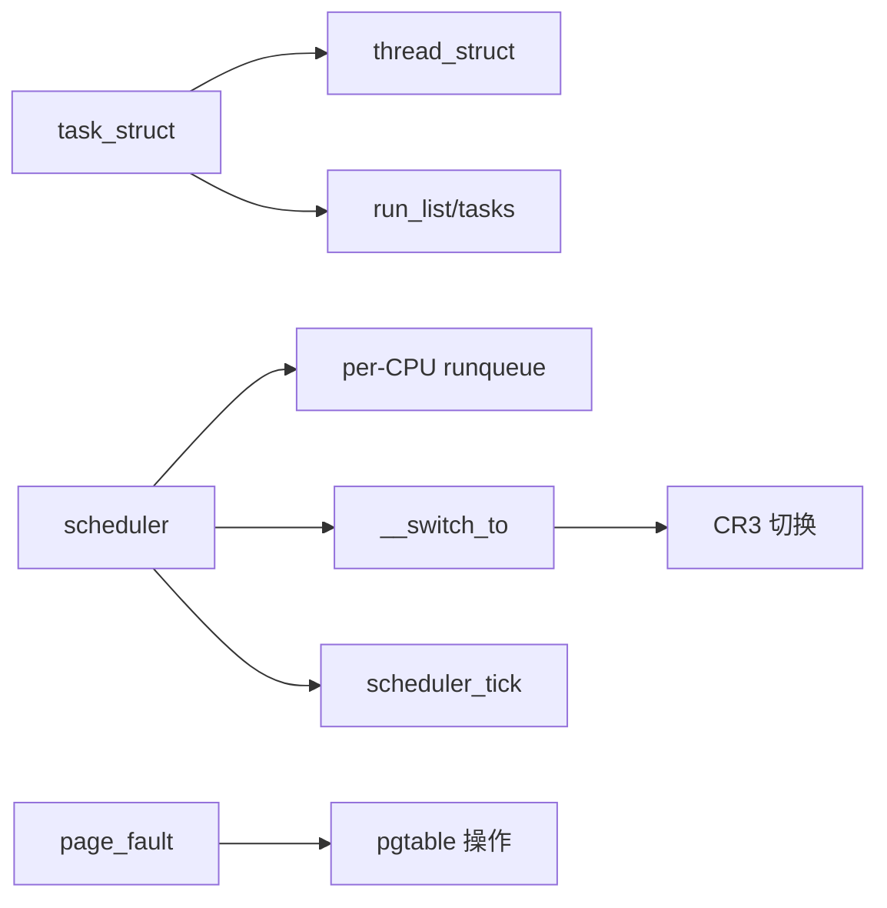

# 进程控制块设计

<cite>
**本文引用的文件**
- [includes/kernel/sched.h](file://includes/kernel/sched.h)
- [includes/thread.h](file://includes/thread.h)
- [kernel/sched.c](file://kernel/sched.c)
- [arch/x86/entry.S](file://arch/x86/entry.S)
- [arch/x86/kernel/process.S](file://arch/x86/kernel/process.S)
- [includes/arch/x86/pgtable.h](file://includes/arch/x86/pgtable.h)
- [arch/x86/kernel/mm/fault.c](file://arch/x86/kernel/mm/fault.c)
- [arch/x86/kernel/mm/mm.c](file://arch/x86/kernel/mm/mm.c)
</cite>

## 目录
1. [简介](#简介)
2. [项目结构](#项目结构)
3. [核心组件](#核心组件)
4. [架构总览](#架构总览)
5. [详细组件分析](#详细组件分析)
6. [依赖关系分析](#依赖关系分析)
7. [性能与内存布局优化](#性能与内存布局优化)
8. [故障排查指南](#故障排查指南)
9. [结论](#结论)

## 简介
本文件围绕 LulaOS 的进程控制块 task_struct 进行系统化文档化，重点解释：
- task_struct 字段定义与组织方式（状态、调度信息、线程上下文、标识等）
- thread_union 的设计模式及其与内核栈的合并布局
- current 宏的工作原理与高效访问机制
- 进程的创建、初始化与销毁流程（含代码路径引用）
- 与内存管理、中断系统的集成点
- 内存布局优化与访问效率分析

## 项目结构
LulaOS 将进程控制块相关的关键定义集中在头文件中，实现分布在调度器与架构相关汇编中：
- 数据结构定义：includes/kernel/sched.h、includes/thread.h
- 调度与生命周期：kernel/sched.c
- 上下文切换与首次执行入口：arch/x86/entry.S、arch/x86/kernel/process.S
- 内存管理与缺页处理：includes/arch/x86/pgtable.h、arch/x86/kernel/mm/fault.c、arch/x86/kernel/mm/mm.c

图表来源
- [includes/kernel/sched.h:45-81](file://includes/kernel/sched.h#L45-L81)
- [kernel/sched.c:76-97](file://kernel/sched.c#L76-L97)
- [arch/x86/entry.S:520-610](file://arch/x86/entry.S#L520-L610)
- [arch/x86/kernel/process.S:1-23](file://arch/x86/kernel/process.S#L1-L23)
- [includes/arch/x86/pgtable.h:10-46](file://includes/arch/x86/pgtable.h#L10-L46)
- [arch/x86/kernel/mm/fault.c:12-42](file://arch/x86/kernel/mm/fault.c#L12-L42)
- [arch/x86/kernel/mm/mm.c:117-134](file://arch/x86/kernel/mm/mm.c#L117-L134)

章节来源
- [includes/kernel/sched.h:1-201](file://includes/kernel/sched.h#L1-L201)
- [kernel/sched.c:1-479](file://kernel/sched.c#L1-L479)
- [arch/x86/entry.S:489-610](file://arch/x86/entry.S#L489-L610)
- [arch/x86/kernel/process.S:1-23](file://arch/x86/kernel/process.S#L1-L23)
- [includes/arch/x86/pgtable.h:1-46](file://includes/arch/x86/pgtable.h#L1-L46)
- [arch/x86/kernel/mm/fault.c:1-42](file://arch/x86/kernel/mm/fault.c#L1-L42)
- [arch/x86/kernel/mm/mm.c:117-134](file://arch/x86/kernel/mm/mm.c#L117-L134)

## 核心组件
- task_struct：进程控制块，包含调度状态、时间片、标识、链表节点、CPU 上下文等。
- thread_struct：保存线程上下文寄存器与页目录基址。
- thread_union：将 task_struct 与内核栈合并到同一 8KB 对齐块，使 current 可通过 esp 掩码直接定位。
- current 宏：通过 esp & ~(THREAD_SIZE-1) 获取当前 task_struct 指针，零额外开销。
- 运行队列与调度：按优先级+时间片轮转，支持 per-CPU 运行队列与负载均衡。
- 上下文切换：__switch_to 保存/恢复寄存器与栈指针，必要时切换 CR3 页表。
- 首次执行：ret_from_fork 清除 PF_NEVER_STARTED 并跳转到初始 eip；kernel_thread_helper 启动用户函数。

章节来源
- [includes/kernel/sched.h:45-106](file://includes/kernel/sched.h#L45-L106)
- [includes/thread.h:7-29](file://includes/thread.h#L7-L29)
- [kernel/sched.c:126-213](file://kernel/sched.c#L126-L213)
- [arch/x86/entry.S:520-610](file://arch/x86/entry.S#L520-L610)
- [arch/x86/kernel/process.S:1-23](file://arch/x86/kernel/process.S#L1-L23)

## 架构总览
下图展示从调度到上下文切换再到新任务首次执行的完整调用链，以及 current 在切换过程中的自动更新。

图表来源
- [kernel/sched.c:136-213](file://kernel/sched.c#L136-L213)
- [arch/x86/entry.S:520-610](file://arch/x86/entry.S#L520-L610)
- [arch/x86/kernel/process.S:1-23](file://arch/x86/kernel/process.S#L1-L23)

## 详细组件分析

### task_struct 字段与组织
- 调度信息：state（TASK_*）、priority、counter（剩余时间片）、timeslice（基础时间片）、need_resched（重调度标志）
- 进程标识：pid、comm
- 链表节点：run_list（运行队列）、tasks（全局任务链表）
- CPU 上下文：thread（thread_struct），包含 esp、eip、ebp、ebx、esi、edi、esp0、pgd、flags
- 其他：pt_regs（内核栈顶寄存器快照）

这些字段在 entry.S 中以固定偏移被汇编直接访问，保证上下文切换的高效性。

章节来源
- [includes/kernel/sched.h:45-67](file://includes/kernel/sched.h#L45-L67)
- [arch/x86/entry.S:514-518](file://arch/x86/entry.S#L514-L518)

### thread_union 与 current 宏
- thread_union 将 task_struct 放在低地址，内核栈在高地址向下增长，整体大小为 THREAD_SIZE（8KB）且 8KB 对齐。
- current 宏通过 esp & ~(THREAD_SIZE-1) 直接得到 task_struct 基址，无需额外查找或全局变量。
- 该设计使得每次切换只需修改 esp，current 自动指向新任务的 task_struct。

图表来源
- [includes/kernel/sched.h:93-106](file://includes/kernel/sched.h#L93-L106)
- [arch/x86/entry.S:549-552](file://arch/x86/entry.S#L549-L552)

章节来源
- [includes/kernel/sched.h:69-106](file://includes/kernel/sched.h#L69-L106)
- [arch/x86/entry.S:549-552](file://arch/x86/entry.S#L549-L552)

### 进程创建与初始化（sys_fork / kernel_thread）
- 分配 8KB 对齐的 thread_union（kmalloc(THREAD_SIZE)），确保 current 在新任务中有效。
- 复制父进程基本字段，重置调度状态，设置 PF_NEVER_STARTED。
- 构造初始栈帧：
  - sys_fork：将 pt_regs 复制到子进程栈顶，设置 thread.eip=ret_from_intr，thread.esp=pt_regs。
  - kernel_thread：在栈顶放置 [fn, arg]，设置 thread.eip=kernel_thread_helper，thread.esp=sp。
- 选择目标 CPU（可负载均衡），加入运行队列并置为 TASK_RUNNING。

图表来源
- [kernel/sched.c:275-356](file://kernel/sched.c#L275-L356)
- [kernel/sched.c:369-433](file://kernel/sched.c#L369-L433)

章节来源
- [kernel/sched.c:275-433](file://kernel/sched.c#L275-L433)

### 进程退出与销毁（do_exit）
- 将状态置为 TASK_ZOMBIE，从运行队列移除（若在队）。
- 触发调度，让出 CPU，不再继续执行。
- 后续由回收逻辑释放资源（如 thread_union 内存），此处不展开具体释放细节。

章节来源
- [kernel/sched.c:437-462](file://kernel/sched.c#L437-L462)

### 上下文切换与首次执行（__switch_to / ret_from_fork / kernel_thread_helper）
- __switch_to：
  - 保存 prev 的 callee-saved 寄存器与 eflags，记录 prev->thread.esp 与 prev->thread.eip。
  - 切换到 next->thread.esp，必要时加载 next->thread.pgd 到 CR3。
  - 若 next 设置了 PF_NEVER_STARTED，跳转到 ret_from_fork；否则恢复寄存器并 ret 回到 schedule() 调用点。
- ret_from_fork：
  - 通过 esp & ~0x1FFF 获取 current，清除 PF_NEER_STARTED，然后跳转到 next->thread.eip。
- kernel_thread_helper：
  - 弹出 fn 与 arg，调用 fn(arg)，返回后调用 do_exit(code)。

图表来源
- [arch/x86/entry.S:520-610](file://arch/x86/entry.S#L520-L610)
- [arch/x86/kernel/process.S:1-23](file://arch/x86/kernel/process.S#L1-L23)

章节来源
- [arch/x86/entry.S:520-610](file://arch/x86/entry.S#L520-L610)
- [arch/x86/kernel/process.S:1-23](file://arch/x86/kernel/process.S#L1-L23)

### 与内存管理的集成
- 上下文切换时根据 next->thread.pgd 切换 CR3，实现地址空间隔离。
- 缺页异常处理路径：page_fault → do_page_fault → 定位 PGD/PTE → 按需分配或写时复制。
- 分页初始化：建立内核映射、固定映射、持久映射，加载 swapper_pg_dir 到 CR3。

图表来源
- [arch/x86/entry.S:158-160](file://arch/x86/entry.S#L158-L160)
- [arch/x86/kernel/mm/fault.c:12-42](file://arch/x86/kernel/mm/fault.c#L12-L42)
- [arch/x86/kernel/mm/mm.c:117-134](file://arch/x86/kernel/mm/mm.c#L117-L134)

章节来源
- [arch/x86/entry.S:554-559](file://arch/x86/entry.S#L554-L559)
- [includes/arch/x86/pgtable.h:10-46](file://includes/arch/x86/pgtable.h#L10-L46)
- [arch/x86/kernel/mm/fault.c:12-42](file://arch/x86/kernel/mm/fault.c#L12-L42)
- [arch/x86/kernel/mm/mm.c:117-134](file://arch/x86/kernel/mm/mm.c#L117-L134)

### 与中断系统的集成
- 中断返回前检查 need_resched，若置位则调用 schedule()，实现抢占式调度。
- 定时器 tick 递减 counter，耗尽时设置 need_resched，等待下一次中断返回或 idle 循环检测。

图表来源
- [arch/x86/entry.S:41-58](file://arch/x86/entry.S#L41-L58)
- [kernel/sched.c:217-237](file://kernel/sched.c#L217-L237)

章节来源
- [arch/x86/entry.S:41-58](file://arch/x86/entry.S#L41-L58)
- [kernel/sched.c:217-237](file://kernel/sched.c#L217-L237)

## 依赖关系分析
- task_struct 依赖 thread_struct（CPU 上下文）与链表节点（运行队列/全局链表）。
- 调度器依赖 per-CPU 运行队列、原子 PID 计数器、SMP 工具。
- 上下文切换依赖 entry.S 中的 __switch_to 与 ret_from_fork。
- 内存管理依赖 pgtable 定义与缺页处理逻辑。

图表来源
- [includes/kernel/sched.h:45-89](file://includes/kernel/sched.h#L45-L89)
- [kernel/sched.c:57-68](file://kernel/sched.c#L57-L68)
- [arch/x86/entry.S:520-583](file://arch/x86/entry.S#L520-L583)
- [includes/arch/x86/pgtable.h:10-46](file://includes/arch/x86/pgtable.h#L10-L46)

章节来源
- [includes/kernel/sched.h:45-89](file://includes/kernel/sched.h#L45-L89)
- [kernel/sched.c:57-68](file://kernel/sched.c#L57-L68)
- [arch/x86/entry.S:520-583](file://arch/x86/entry.S#L520-L583)
- [includes/arch/x86/pgtable.h:10-46](file://includes/arch/x86/pgtable.h#L10-L46)

## 性能与内存布局优化
- 内存布局：
  - thread_union 将 task_struct 与内核栈合并到 8KB 对齐块，减少一次间接寻址，current 通过 esp 掩码即可定位，O(1) 复杂度。
  - 内核栈向下增长，避免与 task_struct 冲突，充分利用连续内存。
- 访问效率：
  - 上下文切换仅保存/恢复必要寄存器，使用固定偏移直接写入 thread_struct 字段，避免动态计算。
  - 仅在需要时切换 CR3，减少 TLB 失效次数。
- 调度效率：
  - 每 tick 递减 counter，简单快速；need_resched 在中断返回时检查，最小化调度开销。
  - 运行队列采用双向链表，插入/删除 O(1)。

[本节为通用性能讨论，不直接分析具体文件]

## 故障排查指南
- 无法获取 current：
  - 检查 thread_union 是否 8KB 对齐；确认链接脚本 .data.init_task 段对齐正确。
  - 参考 current 宏实现与 __switch_to 对 esp 的切换逻辑。
- 新任务未启动：
  - 检查 PF_NEVER_STARTED 是否被正确设置与清除；确认 ret_from_fork 能跳转到正确的 eip。
- 上下文损坏：
  - 核对 __switch_to 保存/恢复顺序与偏移；确保 thread.esp/eip 指向合法位置。
- 缺页崩溃：
  - 检查 pgd_offset/pte_offset 是否正确；确认 CR3 切换与页表项属性设置。

章节来源
- [includes/kernel/sched.h:93-106](file://includes/kernel/sched.h#L93-L106)
- [arch/x86/entry.S:520-610](file://arch/x86/entry.S#L520-L610)
- [arch/x86/kernel/mm/fault.c:12-42](file://arch/x86/kernel/mm/fault.c#L12-L42)

## 结论
LulaOS 通过 thread_union 将 task_struct 与内核栈合并到 8KB 对齐块，结合 current 宏的 esp 掩码定位，实现了高效的进程控制块访问与上下文切换。调度器以静态优先级+时间片轮转为核心，配合 per-CPU 运行队列与负载均衡，提供简洁而实用的并发模型。与内存管理和中断系统的集成点清晰明确，便于扩展与维护。