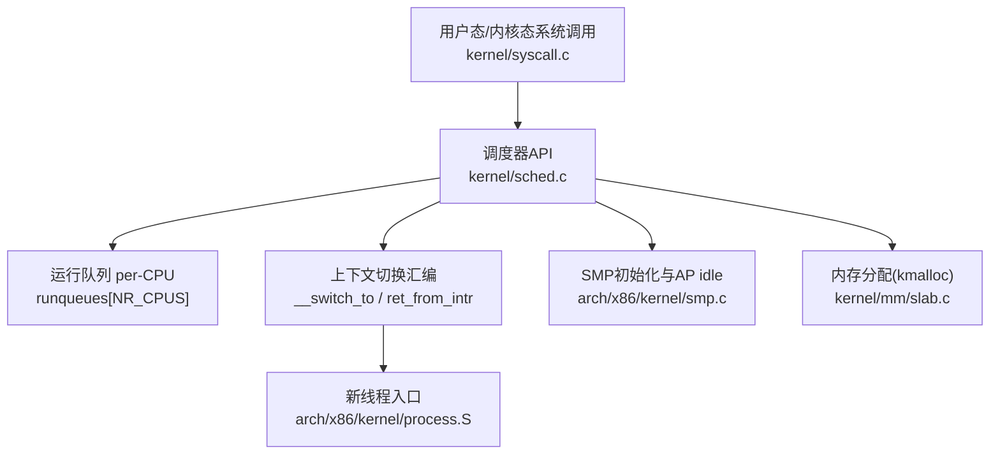
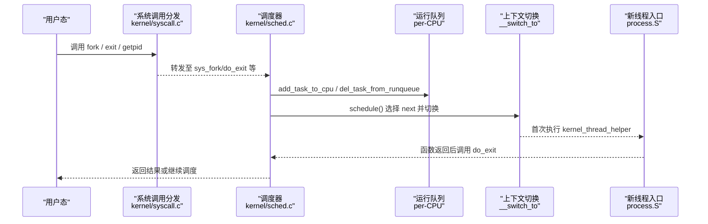
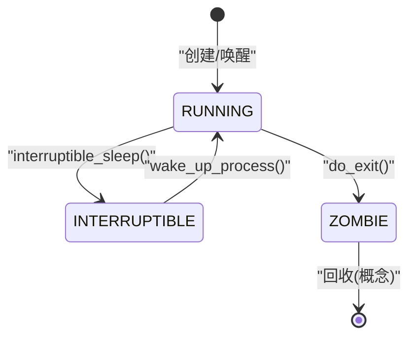
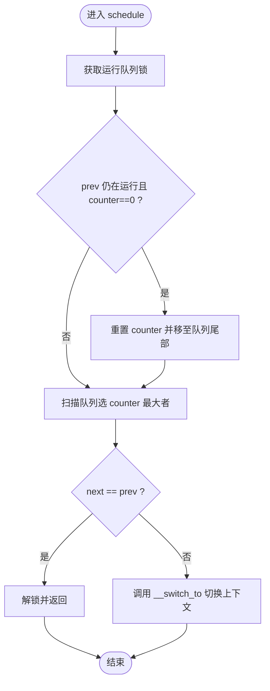
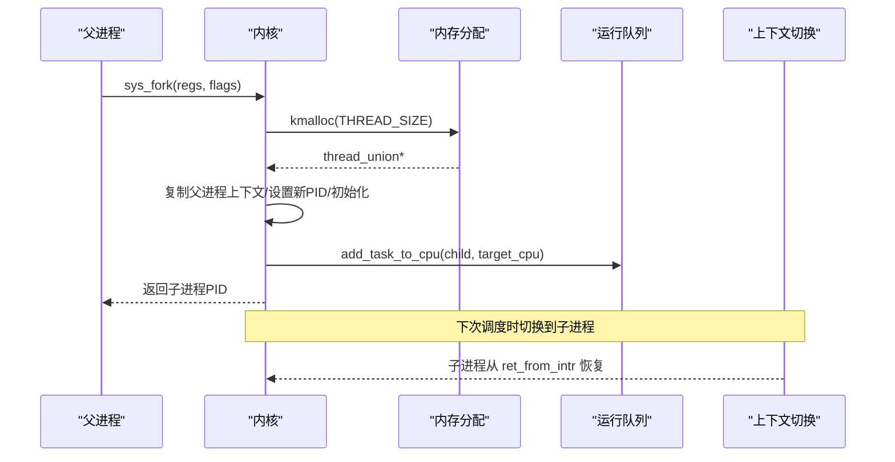
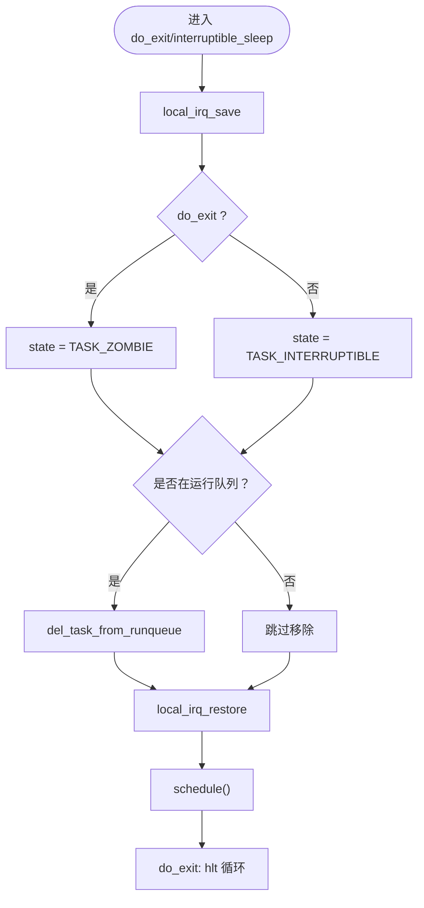
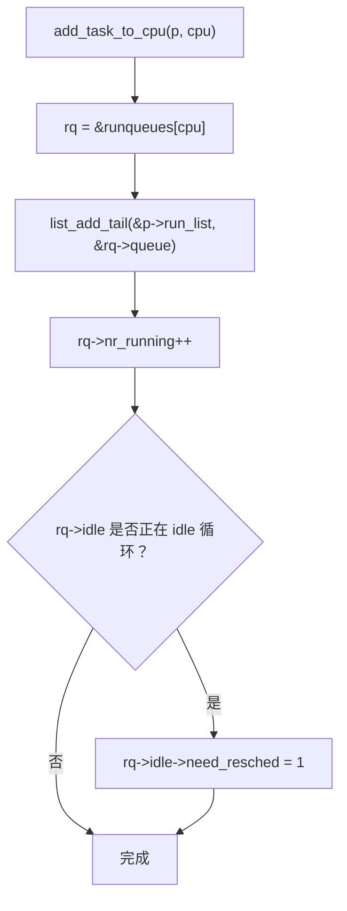
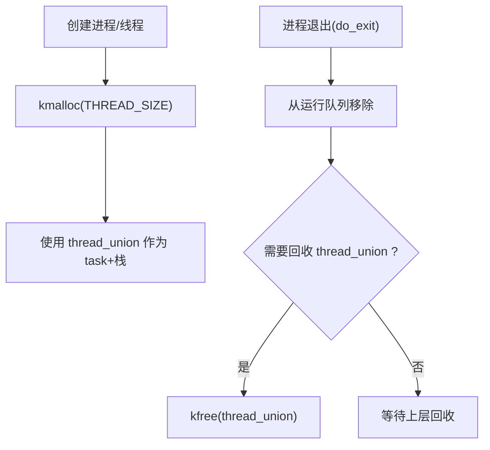
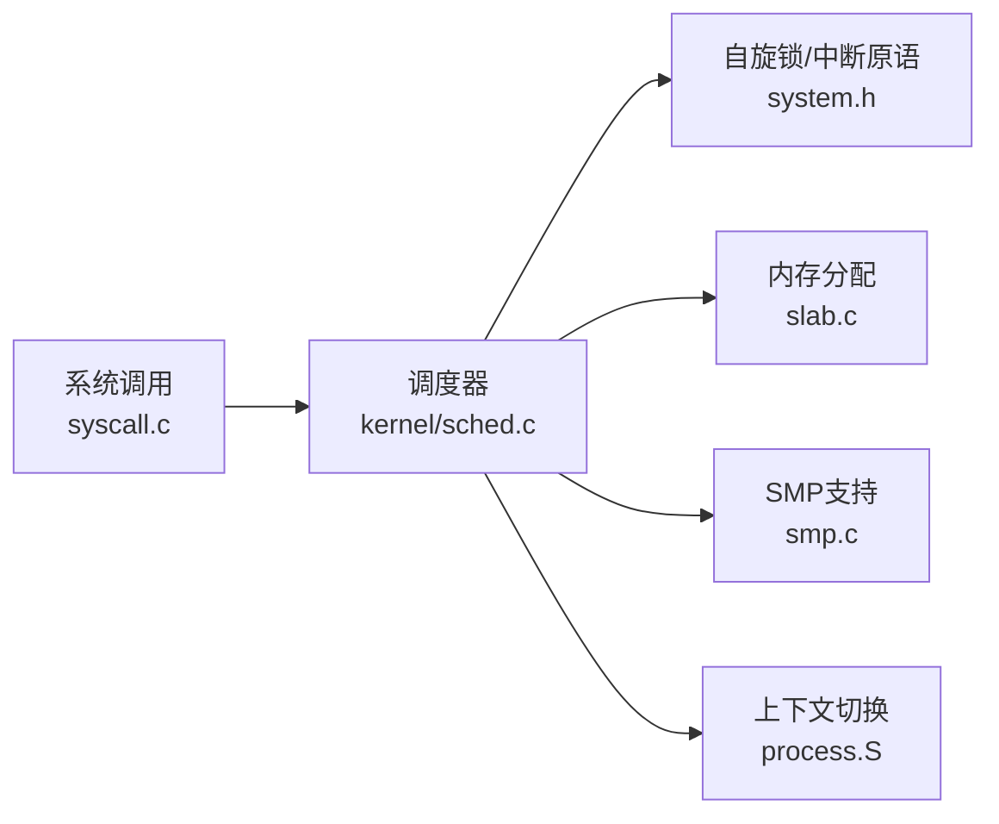

# 进程生命周期管理

<cite>
**本文引用的文件**
- [kernel/sched.c](file://kernel/sched.c)
- [includes/kernel/sched.h](file://includes/kernel/sched.h)
- [arch/x86/kernel/process.S](file://arch/x86/kernel/process.S)
- [kernel/syscall.c](file://kernel/syscall.c)
- [includes/thread.h](file://includes/thread.h)
- [arch/x86/kernel/smp.c](file://arch/x86/kernel/smp.c)
- [includes/arch/x86/system.h](file://includes/arch/x86/system.h)
- [kernel/mm/slab.c](file://kernel/mm/slab.c)
- [includes/mm/slab.h](file://includes/mm/slab.h)
</cite>

## 目录
1. [简介](#简介)
2. [项目结构](#项目结构)
3. [核心组件](#核心组件)
4. [架构总览](#架构总览)
5. [详细组件分析](#详细组件分析)
6. [依赖关系分析](#依赖关系分析)
7. [性能考量](#性能考量)
8. [故障排查指南](#故障排查指南)
9. [结论](#结论)
10. [附录](#附录)

## 简介
本文件面向LulaOS的进程生命周期管理，系统性阐述进程的创建、运行、睡眠与退出全过程，覆盖状态转换（TASK_RUNNING、TASK_UNINTERRUPTIBLE、TASK_INTERRUPTIBLE、TASK_ZOMBIE）、调度器行为、SMP负载均衡与迁移、运行队列操作（add_task_to_cpu、del_task_from_runqueue），以及资源清理与内存回收机制。文档以代码级事实为依据，辅以流程图与时序图帮助理解。

## 项目结构
与进程生命周期相关的核心实现分布在以下模块：
- 调度器与进程描述符定义：includes/kernel/sched.h、kernel/sched.c
- 上下文切换与内核线程入口：arch/x86/kernel/process.S
- SMP多核启动与idle任务注册：arch/x86/kernel/smp.c
- 系统调用接口：kernel/syscall.c
- 基础线程上下文结构：includes/thread.h
- 中断/开关中断与停机原语：includes/arch/x86/system.h
- 内存分配与释放（用于thread_union分配）：kernel/mm/slab.c、includes/mm/slab.h



图表来源
- [kernel/sched.c:128-213](file://kernel/sched.c#L128-L213)
- [arch/x86/kernel/process.S:10-18](file://arch/x86/kernel/process.S#L10-L18)
- [arch/x86/kernel/smp.c:74-215](file://arch/x86/kernel/smp.c#L74-L215)
- [kernel/mm/slab.c:518-540](file://kernel/mm/slab.c#L518-L540)

章节来源
- [kernel/sched.c:1-213](file://kernel/sched.c#L1-L213)
- [includes/kernel/sched.h:21-143](file://includes/kernel/sched.h#L21-L143)
- [arch/x86/kernel/smp.c:74-215](file://arch/x86/kernel/smp.c#L74-L215)

## 核心组件
- 进程描述符与线程上下文
  - task_struct：包含状态、优先级、时间片、链表节点、CPU上下文等
  - thread_struct：保存切换所需的寄存器与页表基址
  - thread_union：将task_struct与8KB内核栈合并，保证current宏通过esp屏蔽低13位定位task_struct
- 运行队列
  - runqueue_t：每CPU一个，含自旋锁、可运行链表、计数与idle指针
- 调度器
  - schedule()：选择下一个任务并执行上下文切换
  - scheduler_tick()：定时器tick递减counter，必要时置need_resched
  - cpu_idle()：空闲循环等待need_resched并调度
- 进程创建与销毁
  - sys_fork()：复制父进程环境，构造子进程初始栈帧，加入目标CPU运行队列
  - kernel_thread()：创建内核线程，首次执行kernel_thread_helper后调用fn(arg)，返回后do_exit
  - do_exit()：置ZOMBIE并从运行队列移除，触发调度
  - interruptible_sleep()：进入可中断睡眠并从运行队列移除
- SMP支持
  - find_idlest_cpu()：选择最空闲CPU
  - add_task_to_cpu()/add_task_to_runqueue()：将任务加入指定或当前CPU运行队列
  - smp_init/start_secondary：为每个AP建立独立idle任务并注册到对应runqueue

章节来源
- [includes/kernel/sched.h:44-143](file://includes/kernel/sched.h#L44-L143)
- [includes/thread.h:6-17](file://includes/thread.h#L6-L17)
- [kernel/sched.c:57-97](file://kernel/sched.c#L57-L97)
- [kernel/sched.c:128-213](file://kernel/sched.c#L128-L213)
- [kernel/sched.c:275-433](file://kernel/sched.c#L275-L433)
- [kernel/sched.c:437-478](file://kernel/sched.c#L437-L478)
- [arch/x86/kernel/smp.c:74-215](file://arch/x86/kernel/smp.c#L74-L215)

## 架构总览
下图展示从系统调用到调度、创建/销毁的关键路径：



图表来源
- [kernel/syscall.c:86-98](file://kernel/syscall.c#L86-L98)
- [kernel/sched.c:128-213](file://kernel/sched.c#L128-L213)
- [arch/x86/kernel/process.S:10-18](file://arch/x86/kernel/process.S#L10-L18)

## 详细组件分析

### 进程状态与转换
- 状态定义
  - TASK_RUNNING：在运行队列中可被调度
  - TASK_INTERRUPTIBLE：可中断睡眠，等待事件唤醒
  - TASK_UNINTERRUPTIBLE：不可中断睡眠
  - TASK_ZOMBIE：已退出，等待回收
- 转换条件与触发点
  - 创建后入队：sys_fork/kernel_thread 设置 state=TASK_RUNNING 并加入运行队列
  - 主动睡眠：interruptible_sleep 设置 state=TASK_INTERRUPTIBLE 并从运行队列移除
  - 退出：do_exit 设置 state=TASK_ZOMBIE 并从运行队列移除
  - 唤醒：wake_up_process 设置 state=TASK_RUNNING 并加入运行队列
  - 时间片耗尽：scheduler_tick 递减 counter，为0时置 need_resched；schedule 将counter归零的任务移到队列尾部并重新赋timeslice



图表来源
- [includes/kernel/sched.h:25-30](file://includes/kernel/sched.h#L25-L30)
- [kernel/sched.c:275-356](file://kernel/sched.c#L275-L356)
- [kernel/sched.c:369-433](file://kernel/sched.c#L369-L433)
- [kernel/sched.c:437-478](file://kernel/sched.c#L437-L478)
- [includes/kernel/sched.h:193-198](file://includes/kernel/sched.h#L193-L198)

章节来源
- [includes/kernel/sched.h:25-30](file://includes/kernel/sched.h#L25-L30)
- [kernel/sched.c:215-237](file://kernel/sched.c#L215-L237)
- [kernel/sched.c:275-478](file://kernel/sched.c#L275-L478)

### 调度器与时间片轮转
- schedule()
  - 获取当前CPU的运行队列，加锁
  - 若prev仍为RUNNING且counter=0，重置counter并移至队列尾部
  - 扫描runqueue选择counter最大的RUNNING任务作为next
  - 若next==prev则直接返回；否则调用__switch_to进行上下文切换
- scheduler_tick()
  - 对非idle任务递减counter，为0时置need_resched
- cpu_idle()
  - 内层循环safe_halt等待need_resched，外层循环调用schedule



图表来源
- [kernel/sched.c:128-213](file://kernel/sched.c#L128-L213)
- [kernel/sched.c:215-237](file://kernel/sched.c#L215-L237)
- [kernel/sched.c:250-259](file://kernel/sched.c#L250-L259)

章节来源
- [kernel/sched.c:128-213](file://kernel/sched.c#L128-L213)
- [kernel/sched.c:215-259](file://kernel/sched.c#L215-L259)

### 进程创建流程（sys_fork 与 kernel_thread）
- sys_fork
  - 分配THREAD_SIZE对齐的thread_union（kmalloc）
  - 复制父进程基本字段，分配新PID，初始化链表节点
  - 设置counter/timeslice/need_resched/flags，构造子进程pt_regs快照
  - 设置thread.eip=ret_from_intr，thread.esp指向pt_regs
  - 根据fork_flags选择目标CPU（KT_BALANCE使用find_idlest_cpu），加入运行队列并加入全局任务链表
- kernel_thread
  - 类似sys_fork，但首次执行入口为kernel_thread_helper，栈上压入[fn, arg]
  - 首次调度进入kernel_thread_helper，开启中断，弹出参数调用fn(arg)，返回后调用do_exit



图表来源
- [kernel/sched.c:275-356](file://kernel/sched.c#L275-L356)
- [kernel/sched.c:369-433](file://kernel/sched.c#L369-L433)
- [kernel/mm/slab.c:518-540](file://kernel/mm/slab.c#L518-L540)

章节来源
- [kernel/sched.c:275-433](file://kernel/sched.c#L275-L433)
- [arch/x86/kernel/process.S:10-18](file://arch/x86/kernel/process.S#L10-L18)
- [kernel/mm/slab.c:518-540](file://kernel/mm/slab.c#L518-L540)

### 进程退出与睡眠
- do_exit
  - 置state=TASK_ZOMBIE，若仍在运行队列则移除
  - 打印日志，触发schedule，之后进入停机循环
- interruptible_sleep
  - 置state=TASK_INTERRUPTIBLE，若仍在运行队列则移除
  - 触发schedule，等待唤醒



图表来源
- [kernel/sched.c:437-478](file://kernel/sched.c#L437-L478)
- [includes/kernel/sched.h:183-191](file://includes/kernel/sched.h#L183-L191)

章节来源
- [kernel/sched.c:437-478](file://kernel/sched.c#L437-L478)
- [includes/kernel/sched.h:183-191](file://includes/kernel/sched.h#L183-L191)

### 运行队列管理（add_task_to_cpu 与 del_task_from_runqueue）
- add_task_to_cpu(p, cpu)
  - 将p插入目标CPU运行队列尾部，nr_running++
  - 若目标CPU处于idle循环，写rq->idle->need_resched=1以唤醒该CPU
- add_task_to_runqueue(p)
  - 在当前CPU运行队列尾部插入，nr_running++
  - 若当前CPU正在运行idle，同样置need_resched
- del_task_from_runqueue(p)
  - 从当前CPU运行队列移除，修复链表指针，nr_running--



图表来源
- [includes/kernel/sched.h:147-181](file://includes/kernel/sched.h#L147-L181)
- [includes/kernel/sched.h:183-191](file://includes/kernel/sched.h#L183-L191)

章节来源
- [includes/kernel/sched.h:147-191](file://includes/kernel/sched.h#L147-L191)

### SMP环境与负载均衡
- find_idlest_cpu()
  - 遍历所有在线CPU，比较runqueues[i].nr_running，选择最小者；相等优先当前CPU以减少迁移开销
- smp_init()
  - 为每个AP分配独立的thread_union作为idle任务，设置其thread.esp，并将rq->idle指向该idle任务
  - 通过wbinvd确保BSP与AP间共享数据一致性
  - 发送INIT-SIPI-SIPI启动AP，等待AP上线
- start_secondary()
  - AP标记自身在线，初始化Local APIC，通知BSP完成，开中断后进入cpu_idle()

```mermaid
sequenceDiagram
participant BSP as "BSP"
participant AP as "AP"
participant MM as "内存分配"
participant RQ as "运行队列"
BSP->>MM : kmalloc(THREAD_SIZE) for AP idle
MM-->>BSP : thread_union*
BSP->>RQ : runqueues[cpu_id].idle = ap_idle
BSP->>AP : INIT-SIPI-SIPI
AP-->>BSP : 完成初始化，置 callin_map
AP->>AP : local_apic_init_ap()
AP->>AP : sti(); cpu_idle()
```

图表来源
- [arch/x86/kernel/smp.c:74-215](file://arch/x86/kernel/smp.c#L74-L215)
- [arch/x86/kernel/smp.c:233-276](file://arch/x86/kernel/smp.c#L233-L276)

章节来源
- [arch/x86/kernel/smp.c:74-215](file://arch/x86/kernel/smp.c#L74-L215)
- [arch/x86/kernel/smp.c:233-276](file://arch/x86/kernel/smp.c#L233-L276)

### 资源清理与内存回收
- 进程创建时的内存分配
  - sys_fork/kernel_thread 使用kmalloc(THREAD_SIZE)分配8KB对齐的thread_union，满足current宏要求
- 进程退出后的清理
  - do_exit将进程置为ZOMBIE并从运行队列移除，后续应回收其thread_union与相关资源
  - 当前实现未显式kfree thread_union，需由上层回收逻辑补充
- 内存分配器
  - kmalloc/kfree基于slab缓存，按大小选择合适缓存分配/释放
  - THREAD_SIZE(8192)命中order=1伙伴系统分配，保证8KB对齐



图表来源
- [kernel/sched.c:275-356](file://kernel/sched.c#L275-L356)
- [kernel/sched.c:369-433](file://kernel/sched.c#L369-L433)
- [kernel/sched.c:437-478](file://kernel/sched.c#L437-L478)
- [kernel/mm/slab.c:518-540](file://kernel/mm/slab.c#L518-L540)
- [includes/mm/slab.h:121-146](file://includes/mm/slab.h#L121-L146)

章节来源
- [kernel/sched.c:275-478](file://kernel/sched.c#L275-L478)
- [kernel/mm/slab.c:518-540](file://kernel/mm/slab.c#L518-L540)
- [includes/mm/slab.h:121-146](file://includes/mm/slab.h#L121-L146)

## 依赖关系分析
- 调度器依赖
  - 运行队列与自旋锁：per-CPU runqueues[NR_CPUS]，spinlock保护
  - 系统原语：local_irq_save/restore、safe_halt、sti/cli
  - 内存分配：kmalloc用于分配thread_union
  - SMP：find_idlest_cpu、smp_processor_id、cpu_online_map
- 上下文切换依赖
  - __switch_to与ret_from_intr：C侧设置thread.eip/esp，汇编侧负责切换与恢复
- 系统调用依赖
  - syscall_table分发：do_syscall根据编号调用具体处理函数



图表来源
- [includes/arch/x86/system.h:12-33](file://includes/arch/x86/system.h#L12-L33)
- [kernel/mm/slab.c:518-540](file://kernel/mm/slab.c#L518-L540)
- [arch/x86/kernel/smp.c:74-215](file://arch/x86/kernel/smp.c#L74-L215)
- [kernel/syscall.c:86-98](file://kernel/syscall.c#L86-L98)

章节来源
- [includes/arch/x86/system.h:12-33](file://includes/arch/x86/system.h#L12-L33)
- [kernel/syscall.c:86-98](file://kernel/syscall.c#L86-L98)
- [kernel/sched.c:128-213](file://kernel/sched.c#L128-L213)

## 性能考量
- 时间片与调度开销
  - 静态优先级+时间片轮转，counter递减与need_resched标志减少不必要的频繁切换
  - idle任务counter保持MAX_TIMESLICE，避免误调度
- 负载均衡
  - find_idlest_cpu仅比较nr_running，计算开销小；相等时优先当前CPU降低cache miss
- SMP一致性
  - wbinvd确保BSP写入的idle任务与栈信息对AP可见，避免竞态
- 内存分配
  - kmalloc按大小选择缓存，THREAD_SIZE命中大对象缓存，减少碎片

[本节为通用指导，不直接分析具体文件]

## 故障排查指南
- 新进程无法调度
  - 检查是否成功加入运行队列（add_task_to_cpu/add_task_to_runqueue）
  - 确认目标CPU的rq->idle->need_resched已被置位，避免idle一直hlt
- AP无法上线
  - 检查smp_init中是否为AP分配了独立thread_union并设置rq->idle
  - 确认wbinvd前已正确写入ap_stack_start.esp与rq->idle
- 进程退出后仍占用CPU
  - 确认do_exit已将state置为TASK_ZOMBIE并从运行队列移除
  - 检查是否有遗漏的schedule调用导致卡住
- 睡眠后无法唤醒
  - 确认唤醒方调用了wake_up_process，将state设为TASK_RUNNING并加入运行队列

章节来源
- [kernel/sched.c:147-181](file://kernel/sched.c#L147-L181)
- [kernel/sched.c:250-259](file://kernel/sched.c#L250-L259)
- [arch/x86/kernel/smp.c:170-180](file://arch/x86/kernel/smp.c#L170-L180)
- [kernel/sched.c:437-478](file://kernel/sched.c#L437-L478)
- [includes/kernel/sched.h:193-198](file://includes/kernel/sched.h#L193-L198)

## 结论
LulaOS的进程生命周期管理围绕简洁高效的调度器展开：通过thread_union合并task_struct与内核栈，简化current定位；以per-CPU运行队列与轻量负载均衡实现SMP支持；通过明确的状态机与调度时机控制进程创建、运行、睡眠与退出。内存分配基于slab，满足8KB对齐需求。整体设计清晰、可扩展，便于后续引入更复杂的调度策略与资源回收机制。

[本节为总结性内容，不直接分析具体文件]

## 附录
- 关键API速查
  - 调度：sched_init、schedule、scheduler_tick、cpu_idle
  - 创建：sys_fork、kernel_thread
  - 退出/睡眠：do_exit、interruptible_sleep
  - 运行队列：add_task_to_runqueue、add_task_to_cpu、del_task_from_runqueue、wake_up_process
  - SMP：find_idlest_cpu、smp_init、start_secondary
  - 内存：kmalloc、kfree

章节来源
- [includes/kernel/sched.h:128-143](file://includes/kernel/sched.h#L128-L143)
- [kernel/sched.c:76-97](file://kernel/sched.c#L76-L97)
- [kernel/sched.c:128-213](file://kernel/sched.c#L128-L213)
- [kernel/sched.c:275-478](file://kernel/sched.c#L275-L478)
- [arch/x86/kernel/smp.c:74-215](file://arch/x86/kernel/smp.c#L74-L215)
- [kernel/mm/slab.c:518-540](file://kernel/mm/slab.c#L518-L540)