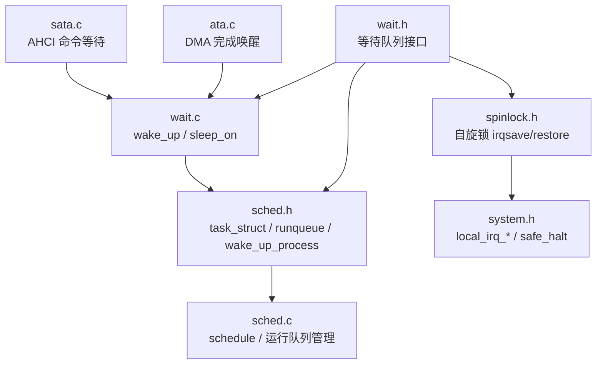
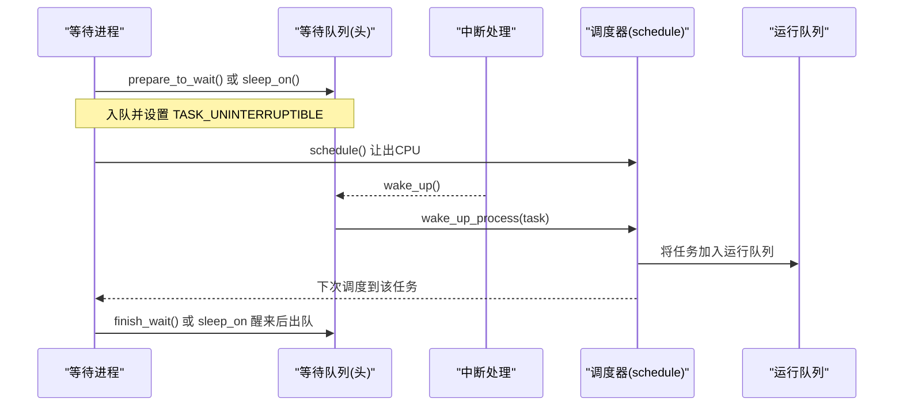
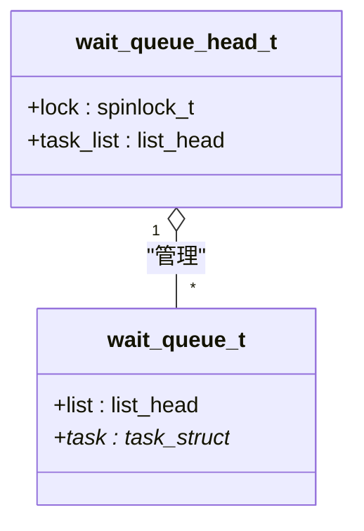
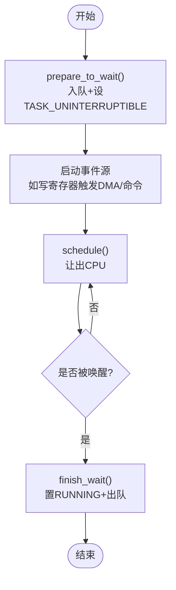
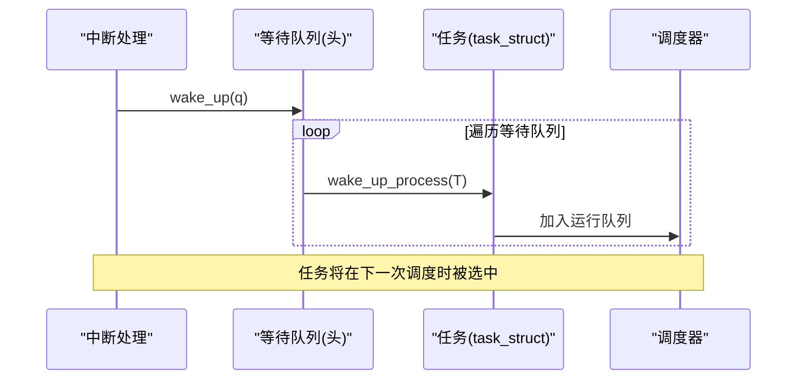
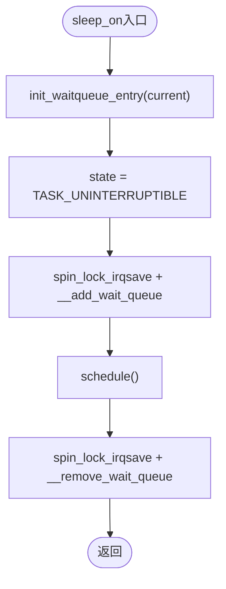
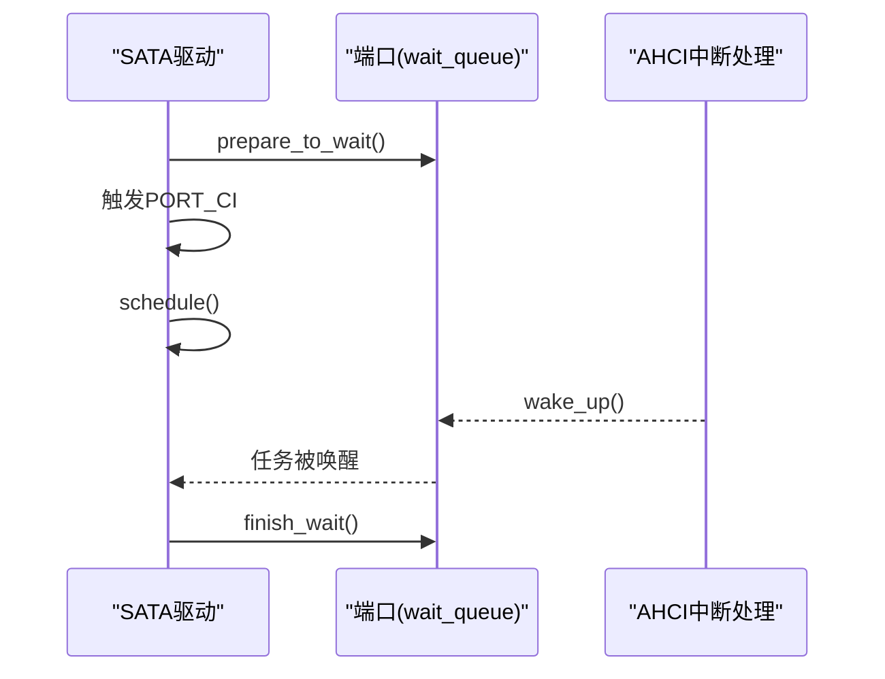
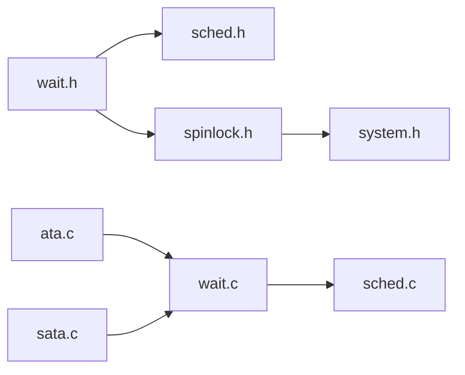

# 等待队列同步机制

<cite>
**本文引用的文件**
- [includes/wait.h](file://includes/wait.h)
- [kernel/wait.c](file://kernel/wait.c)
- [includes/kernel/sched.h](file://includes/kernel/sched.h)
- [kernel/sched.c](file://kernel/sched.c)
- [includes/arch/x86/spinlock.h](file://includes/arch/x86/spinlock.h)
- [includes/arch/x86/system.h](file://includes/arch/x86/system.h)
- [kernel/ata/ata.c](file://kernel/ata/ata.c)
- [kernel/sata/sata.c](file://kernel/sata/sata.c)
</cite>

## 目录
1. [简介](#简介)
2. [项目结构](#项目结构)
3. [核心组件](#核心组件)
4. [架构总览](#架构总览)
5. [详细组件分析](#详细组件分析)
6. [依赖关系分析](#依赖关系分析)
7. [性能考虑](#性能考虑)
8. [故障排查指南](#故障排查指南)
9. [结论](#结论)
10. [附录](#附录)

## 简介
本文件系统性地梳理并文档化 LulaOS 中的“等待队列同步机制”。该机制用于进程在等待 I/O、中断或事件完成时进入睡眠，并在事件就绪时被唤醒。其设计对齐 Linux 2.6.20 的 wait 接口思想：通过自旋锁保护等待队列头，使用“入队 + 设置睡眠状态”的原子操作避免唤醒丢失；唤醒侧在中断上下文中遍历等待队列，将任务置为可运行并加入运行队列；被唤醒进程醒来后自行清理等待队列条目。

## 项目结构
围绕等待队列的关键代码分布在以下位置：
- 等待队列接口与数据结构定义：includes/wait.h
- 等待队列实现（wake_up、sleep_on）：kernel/wait.c
- 调度器与任务状态管理（schedule、wake_up_process、runqueue）：includes/kernel/sched.h、kernel/sched.c
- 自旋锁与中断开关：includes/arch/x86/spinlock.h、includes/arch/x86/system.h
- 实际驱动中使用等待队列的例子：kernel/ata/ata.c、kernel/sata/sata.c

**图表来源**
- [includes/wait.h:20-30](file://includes/wait.h#L20-L30)
- [kernel/wait.c:26-42](file://kernel/wait.c#L26-L42)
- [includes/kernel/sched.h:193-223](file://includes/kernel/sched.h#L193-L223)
- [kernel/sched.c:136-227](file://kernel/sched.c#L136-L227)
- [includes/arch/x86/spinlock.h:137-138](file://includes/arch/x86/spinlock.h#L137-L138)
- [includes/arch/x86/system.h:19-24](file://includes/arch/x86/system.h#L19-L24)
- [kernel/ata/ata.c:570-574](file://kernel/ata/ata.c#L570-L574)
- [kernel/sata/sata.c:180-226](file://kernel/sata/sata.c#L180-L226)

**章节来源**
- [includes/wait.h:1-140](file://includes/wait.h#L1-L140)
- [kernel/wait.c:1-84](file://kernel/wait.c#L1-L84)
- [includes/kernel/sched.h:1-226](file://includes/kernel/sched.h#L1-L226)
- [kernel/sched.c:1-493](file://kernel/sched.c#L1-L493)
- [includes/arch/x86/spinlock.h:1-142](file://includes/arch/x86/spinlock.h#L1-L142)
- [includes/arch/x86/system.h:1-33](file://includes/arch/x86/system.h#L1-L33)
- [kernel/ata/ata.c:570-574](file://kernel/ata/ata.c#L570-L574)
- [kernel/sata/sata.c:180-226](file://kernel/sata/sata.c#L180-L226)

## 核心组件
- 等待队列头与条目
  - 等待队列头包含自旋锁和双向链表，用于管理所有等待同一事件的进程。
  - 等待队列条目保存指向当前 task_struct 的指针，表示一个等待者。
- 关键 API
  - 初始化：init_waitqueue_head、init_waitqueue_entry
  - 入队/出队：add_wait_queue、remove_wait_queue、__add_wait_queue、__remove_wait_queue
  - 三段式等待：prepare_to_wait、finish_wait
  - 唤醒：wake_up
  - 便捷睡眠：sleep_on
- 调度器协作
  - wake_up_process：将任务状态置为 RUNNING 并加入运行队列（防重复入队）。
  - schedule：从运行队列选择下一个任务；若当前任务不可运行则将其从运行队列移除。
- 并发原语
  - spin_lock_irqsave/spin_unlock_irqrestore：在持有自旋锁的同时保存并关闭本地中断，确保中断上下文安全。
  - local_irq_save/local_irq_restore：保存/恢复中断标志位。

**章节来源**
- [includes/wait.h:20-137](file://includes/wait.h#L20-L137)
- [kernel/wait.c:26-83](file://kernel/wait.c#L26-L83)
- [includes/kernel/sched.h:193-223](file://includes/kernel/sched.h#L193-L223)
- [kernel/sched.c:136-227](file://kernel/sched.c#L136-L227)
- [includes/arch/x86/spinlock.h:137-138](file://includes/arch/x86/spinlock.h#L137-L138)
- [includes/arch/x86/system.h:19-24](file://includes/arch/x86/system.h#L19-L24)

## 架构总览
等待队列机制由“等待者”和“唤醒者”两部分组成，并通过调度器的运行队列进行桥接：
- 等待者：调用 prepare_to_wait 或 sleep_on 将自己加入等待队列并进入睡眠。
- 唤醒者：在硬中断或进程上下文调用 wake_up，遍历等待队列并将每个等待者的任务置为可运行并加入运行队列。
- 调度器：schedule 负责扫描运行队列并切换任务；当任务被唤醒后，schedule 会将其纳入调度。

**图表来源**
- [includes/wait.h:103-131](file://includes/wait.h#L103-L131)
- [kernel/wait.c:26-42](file://kernel/wait.c#L26-L42)
- [includes/kernel/sched.h:193-223](file://includes/kernel/sched.h#L193-L223)
- [kernel/sched.c:136-227](file://kernel/sched.c#L136-L227)

## 详细组件分析

### 等待队列头与条目
- 数据结构
  - 等待队列头：包含自旋锁与任务链表。
  - 等待队列条目：包含链表节点与任务指针。
- 初始化与检查
  - init_waitqueue_head：初始化锁与链表。
  - init_waitqueue_entry：初始化条目并绑定任务。
  - waitqueue_active：判断队列是否为空。
- 内部无锁操作
  - __add_wait_queue：尾部插入。
  - __remove_wait_queue：删除并重置链表节点。
- 对外带锁操作
  - add_wait_queue/remove_wait_queue：加锁后调用内部操作。

**图表来源**
- [includes/wait.h:20-30](file://includes/wait.h#L20-L30)

**章节来源**
- [includes/wait.h:20-87](file://includes/wait.h#L20-L87)

### 三段式等待：prepare_to_wait / schedule / finish_wait
- prepare_to_wait
  - 持锁原子地执行“入队 + 设置不可中断睡眠”，避免唤醒丢失。
  - 适用于需要在入队之后、睡眠之前启动事件源的场景（如 DMA 启动）。
- schedule
  - 让出 CPU；调度器检测到 state != RUNNING 会将任务从运行队列移除。
- finish_wait
  - 醒来后将状态置回 RUNNING，并持锁从等待队列中移除条目。

**图表来源**
- [includes/wait.h:103-131](file://includes/wait.h#L103-L131)
- [kernel/sched.c:136-227](file://kernel/sched.c#L136-L227)

**章节来源**
- [includes/wait.h:103-131](file://includes/wait.h#L103-L131)
- [kernel/sched.c:136-227](file://kernel/sched.c#L136-L227)

### 唤醒流程：wake_up 与 wake_up_process
- wake_up
  - 持等待队列头锁遍历任务链表，对每个 entry 调用 wake_up_process。
  - 不直接操作等待队列条目，避免中断上下文访问睡眠者栈的风险。
- wake_up_process
  - 将任务状态置为 RUNNING。
  - 若任务不在运行队列中，则加入运行队列；已在队列中则跳过（防重复）。
- 与调度器的协作
  - schedule 会在合适时机选择运行队列中的任务并切换上下文。

**图表来源**
- [kernel/wait.c:26-42](file://kernel/wait.c#L26-L42)
- [includes/kernel/sched.h:193-223](file://includes/kernel/sched.h#L193-L223)
- [kernel/sched.c:136-227](file://kernel/sched.c#L136-L227)

**章节来源**
- [kernel/wait.c:26-42](file://kernel/wait.c#L26-L42)
- [includes/kernel/sched.h:193-223](file://includes/kernel/sched.h#L193-L223)
- [kernel/sched.c:136-227](file://kernel/sched.c#L136-L227)

### 便捷睡眠：sleep_on
- 步骤
  - 初始化等待条目并设置不可中断睡眠。
  - 持锁入队。
  - schedule 让出 CPU。
  - 醒来后持锁出队。
- 适用限制
  - 如果事件在进入函数前已触发，可能丢失唤醒（因为尚未入队）。
  - 适合“先准备再启动事件源”的场景，或允许丢失事件的场景。

**图表来源**
- [kernel/wait.c:61-83](file://kernel/wait.c#L61-L83)

**章节来源**
- [kernel/wait.c:61-83](file://kernel/wait.c#L61-L83)

### 驱动使用示例
- ATA DMA 完成唤醒
  - 在 DMA 完成后调用 wake_up(&host->wait_queue)，唤醒等待 DMA 完成的进程。
- SATA AHCI 命令等待
  - 使用三段式：prepare_to_wait → 触发 PORT_CI → schedule → finish_wait。
  - 中断处理函数读取端口状态快照，并调用 wake_up(&port->wait_queue)。

**图表来源**
- [kernel/sata/sata.c:180-226](file://kernel/sata/sata.c#L180-L226)
- [kernel/sata/sata.c:248-284](file://kernel/sata/sata.c#L248-L284)
- [kernel/ata/ata.c:570-574](file://kernel/ata/ata.c#L570-L574)

**章节来源**
- [kernel/ata/ata.c:570-574](file://kernel/ata/ata.c#L570-L574)
- [kernel/sata/sata.c:180-226](file://kernel/sata/sata.c#L180-L226)
- [kernel/sata/sata.c:248-284](file://kernel/sata/sata.c#L248-L284)

## 依赖关系分析
- 等待队列依赖调度器
  - wake_up 依赖 wake_up_process 将任务加入运行队列。
  - schedule 负责从运行队列中选择任务并切换上下文。
- 并发控制依赖自旋锁与中断开关
  - 等待队列头的操作必须使用 spin_lock_irqsave/spin_unlock_irqrestore，以支持中断上下文。
  - 系统级中断开关由 system.h 提供。
- 数据结构依赖
  - 链表操作来自 libs/list.h（通过 wait.h 间接使用）。
  - 任务描述符与运行队列来自 sched.h。

**图表来源**
- [includes/wait.h:1-140](file://includes/wait.h#L1-L140)
- [kernel/wait.c:1-84](file://kernel/wait.c#L1-L84)
- [includes/kernel/sched.h:1-226](file://includes/kernel/sched.h#L1-L226)
- [kernel/sched.c:1-493](file://kernel/sched.c#L1-L493)
- [includes/arch/x86/spinlock.h:1-142](file://includes/arch/x86/spinlock.h#L1-L142)
- [includes/arch/x86/system.h:1-33](file://includes/arch/x86/system.h#L1-L33)
- [kernel/ata/ata.c:570-574](file://kernel/ata/ata.c#L570-L574)
- [kernel/sata/sata.c:180-226](file://kernel/sata/sata.c#L180-L226)

**章节来源**
- [includes/wait.h:1-140](file://includes/wait.h#L1-L140)
- [kernel/wait.c:1-84](file://kernel/wait.c#L1-L84)
- [includes/kernel/sched.h:1-226](file://includes/kernel/sched.h#L1-L226)
- [kernel/sched.c:1-493](file://kernel/sched.c#L1-L493)
- [includes/arch/x86/spinlock.h:1-142](file://includes/arch/x86/spinlock.h#L1-L142)
- [includes/arch/x86/system.h:1-33](file://includes/arch/x86/system.h#L1-L33)
- [kernel/ata/ata.c:570-574](file://kernel/ata/ata.c#L570-L574)
- [kernel/sata/sata.c:180-226](file://kernel/sata/sata.c#L180-L226)

## 性能考虑
- 最小临界区
  - 等待队列的入队/出队与状态设置尽量保持短临界区，减少锁持有时间。
- 避免重复入队
  - wake_up_process 内部检查 run_list 自指，防止重复加入运行队列，降低调度开销。
- 中断上下文安全
  - 使用 irqsave/restore 变体，避免在中断中死锁。
- 事件顺序
  - 使用 prepare_to_wait 保证“入队 + 启动事件源”的顺序，避免唤醒丢失导致的永久睡眠。

[本节为通用指导，不直接分析具体文件]

## 故障排查指南
- 唤醒丢失导致永久睡眠
  - 现象：调用 sleep_on 后事件提前到达，wake_up 遍历空队列，进程永远睡眠。
  - 解决：改用 prepare_to_wait → 启动事件源 → schedule → finish_wait 三段式。
- 运行队列损坏
  - 现象：schedule 选择任务异常或任务饥饿。
  - 排查：确认 wake_up_process 的重复入队保护；检查是否在非预期路径修改了 run_list。
- 自旋锁竞争
  - 现象：高负载下延迟增加。
  - 排查：缩短临界区；避免在锁内执行耗时操作；确认中断开关正确。
- 中断未唤醒
  - 现象：设备完成但未唤醒等待进程。
  - 排查：确认中断处理函数调用了 wake_up；检查等待队列头是否正确初始化。

**章节来源**
- [kernel/wait.c:61-83](file://kernel/wait.c#L61-L83)
- [includes/wait.h:103-131](file://includes/wait.h#L103-L131)
- [includes/kernel/sched.h:193-223](file://includes/kernel/sched.h#L193-L223)
- [kernel/sched.c:136-227](file://kernel/sched.c#L136-L227)

## 结论
LulaOS 的等待队列同步机制通过自旋锁保护、三段式等待与调度器的紧密协作，实现了可靠的进程睡眠/唤醒语义。其设计遵循 Linux 2.6.20 的思想，兼顾中断上下文安全与性能。驱动层通过 prepare_to_wait/schedule/finish_wait 模式确保事件顺序，避免唤醒丢失；wake_up 仅负责状态转换与入队，职责清晰。整体架构简洁、可扩展，适用于磁盘、网络等异步 I/O 场景。

[本节为总结性内容，不直接分析具体文件]

## 附录
- 术语
  - 等待队列：管理等待同一事件的进程集合。
  - 运行队列：调度器维护的可运行任务集合。
  - 自旋锁：忙等互斥原语，常用于内核临界区。
- 参考实现路径
  - 等待队列接口：includes/wait.h
  - 等待队列实现：kernel/wait.c
  - 调度器与任务管理：includes/kernel/sched.h、kernel/sched.c
  - 并发原语：includes/arch/x86/spinlock.h、includes/arch/x86/system.h
  - 驱动示例：kernel/ata/ata.c、kernel/sata/sata.c

[本节为补充信息，不直接分析具体文件]