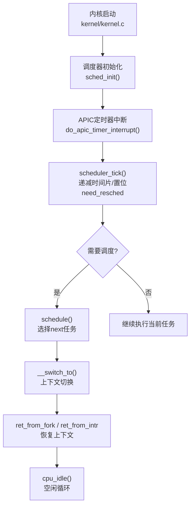
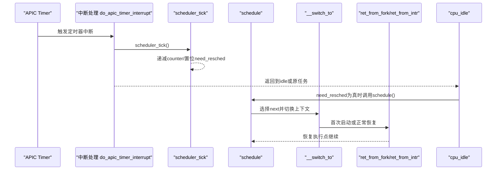
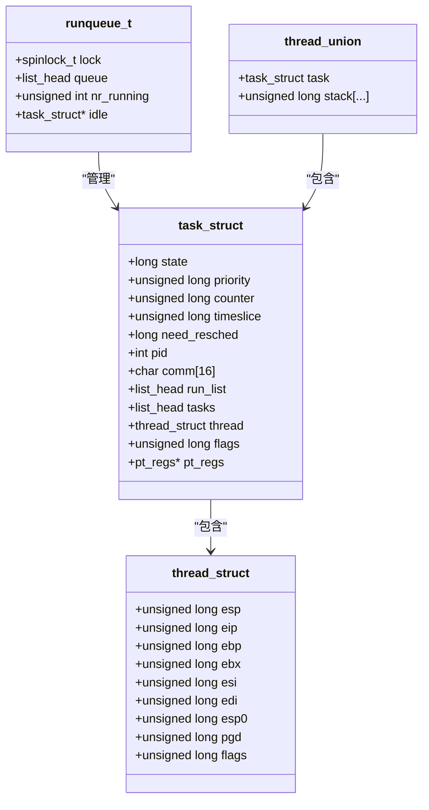
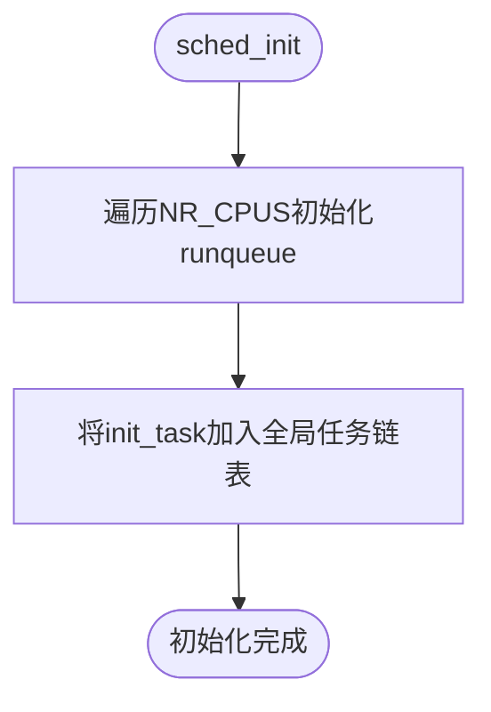
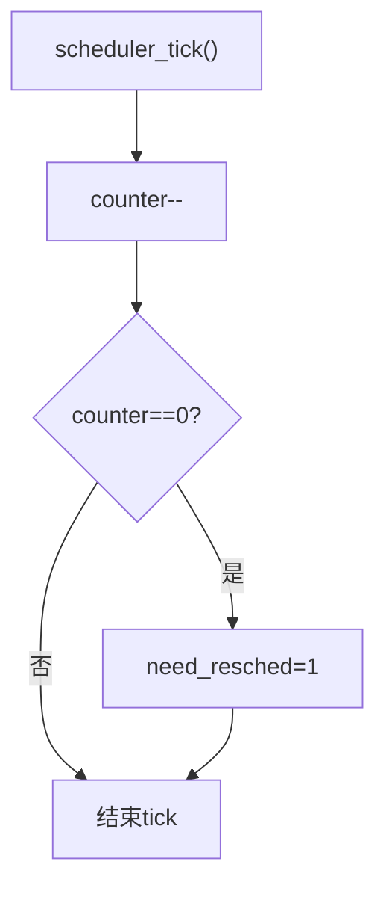
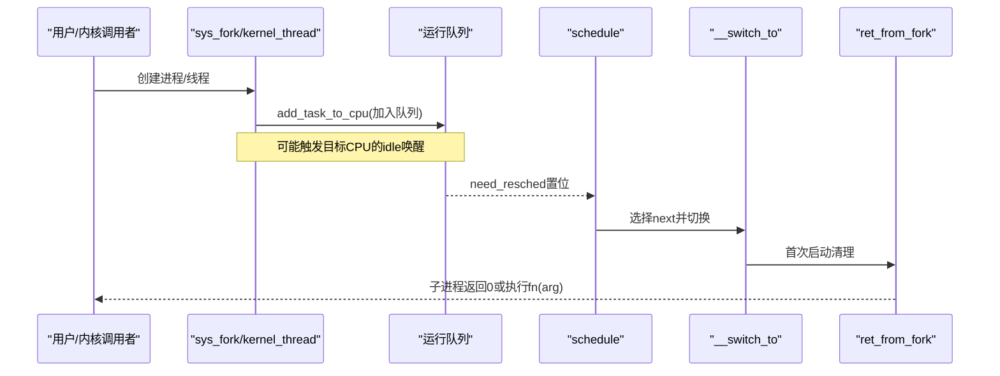
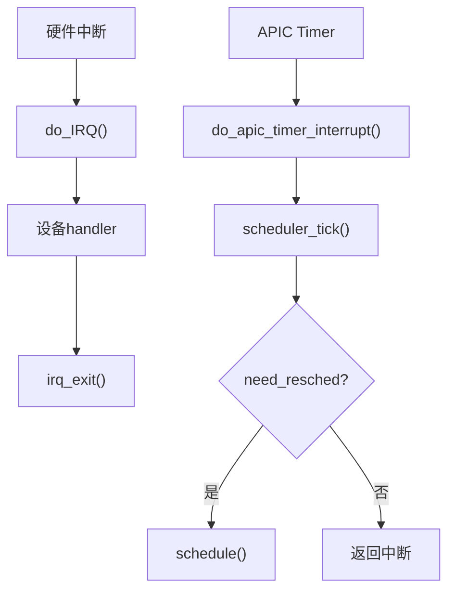
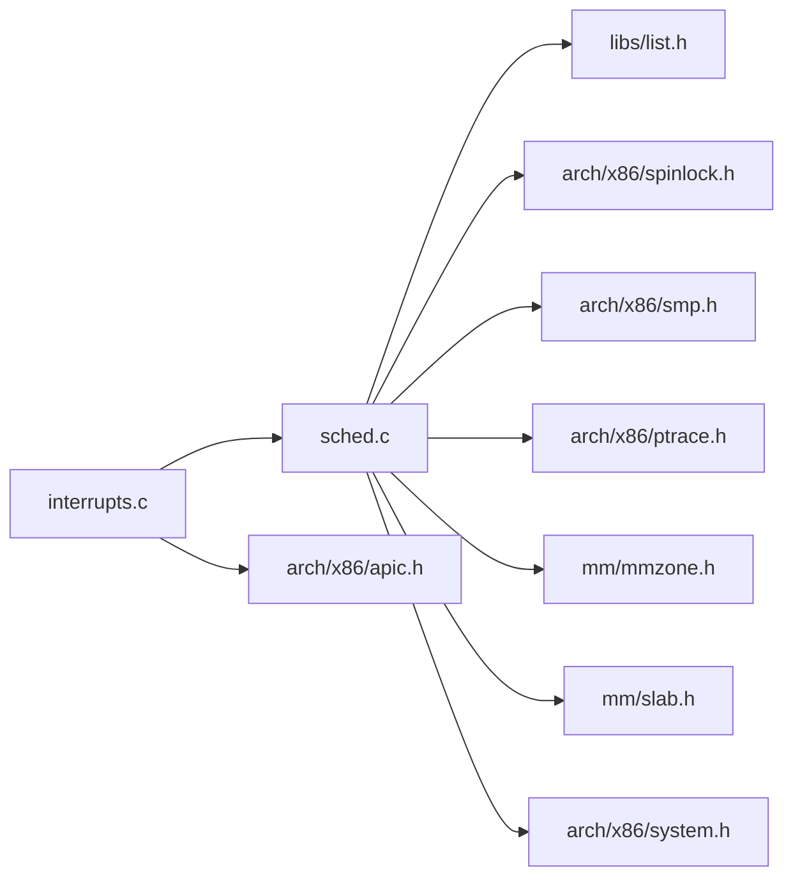

# 进程调度系统

<cite>
**本文引用的文件**
- [includes/kernel/sched.h](file://includes/kernel/sched.h)
- [kernel/sched.c](file://kernel/sched.c)
- [arch/x86/entry.S](file://arch/x86/entry.S)
- [arch/x86/kernel/process.S](file://arch/x86/kernel/process.S)
- [includes/thread.h](file://includes/thread.h)
- [kernel/interrupts/interrupts.c](file://kernel/interrupts/interrupts.c)
- [includes/arch/x86/system.h](file://includes/arch/x86/system.h)
- [kernel/kernel.c](file://kernel/kernel.c)
</cite>

## 目录
1. [简介](#简介)
2. [项目结构](#项目结构)
3. [核心组件](#核心组件)
4. [架构总览](#架构总览)
5. [详细组件分析](#详细组件分析)
6. [依赖关系分析](#依赖关系分析)
7. [性能考虑](#性能考虑)
8. [故障排查指南](#故障排查指南)
9. [结论](#结论)
10. [附录](#附录)

## 简介
本文件面向LulaOS的进程调度子系统，围绕时间片轮转调度算法的实现进行深入说明。内容涵盖：
- 进程控制块 task_struct 的数据结构设计
- 调度器初始化流程
- 进程状态管理与运行队列组织
- 上下文切换机制（含汇编实现）
- 调度策略、优先级与时间片分配算法
- 进程创建、调度与销毁的完整流程示例
- 与中断系统和内存管理的集成点
- 性能优化建议与常见问题解决方案

## 项目结构
调度相关代码主要分布在以下位置：
- 头文件定义：includes/kernel/sched.h、includes/thread.h
- 调度器实现：kernel/sched.c
- 上下文切换与首次执行入口：arch/x86/entry.S、arch/x86/kernel/process.S
- 中断与定时器驱动调度：kernel/interrupts/interrupts.c
- 系统启动与idle循环：kernel/kernel.c
- 底层系统调用与CPU指令封装：includes/arch/x86/system.h



图表来源
- [kernel/kernel.c:72-136](file://kernel/kernel.c#L72-L136)
- [kernel/sched.c:76-97](file://kernel/sched.c#L76-L97)
- [kernel/interrupts/interrupts.c:116-128](file://kernel/interrupts/interrupts.c#L116-L128)
- [kernel/sched.c:136-213](file://kernel/sched.c#L136-L213)
- [arch/x86/entry.S:520-610](file://arch/x86/entry.S#L520-L610)

章节来源
- [kernel/kernel.c:72-136](file://kernel/kernel.c#L72-L136)
- [kernel/sched.c:76-97](file://kernel/sched.c#L76-L97)
- [kernel/interrupts/interrupts.c:116-128](file://kernel/interrupts/interrupts.c#L116-L128)
- [arch/x86/entry.S:520-610](file://arch/x86/entry.S#L520-L610)

## 核心组件
- 任务描述符与线程上下文
  - task_struct：包含状态、优先级、时间片、链表节点、CPU上下文等
  - thread_struct：保存被调度的寄存器上下文、页目录基址等
  - thread_union：将task_struct与8KB内核栈合并，便于通过esp定位current
- 运行队列
  - per-CPU runqueue_t：自旋锁保护的可运行任务链表、计数、idle指针
- 调度器API
  - sched_init、schedule、scheduler_tick、cpu_idle
  - kernel_thread、sys_fork、do_exit、interruptible_sleep
- 上下文切换
  - __switch_to：保存prev上下文、恢复next上下文、处理首次启动分支
  - ret_from_fork：新任务首次执行的清理与跳转
  - kernel_thread_helper：新内核线程入口，调用用户函数后退出

章节来源
- [includes/kernel/sched.h:45-89](file://includes/kernel/sched.h#L45-L89)
- [includes/thread.h:7-17](file://includes/thread.h#L7-L17)
- [kernel/sched.c:136-213](file://kernel/sched.c#L136-L213)
- [arch/x86/entry.S:520-610](file://arch/x86/entry.S#L520-L610)
- [arch/x86/kernel/process.S:10-23](file://arch/x86/kernel/process.S#L10-L23)

## 架构总览
调度系统采用“静态优先级 + 时间片轮转”的策略：
- 每个tick由APIC定时器触发，scheduler_tick递减当前任务的counter
- counter归零时设置need_resched，在合适的时机（中断返回或idle循环）调用schedule
- schedule从runqueue中选择counter最大的TASK_RUNNING任务作为next
- 通过__switch_to完成上下文切换；若next为首次启动，则走ret_from_fork路径



图表来源
- [kernel/interrupts/interrupts.c:116-128](file://kernel/interrupts/interrupts.c#L116-L128)
- [kernel/sched.c:223-237](file://kernel/sched.c#L223-L237)
- [kernel/sched.c:136-213](file://kernel/sched.c#L136-L213)
- [arch/x86/entry.S:520-610](file://arch/x86/entry.S#L520-L610)

## 详细组件分析

### 数据结构设计
- task_struct关键字段
  - state：任务状态（可运行、可中断睡眠、不可中断睡眠、僵尸、停止）
  - priority/timeslice/counter：优先级、基础时间片、剩余时间片
  - need_resched：调度标志
  - pid/comm：标识与名称
  - run_list/tasks：运行队列与全局任务链表节点
  - thread：CPU上下文
  - flags：PF_*标志（如PF_NEVER_STARTED）
  - pt_regs：内核态寄存器快照（用于fork子进程返回用户态）
- thread_struct关键字段
  - esp/eip/ebp/ebx/esi/edi：被调度的callee-saved寄存器
  - esp0：内核栈顶（TSS兼容）
  - pgd：CR3页目录基地址（用于地址空间切换）
  - flags：PF_*标志
- thread_union
  - 将task_struct与8KB栈合并，保证8KB对齐，current宏通过esp屏蔽低13位直接得到task_struct基址



图表来源
- [includes/kernel/sched.h:45-89](file://includes/kernel/sched.h#L45-L89)
- [includes/thread.h:7-17](file://includes/thread.h#L7-L17)

章节来源
- [includes/kernel/sched.h:45-89](file://includes/kernel/sched.h#L45-L89)
- [includes/thread.h:7-17](file://includes/thread.h#L7-L17)

### 调度器初始化
- 初始化所有CPU的运行队列：自旋锁、空链表、nr_running=0、idle指向init_task
- 将init_task加入全局任务链表
- BSP进入idle循环前完成软中断、SMP、设备初始化



图表来源
- [kernel/sched.c:76-97](file://kernel/sched.c#L76-L97)

章节来源
- [kernel/sched.c:76-97](file://kernel/sched.c#L76-L97)

### 调度策略、优先级与时间片
- 策略：静态优先级 + 时间片轮转
- 时间片计算：timeslice基于priority（MIN_TIMESLICE ~ MAX_TIMESLICE），每个tick递减counter
- 选择策略：扫描runqueue，取counter最大的TASK_RUNNING任务；若无则选idle
- idle任务不参与counter递减，避免破坏链表



图表来源
- [kernel/sched.c:223-237](file://kernel/sched.c#L223-L237)

章节来源
- [kernel/sched.c:223-237](file://kernel/sched.c#L223-L237)

### 上下文切换机制
- schedule中获取prev/next，必要时将prev移回队尾并重置counter
- 通过内联汇编调用__switch_to(prev, next)
- __switch_to保存prev的寄存器与返回地址，恢复next的寄存器与eip
- 若next设置了PF_NEVER_STARTED，跳转到ret_from_fork进行首次启动清理
- 正常路径ret弹出next->thread.eip回到schedule调用点

```mermaid
sequenceDiagram
participant SCH as "schedule()"
participant SW as "__switch_to"
participant RF as "ret_from_fork/ret_from_intr"
SCH->>SW : push prev,next; call __switch_to
SW->>SW : 保存prev寄存器/返回地址
SW->>SW : 加载next->thread.esp
alt 首次启动
SW->>RF : jmp ret_from_fork
RF->>RF : 清除PF_NEVER_STARTED
RF->>SCH : 跳转到thread.eip
else 正常恢复
SW->>SW : 恢复next寄存器/eflags
SW-->>SCH : ret到schedule调用点
end
```

图表来源
- [kernel/sched.c:136-213](file://kernel/sched.c#L136-L213)
- [arch/x86/entry.S:520-610](file://arch/x86/entry.S#L520-L610)

章节来源
- [kernel/sched.c:136-213](file://kernel/sched.c#L136-L213)
- [arch/x86/entry.S:520-610](file://arch/x86/entry.S#L520-L610)

### 进程创建、调度与销毁流程
- sys_fork：分配thread_union，复制父进程基本字段，设置子进程初始栈帧与上下文，根据flags选择目标CPU并加入运行队列
- kernel_thread：类似fork但构造新线程入口为kernel_thread_helper，首次执行fn(arg)，结束后调用do_exit
- do_exit：标记ZOMBIE，从运行队列移除，触发调度
- interruptible_sleep：置为可中断睡眠并从运行队列移除，触发调度



图表来源
- [kernel/sched.c:275-356](file://kernel/sched.c#L275-L356)
- [kernel/sched.c:369-433](file://kernel/sched.c#L369-L433)
- [kernel/sched.c:437-479](file://kernel/sched.c#L437-L479)
- [arch/x86/entry.S:520-610](file://arch/x86/entry.S#L520-L610)

章节来源
- [kernel/sched.c:275-356](file://kernel/sched.c#L275-L356)
- [kernel/sched.c:369-433](file://kernel/sched.c#L369-L433)
- [kernel/sched.c:437-479](file://kernel/sched.c#L437-L479)
- [arch/x86/entry.S:520-610](file://arch/x86/entry.S#L520-L610)

### 与中断系统的集成
- APIC定时器中断：do_apic_timer_interrupt调用scheduler_tick，驱动时间片递减与调度标志
- 中断通用入口：do_IRQ分发到具体handler，irq_enter/irq_exit包裹，irq_exit内部会处理软中断
- safe_halt：idle循环中使用，等待中断唤醒



图表来源
- [kernel/interrupts/interrupts.c:84-108](file://kernel/interrupts/interrupts.c#L84-L108)
- [kernel/interrupts/interrupts.c:116-128](file://kernel/interrupts/interrupts.c#L116-L128)
- [includes/arch/x86/system.h:17-22](file://includes/arch/x86/system.h#L17-L22)

章节来源
- [kernel/interrupts/interrupts.c:84-108](file://kernel/interrupts/interrupts.c#L84-L108)
- [kernel/interrupts/interrupts.c:116-128](file://kernel/interrupts/interrupts.c#L116-L128)
- [includes/arch/x86/system.h:17-22](file://includes/arch/x86/system.h#L17-L22)

### 与内存管理的集成
- 进程/线程栈分配：使用kmalloc(THREAD_SIZE)分配8KB对齐的thread_union，确保current宏有效
- 地址空间切换：__switch_to中根据next->thread.pgd非零时加载CR3，实现页目录切换
- 初始化阶段：mm_init与kmem_cache_init在sched_init之后，确保调度器可用时内存分配器就绪

章节来源
- [kernel/sched.c:275-356](file://kernel/sched.c#L275-L356)
- [kernel/sched.c:369-433](file://kernel/sched.c#L369-L433)
- [arch/x86/entry.S:554-559](file://arch/x86/entry.S#L554-L559)
- [kernel/kernel.c:72-136](file://kernel/kernel.c#L72-L136)

## 依赖关系分析
- 调度器依赖
  - 列表操作：libs/list.h
  - 原子操作与SMP：arch/x86/spinlock.h、arch/x86/smp.h
  - 寄存器快照：arch/x86/ptrace.h
  - 内存分配：mm/mmzone.h、mm/slab.h
  - 系统指令：arch/x86/system.h
- 中断系统依赖
  - APIC寄存器访问：arch/x86/apic.h
  - 中断框架：interrupts/interrupts.h
- 启动流程依赖
  - 多核启动：arch/x86/smp.h
  - 软中断：kernel/softirq.h



图表来源
- [kernel/sched.c:28-37](file://kernel/sched.c#L28-L37)
- [kernel/interrupts/interrupts.c:1-7](file://kernel/interrupts/interrupts.c#L1-L7)

章节来源
- [kernel/sched.c:28-37](file://kernel/sched.c#L28-L37)
- [kernel/interrupts/interrupts.c:1-7](file://kernel/interrupts/interrupts.c#L1-L7)

## 性能考虑
- 减少不必要的调度
  - idle任务不递减counter，避免无效移动
  - schedule中若next==prev直接返回，避免无意义切换
- 负载均衡
  - find_idlest_cpu优先选择当前CPU以减少缓存失效
  - fork/kernel_thread支持KT_BALANCE以分散负载
- 中断处理最小化
  - APIC定时器中断尽早发送EOI，避免阻塞同级中断
  - scheduler_tick保持轻量，仅更新counter与need_resched
- 内存分配
  - 使用kmalloc分配固定大小（THREAD_SIZE）以降低碎片
  - 确保mm_init与kmem_cache_init在调度器使用前就绪

## 故障排查指南
- 新任务无法执行
  - 检查PF_NEVER_STARTED是否被正确设置与清除
  - 确认ret_from_fork能正确跳转到thread.eip
- 调度不生效
  - 检查scheduler_tick是否正确递减counter并置位need_resched
  - 确认cpu_idle循环能检测到need_resched并调用schedule
- 上下文切换异常
  - 验证__switch_to保存/恢复的寄存器偏移与task_struct布局一致
  - 检查CR3切换逻辑（pgd是否为0）
- 中断相关问题
  - 确认IOAPIC已启用对应GSI，EOI及时发送
  - 检查do_IRQ对未注册向量的处理

章节来源
- [arch/x86/entry.S:520-610](file://arch/x86/entry.S#L520-L610)
- [kernel/sched.c:223-237](file://kernel/sched.c#L223-L237)
- [kernel/interrupts/interrupts.c:84-108](file://kernel/interrupts/interrupts.c#L84-L108)

## 结论
LulaOS的调度系统采用简洁高效的“静态优先级 + 时间片轮转”模型，结合per-CPU运行队列与轻量级调度器tick，实现了稳定的多任务并发。通过thread_union与current宏简化了当前任务定位，__switch_to与ret_from_fork协作完成上下文切换与首次启动。与中断和内存管理的紧密集成确保了系统在真实硬件环境下的可靠运行。建议在后续版本中引入动态优先级调整、更精细的负载均衡与抢占优化，以提升整体吞吐与响应性。

## 附录
- 关键常量与宏
  - THREAD_SIZE=8192，THREAD_MASK=~(THREAD_SIZE-1)
  - MAX_PRIO=40，DEF_PRIO=20，MIN_TIMESLICE=5，MAX_TIMESLICE=200
  - PF_NEVER_STARTED=0x00000001，KT_BALANCE=0x00000001
- 常用API参考
  - sched_init、schedule、scheduler_tick、cpu_idle
  - kernel_thread、sys_fork、do_exit、interruptible_sleep
  - add_task_to_runqueue、add_task_to_cpu、del_task_from_runqueue、wake_up_process

章节来源
- [includes/kernel/sched.h:21-43](file://includes/kernel/sched.h#L21-L43)
- [includes/kernel/sched.h:128-198](file://includes/kernel/sched.h#L128-L198)