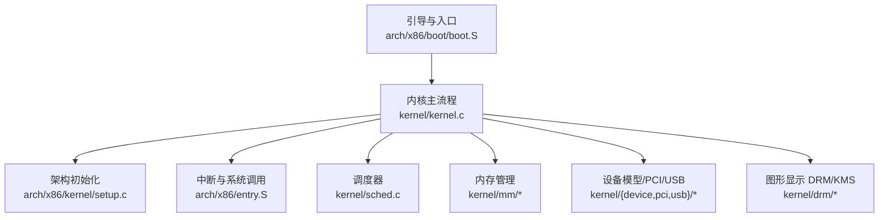
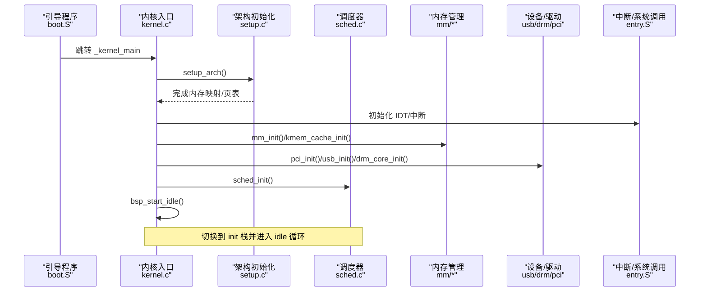
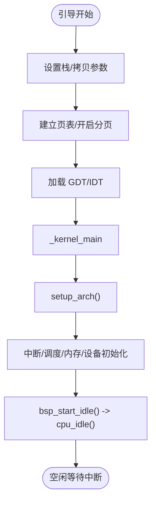
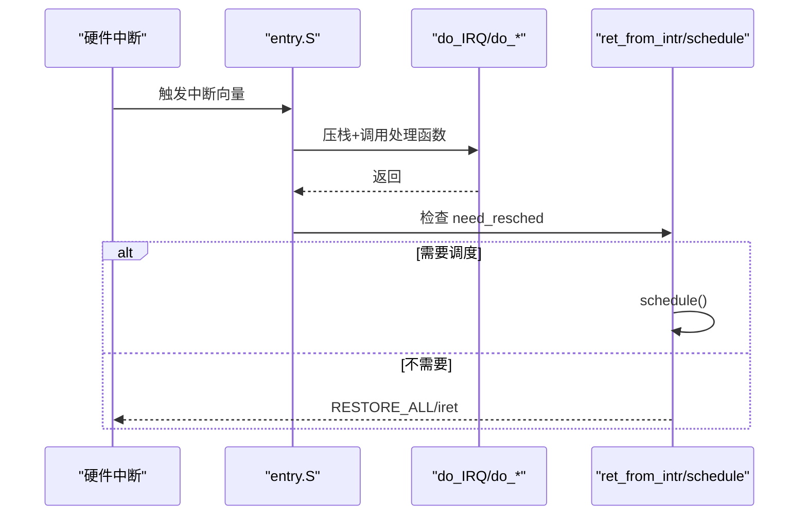
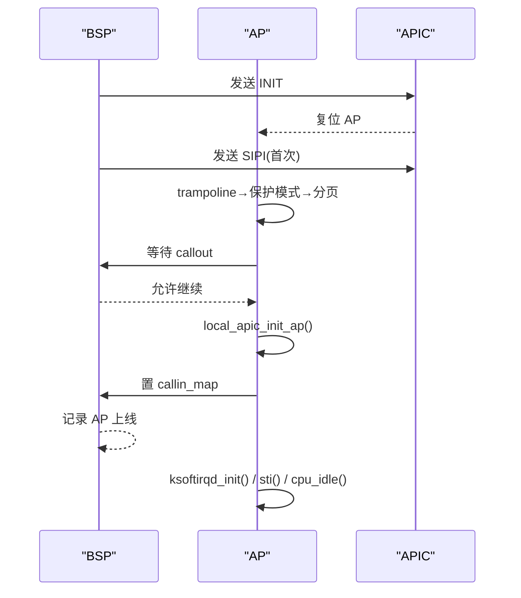
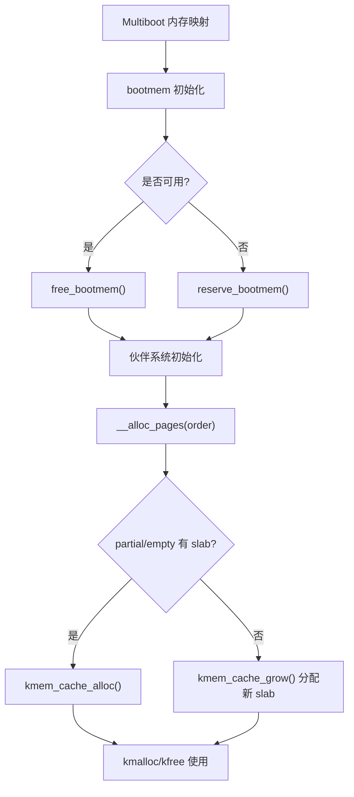
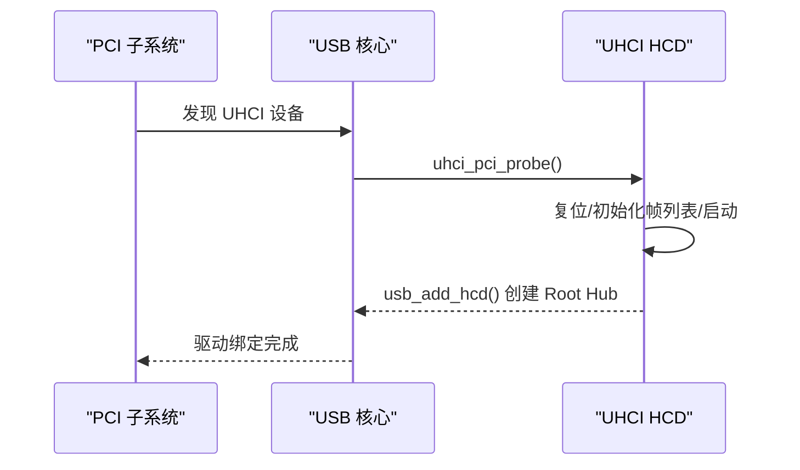
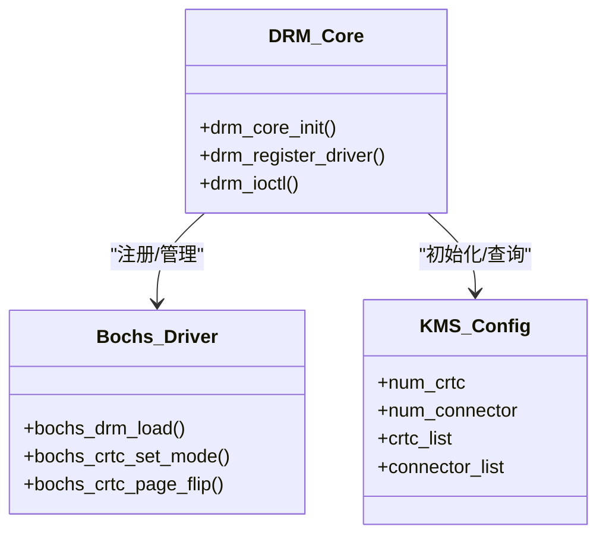
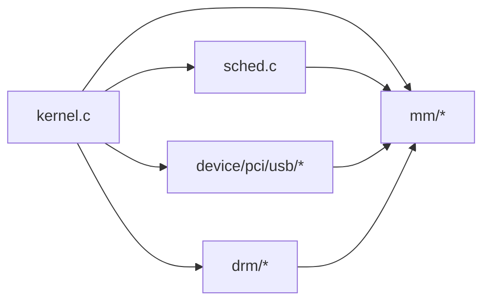

# 项目概述

<cite>
**本文引用的文件列表**
- [README.md](file://README.md)
- [Makefile](file://Makefile)
- [arch/x86/boot/boot.S](file://arch/x86/boot/boot.S)
- [arch/x86/entry.S](file://arch/x86/entry.S)
- [kernel/kernel.c](file://kernel/kernel.c)
- [arch/x86/kernel/setup.c](file://arch/x86/kernel/setup.c)
- [kernel/sched.c](file://kernel/sched.c)
- [arch/x86/kernel/smp.c](file://arch/x86/kernel/smp.c)
- [kernel/mm/bootmem.c](file://kernel/mm/bootmem.c)
- [kernel/mm/mmzone.c](file://kernel/mm/mmzone.c)
- [kernel/mm/slab.c](file://kernel/mm/slab.c)
- [kernel/drm/drm_core.c](file://kernel/drm/drm_core.c)
- [kernel/drm/drm_bochs.c](file://kernel/drm/drm_bochs.c)
- [kernel/usb/usb.c](file://kernel/usb/usb.c)
- [kernel/usb/uhci-hcd.c](file://kernel/usb/uhci-hcd.c)
</cite>

## 目录
1. [简介](#简介)
2. [项目结构](#项目结构)
3. [核心组件](#核心组件)
4. [架构总览](#架构总览)
5. [详细组件分析](#详细组件分析)
6. [依赖关系分析](#依赖关系分析)
7. [性能考量](#性能考量)
8. [故障排查指南](#故障排查指南)
9. [结论](#结论)
10. [附录](#附录)

## 简介
LulaOS 是一个面向 x86 的完整操作系统内核实现，目标是为教学与二次开发提供清晰、可维护且功能完备的内核基线。项目以 Linux 2.6.20 内核架构为参考设计，实现了进程调度、内存管理（伙伴系统 + slab）、设备驱动框架（平台总线/PCI/USB）、图形显示系统（DRM/KMS + Bochs/QEMU VBE 驱动）以及 SMP 多处理器支持等核心能力。构建与调试工具链集成 Makefile，支持 QEMU/Bochs 运行与 GDB 调试。

- 技术特点
  - 基于 x86 架构，采用 Multiboot 引导，页表与分页在早期阶段建立
  - 进程调度：静态优先级 + 时间片轮转，SMP 安全
  - 内存管理：bootmem → 伙伴系统 → slab 三级分配体系
  - 设备模型：平台总线 + PCI + USB（UHCI HCD）
  - 图形子系统：DRM/KMS 框架 + Bochs/QEMU VBE 驱动，支持双缓冲翻页
  - SMP：通过 APIC/SIPI 启动 AP，每个 CPU 独立 idle 任务与运行队列

**章节来源**
- [README.md:1-84](file://README.md#L1-L84)
- [Makefile:1-138](file://Makefile#L1-L138)

## 项目结构
仓库按“架构相关代码”和“通用内核代码”分层组织：
- arch/x86：x86 特定引导、中断、SMP、页表、GDT/IDT 等
- kernel：通用内核子系统（调度、内存、设备、USB、DRM、TTY 等）
- includes：公共头文件（按子系统划分）
- config、docs：配置与文档
- 顶层脚本与配置文件：构建、GRUB、模拟器配置

**图表来源**
- [arch/x86/boot/boot.S:39-125](file://arch/x86/boot/boot.S#L39-L125)
- [kernel/kernel.c:72-135](file://kernel/kernel.c#L72-L135)
- [arch/x86/kernel/setup.c:201-214](file://arch/x86/kernel/setup.c#L201-L214)
- [arch/x86/entry.S:445-486](file://arch/x86/entry.S#L445-L486)
- [kernel/sched.c:76-213](file://kernel/sched.c#L76-L213)
- [kernel/mm/bootmem.c:12-223](file://kernel/mm/bootmem.c#L12-L223)
- [kernel/usb/usb.c:140-187](file://kernel/usb/usb.c#L140-L187)
- [kernel/drm/drm_core.c:258-311](file://kernel/drm/drm_core.c#L258-L311)

**章节来源**
- [arch/x86/boot/boot.S:39-125](file://arch/x86/boot/boot.S#L39-L125)
- [kernel/kernel.c:72-135](file://kernel/kernel.c#L72-L135)
- [arch/x86/kernel/setup.c:201-214](file://arch/x86/kernel/setup.c#L201-L214)

## 核心组件
- 引导与入口
  - boot.S：设置栈、拷贝 multiboot 信息、建立初始页表、开启分页、加载 GDT/IDT、跳转到内核入口
  - entry.S：异常/中断向量、系统调用入口、进程上下文切换 __switch_to、SMP AP trampoline
- 内核初始化
  - kernel.c：顺序初始化 CPU、架构、中断、调度、内存、平台总线、ACPI、PS/2、键盘鼠标、PCI、USB、DRM/KMS，最后进入 idle
  - setup.c：解析 Multiboot 内存映射、初始化 bootmem、建立 3G-4G 页表、初始化帧缓冲控制台与 ACPI
- 调度与 SMP
  - sched.c：runqueue、schedule()、scheduler_tick()、cpu_idle()、sys_fork()/kernel_thread()
  - smp.c：复制 trampoline、发送 INIT-SIPI-SIPI、AP 启动与 idle 注册、本地 APIC 初始化
- 内存管理
  - bootmem.c：bootmem 位图、保留/释放、迁移到伙伴系统
  - mmzone.c：伙伴系统分配/回收、expand/shrink
  - slab.c：对象缓存、ON_SLAB/OFF_SLAB、kmalloc/kfree
- 设备与驱动框架
  - USB：usb.c 定义 usb_bus_type、匹配/探测；uhci-hcd.c 实现 UHCI HCD（帧列表、控制器启停）
  - DRM/KMS：drm_core.c 提供 ioctl 分发与设备管理；drm_bochs.c 实现 Bochs/QEMU VBE 驱动（CRTC/Plane/Connector）
- 其他
  - TTY/FB：framebuffer 控制台与文本输出
  - I8042/键盘/鼠标：PS/2 输入设备

**章节来源**
- [arch/x86/boot/boot.S:39-125](file://arch/x86/boot/boot.S#L39-L125)
- [arch/x86/entry.S:445-486](file://arch/x86/entry.S#L445-L486)
- [kernel/kernel.c:72-135](file://kernel/kernel.c#L72-L135)
- [arch/x86/kernel/setup.c:201-214](file://arch/x86/kernel/setup.c#L201-L214)
- [kernel/sched.c:76-213](file://kernel/sched.c#L76-L213)
- [arch/x86/kernel/smp.c:74-277](file://arch/x86/kernel/smp.c#L74-L277)
- [kernel/mm/bootmem.c:12-223](file://kernel/mm/bootmem.c#L12-L223)
- [kernel/mm/mmzone.c:275-309](file://kernel/mm/mmzone.c#L275-L309)
- [kernel/mm/slab.c:249-430](file://kernel/mm/slab.c#L249-L430)
- [kernel/usb/usb.c:140-187](file://kernel/usb/usb.c#L140-L187)
- [kernel/usb/uhci-hcd.c:148-201](file://kernel/usb/uhci-hcd.c#L148-L201)
- [kernel/drm/drm_core.c:258-311](file://kernel/drm/drm_core.c#L258-L311)
- [kernel/drm/drm_bochs.c:388-591](file://kernel/drm/drm_bochs.c#L388-L591)

## 架构总览
下图展示了从引导到内核主循环的关键路径，以及各子系统之间的调用关系。

**图表来源**
- [arch/x86/boot/boot.S:39-125](file://arch/x86/boot/boot.S#L39-L125)
- [kernel/kernel.c:72-135](file://kernel/kernel.c#L72-L135)
- [arch/x86/kernel/setup.c:201-214](file://arch/x86/kernel/setup.c#L201-L214)
- [kernel/sched.c:76-213](file://kernel/sched.c#L76-L213)
- [arch/x86/entry.S:445-486](file://arch/x86/entry.S#L445-L486)

## 详细组件分析

### 引导与内核入口
- 引导流程
  - 设置栈、拷贝 multiboot 参数、建立初始页表、开启分页、加载 GDT/IDT、跳转到内核入口
- 内核主流程
  - 初始化 CPU、架构、中断、调度、内存、平台总线、ACPI、PS/2、键盘鼠标、PCI、USB、DRM/KMS，最终进入 idle
- 关键路径
  - _kernel_main → setup_arch → 中断/调度/内存/设备初始化 → bsp_start_idle → cpu_idle

**图表来源**
- [arch/x86/boot/boot.S:39-125](file://arch/x86/boot/boot.S#L39-L125)
- [kernel/kernel.c:72-135](file://kernel/kernel.c#L72-L135)

**章节来源**
- [arch/x86/boot/boot.S:39-125](file://arch/x86/boot/boot.S#L39-L125)
- [kernel/kernel.c:72-135](file://kernel/kernel.c#L72-L135)

### 中断与系统调用
- 中断入口
  - 统一包装器将寄存器压栈后调用具体 do_* 处理函数，返回前检查 need_resched 决定是否调度
- 系统调用
  - int 0x80 入口保存 pt_regs，调用 do_syscall，返回值写回 eax
- 上下文切换
  - __switch_to 保存 prev 寄存器与 eip，恢复 next 寄存器与 eip，必要时切换 CR3

**图表来源**
- [arch/x86/entry.S:23-58](file://arch/x86/entry.S#L23-L58)
- [arch/x86/entry.S:445-486](file://arch/x86/entry.S#L445-L486)
- [arch/x86/entry.S:520-610](file://arch/x86/entry.S#L520-L610)

**章节来源**
- [arch/x86/entry.S:23-58](file://arch/x86/entry.S#L23-L58)
- [arch/x86/entry.S:445-486](file://arch/x86/entry.S#L445-L486)
- [arch/x86/entry.S:520-610](file://arch/x86/entry.S#L520-L610)

### 进程调度与 SMP
- 调度策略
  - 每个 CPU 一个 runqueue，idle 任务默认指向 BSP 的 init_task；AP 启动时为其分配独立 idle
  - scheduler_tick 递减 counter，耗尽置 need_resched；schedule 选择 counter 最大者
- SMP 启动
  - BSP 复制 trampoline 到物理地址，写入 GDTR/GDT，遍历 ACPI LAPIC 列表发送 INIT-SIPI-SIPI
  - AP 进入 start_secondary，初始化本地 APIC，标记在线，创建 ksoftirqd，进入 idle

**图表来源**
- [arch/x86/kernel/smp.c:74-215](file://arch/x86/kernel/smp.c#L74-L215)
- [arch/x86/kernel/smp.c:233-277](file://arch/x86/kernel/smp.c#L233-L277)
- [kernel/sched.c:76-213](file://kernel/sched.c#L76-L213)

**章节来源**
- [kernel/sched.c:76-213](file://kernel/sched.c#L76-L213)
- [arch/x86/kernel/smp.c:74-277](file://arch/x86/kernel/smp.c#L74-L277)

### 内存管理
- 引导期内存
  - 解析 Multiboot 内存映射，初始化 bootmem 位图，保留必要区域（0-4K、APIC、trampoline 等）
- 伙伴系统
  - 从可用区分配指定 order 的块，expand 拆分大块至目标阶，更新位图与 free_pages
- Slab 分配器
  - 创建 kmalloc-* 缓存，支持 ON_SLAB/OFF_SLAB；优先从 partial/empty 链表取，否则 grow 新 slab

**图表来源**
- [arch/x86/kernel/setup.c:123-196](file://arch/x86/kernel/setup.c#L123-L196)
- [kernel/mm/bootmem.c:12-223](file://kernel/mm/bootmem.c#L12-L223)
- [kernel/mm/mmzone.c:275-309](file://kernel/mm/mmzone.c#L275-L309)
- [kernel/mm/slab.c:249-430](file://kernel/mm/slab.c#L249-L430)

**章节来源**
- [arch/x86/kernel/setup.c:123-196](file://arch/x86/kernel/setup.c#L123-L196)
- [kernel/mm/bootmem.c:12-223](file://kernel/mm/bootmem.c#L12-L223)
- [kernel/mm/mmzone.c:275-309](file://kernel/mm/mmzone.c#L275-L309)
- [kernel/mm/slab.c:249-430](file://kernel/mm/slab.c#L249-L430)

### 设备驱动框架与 USB 子系统
- 设备模型
  - 平台总线用于 PS/2 设备枚举；PCI 总线扫描并触发驱动 probe
- USB 核心
  - 定义 usb_bus_type，实现 match/probe/remove；usb_register_driver 注册驱动；usb_new_device 注册设备
- UHCI HCD
  - 发现 class=0x0C0300 的 UHCI 控制器，从 BAR4 获取 I/O 基址，初始化帧列表，启动控制器，创建 Root Hub

**图表来源**
- [kernel/usb/usb.c:140-187](file://kernel/usb/usb.c#L140-L187)
- [kernel/usb/uhci-hcd.c:275-346](file://kernel/usb/uhci-hcd.c#L275-L346)

**章节来源**
- [kernel/usb/usb.c:140-187](file://kernel/usb/usb.c#L140-L187)
- [kernel/usb/uhci-hcd.c:275-346](file://kernel/usb/uhci-hcd.c#L275-L346)

### 图形显示系统（DRM/KMS）
- DRM 核心
  - 维护驱动链表，提供 ioctl 分发（能力查询、版本、GEM、KMS 资源/模式/翻页等）
- Bochs/QEMU VBE 驱动
  - 探测 VRAM 大小与支持的分辨率，设置 BGA 寄存器，实现 CRTC/Plane/Connector
  - 支持双缓冲：虚拟高度=实际高度×2，通过 Y_OFFSET 切换前后缓冲

**图表来源**
- [kernel/drm/drm_core.c:258-311](file://kernel/drm/drm_core.c#L258-L311)
- [kernel/drm/drm_bochs.c:388-591](file://kernel/drm/drm_bochs.c#L388-L591)

**章节来源**
- [kernel/drm/drm_core.c:258-311](file://kernel/drm/drm_core.c#L258-L311)
- [kernel/drm/drm_bochs.c:388-591](file://kernel/drm/drm_bochs.c#L388-L591)

## 依赖关系分析
- 模块耦合
  - kernel.c 作为编排点，依赖 arch、mm、device、usb、drm 等子系统
  - 调度器依赖内存分配（kmalloc）与中断（need_resched）
  - USB 依赖 PCI 与设备模型；DRM 依赖 PCI 与内存映射（ioremap）
- 外部依赖
  - Multiboot 提供内存映射与视频模式信息
  - GRUB 负责生成 ISO/IMG 镜像并引导内核
  - QEMU/Bochs 提供虚拟化环境与调试接口

**图表来源**
- [kernel/kernel.c:72-135](file://kernel/kernel.c#L72-L135)
- [kernel/sched.c:76-213](file://kernel/sched.c#L76-L213)
- [kernel/usb/usb.c:140-187](file://kernel/usb/usb.c#L140-L187)
- [kernel/drm/drm_core.c:258-311](file://kernel/drm/drm_core.c#L258-L311)

**章节来源**
- [kernel/kernel.c:72-135](file://kernel/kernel.c#L72-L135)
- [kernel/sched.c:76-213](file://kernel/sched.c#L76-L213)
- [kernel/usb/usb.c:140-187](file://kernel/usb/usb.c#L140-L187)
- [kernel/drm/drm_core.c:258-311](file://kernel/drm/drm_core.c#L258-L311)

## 性能考量
- 调度
  - 每 CPU 运行队列减少锁竞争；idle 任务不参与时间片递减，避免无谓调度
- 内存
  - 伙伴系统按阶分配，减少碎片；slab 优先复用 partial/empty slab，降低分配延迟
- 图形
  - 双缓冲减少闪烁；根据 VRAM 动态筛选分辨率，避免超配
- SMP
  - AP 独立 idle 与运行队列，负载均衡选择最空闲 CPU，降低迁移开销

[本节为通用指导，不直接分析具体文件]

## 故障排查指南
- 无法进入 idle
  - 检查 bsp_start_idle 是否正确切换到 init 栈并开启中断
  - 确认 sched_init 与 smp_init 顺序正确
- 多核未上线
  - 检查 ACPI MADT 中 LAPIC 列表与 apicid_to_cpu 映射
  - 确认 trampoline 复制与 GDTR base 更新正确
- USB 设备未识别
  - 确认 PCI 已枚举且 UHCI BAR4 I/O 空间有效
  - 检查帧列表初始化与控制器启动状态
- 图形花屏或黑屏
  - 校验 BGA 寄存器设置顺序（先禁用再改分辨率，再启用）
  - 确认 VRAM ioremap 成功且 pitch/偏移计算正确

**章节来源**
- [arch/x86/kernel/smp.c:74-215](file://arch/x86/kernel/smp.c#L74-L215)
- [kernel/usb/uhci-hcd.c:148-201](file://kernel/usb/uhci-hcd.c#L148-L201)
- [kernel/drm/drm_bochs.c:176-214](file://kernel/drm/drm_bochs.c#L176-L214)

## 结论
LulaOS 以 Linux 2.6.20 为蓝本，构建了覆盖引导、中断、调度、内存、设备模型、USB 与 DRM/KMS 的完整内核基线，具备 SMP 多核能力与图形显示支持。其模块化设计与清晰的初始化序列便于扩展与维护，适合作为学习与二次开发的起点。

[本节为总结性内容，不直接分析具体文件]

## 附录
- 构建与运行
  - 使用 make all 构建镜像，make debug-qemu/debug-bochs 进行调试
  - 依赖工具：GCC 交叉编译链、QEMU/Bochs、GRUB、GDB
- 术语对照
  - BSP/AP：主处理器/应用处理器
  - HCD：主机控制器驱动
  - CRTC/Plane/Connector：显示管线中的关键 KMS 对象
  - GEM：图形执行管理器，用于显存对象管理

[本节为补充说明，不直接分析具体文件]